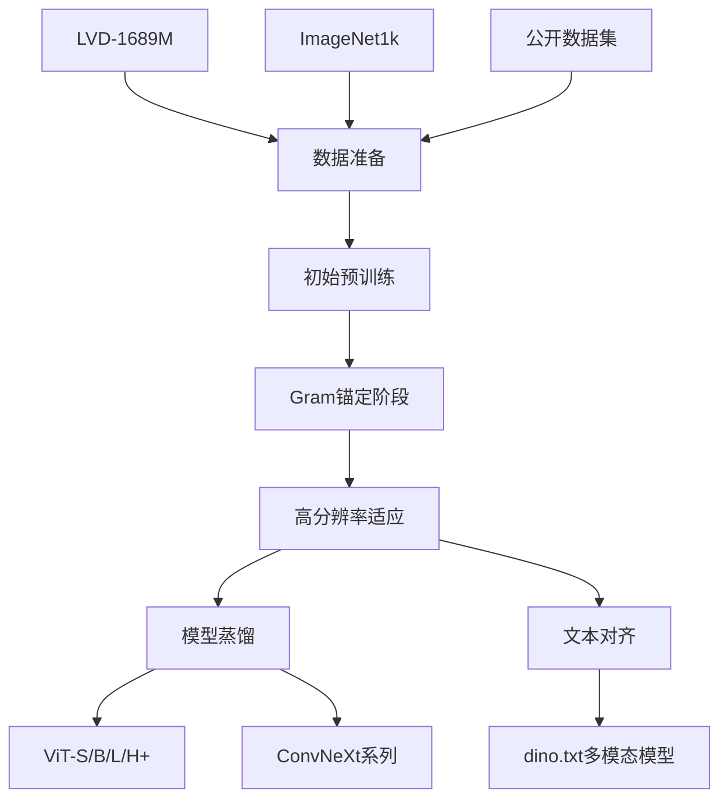
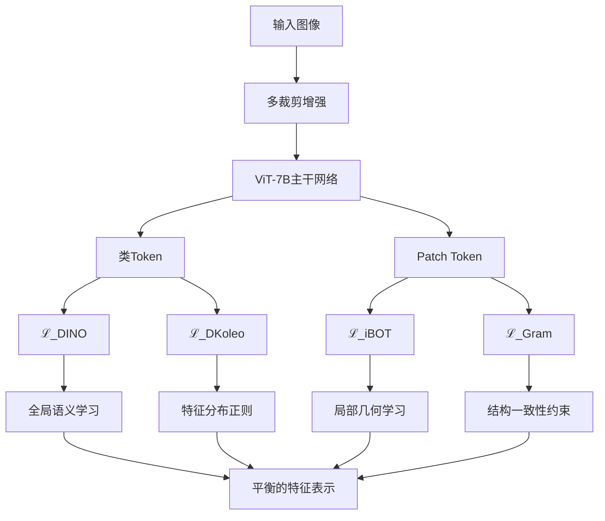

# DINOv3 技术深度解析笔记

## 📌 论文基本信息
- **标题**: DINOv3: Learning Robust Visual Features Without Supervision
- **作者**: Meta AI Research 团队
- **发表**: 2025年技术报告
- **核心贡献**: 首个在密集任务和全局任务上均达到SOTA的自监督视觉基础模型

---

## 🎯 一句话概括

> DINOv3 通过引入 **Gram锚定训练机制**，成功解决了大规模自监督学习中密集特征退化的问题，构建了一个**无需微调**即可在分类、分割、检测、深度估计等多样化任务上达到最先进性能的通用视觉编码器。

---

## 🔍 研究背景与动机

### 问题定义详解

#### 当前视觉基础模型的困境
```
传统范式:
监督学习 → 需要大量标注数据
弱监督学习 → 依赖图像-文本对
自监督学习 → 难以扩展到超大模型
```

#### DINOv3要解决的核心问题
1. **规模扩展瓶颈**: 当模型参数量超过1B、训练时间延长时，密集特征质量下降
2. **任务权衡难题**: 全局语义理解 vs 局部几何一致性难以兼顾
3. **部署灵活性**: 能否用一个冻结的主干网络服务多种下游任务？

### 现有方法局限性分析

| 方法类型 | 代表模型 | 优势 | 劣势 |
|---------|---------|------|------|
| 监督学习 | ViT-22B | 分类性能强 | 需要海量标注数据 |
| 弱监督学习 | CLIP, SigLIP | 零样本能力强 | 密集任务表现差 |
| 自监督学习 | DINOv2 | 密集特征较好 | 扩展到7B时特征退化 |
| 聚合方法 | AM-RADIO | 多任务性能好 | 训练复杂，需要多个教师 |

### 关键观察与动机形成

**核心发现**: 在长时训练中，模型出现"特征一致性漂移"
- ✅ 全局分类性能持续提升
- ❌ 密集分割性能先升后降
- 🔍 可视化显示: patch间相似度图变得噪声增多

**假设**: 全局目标(DINO损失)与局部目标(iBOT损失)在长时训练中失去平衡

---

## 🏗️ 核心方法原理剖析

### 整体训练架构



#### 阶段一：初始预训练 (1M iterations)

**数据流**:
```
原始图像 → 多裁剪(2全局+8局部) → ViT-7B主干 → 
    ↘ DINO头 → ℒ_DINO (全局对比)
    ↘ iBOT头 → ℒ_iBOT (局部重建)
    ↘ Koleo正则 → ℒ_DKoleo (分布均匀性)
```

**关键配置**:
- 模型: ViT-7B (40层, 4096维, 16×16 patch)
- 批次: 4096图像，总计3.7M tokens
- 优化: 恒定学习率(4e-4)，无调度器

#### 阶段二：Gram锚定训练

**问题现象**:
```python
# 训练过程中的特征变化
第200k次迭代: 相似度图清晰，分割mIoU=50
第600k次迭代: 相似度图噪声增多，分割mIoU=45
第1M次迭代: 相似度图严重退化，分割mIoU=40
```

**解决方案**: Gram矩阵一致性约束

### 算法细节深度解析

#### 核心公式详解

**1. 初始训练损失函数**
```
ℒ_Pre = ℒ_DINO + ℒ_iBOT + 0.1 × ℒ_DKoleo
```

**各项含义**:
- `ℒ_DINO`: 图像级对比损失，确保全局语义一致性
- `ℒ_iBOT`: 掩码patch重建损失，增强局部特征质量  
- `ℒ_DKoleo`: 分布均匀性正则，防止特征坍塌

**2. Gram锚定损失（核心创新）**

```math
\mathcal{L}_{\text{Gram}} = \left\| \mathbf{X}_S \cdot \mathbf{X}_S^\top - \mathbf{X}_G \cdot \mathbf{X}_G^\top \right\|_F^2
```

**符号解析表**:

| 符号 | 维度 | 含义 | 数学意义 |
|-----|------|------|----------|
| $\mathbf{X}_S$ | $P \times d$ | 学生模型特征矩阵 | L2归一化后的patch特征 |
| $\mathbf{X}_G$ | $P \times d$ | Gram教师特征矩阵 | 早期checkpoint的特征 |
| $P$ | 标量 | patch数量 | 图像被划分的块数 |
| $d$ | 标量 | 特征维度 | 每个patch的表示维度 |
| $\|\cdot\|_F$ | - | Frobenius范数 | 矩阵元素平方和的平方根 |

**物理意义**: 
- $\mathbf{X}_S \mathbf{X}_S^\top$: 学生模型所有patch对的余弦相似度矩阵
- $\mathbf{X}_G \mathbf{X}_G^\top$: 教师模型patch相似度矩阵
- 损失函数: 强制学生保持与教师相同的**局部结构关系**

**3. 精炼阶段损失**
```math
\mathcal{L}_{\text{Ref}} = w_{\text{D}}\mathcal{L}_{\text{DINO}} + \mathcal{L}_{\text{iBOT}} + w_{\text{DK}}\mathcal{L}_{\text{DKoleo}} + w_{\text{Gram}}\mathcal{L}_{\text{Gram}}
```
其中 $w_{\text{Gram}} = 2$，强调Gram约束的重要性

### 创新模块技术详解

#### Gram锚定机制

**设计哲学**: 
> "不是直接约束特征值，而是约束特征间的关系结构"

**工作流程**:
```python
def gram_anchoring_training():
    # 1. 选择Gram教师
    gram_teacher = load_checkpoint("model_200k.pth")  # 早期模型
    
    for batch in dataloader:
        # 2. 学生前向
        student_features = model(batch)
        
        # 3. 教师前向（高分辨率）
        with torch.no_grad():
            high_res_features = gram_teacher(high_res_batch)
            teacher_features = downsample(high_res_features)  # 2×下采样
        
        # 4. 计算Gram损失
        student_gram = student_features @ student_features.T
        teacher_gram = teacher_features @ teacher_features.T
        gram_loss = F.mse_loss(student_gram, teacher_gram)
        
        # 5. 总损失
        total_loss = base_loss + 2 * gram_loss
        total_loss.backward()
```

**技术优势**:
- 🎯 **针对性**: 专门解决密集特征退化
- 🔄 **灵活性**: 允许特征值变化，只约束关系
- 🚀 **有效性**: 10k迭代内就能显著改善密集任务性能

#### 高分辨率适应策略

**多分辨率训练配方**:
```python
training_resolutions = {
    (512, 112, 768): 0.3,    # (全局crop, 局部crop, Gram教师crop): 概率
    (768, 112, 1152): 0.3,
    (768, 168, 1152): 0.3, 
    (768, 224, 1152): 0.05,
    (768, 336, 1152): 0.05
}
```

**效果**: 支持从256×256到4096×4096的推理分辨率

#### 高效多学生蒸馏

**并行蒸馏架构**:
```
全局批次 → [教师推理组] → 所有GPU特征共享
                ↓
        [学生组A] [学生组B] [学生组C]
           ↓         ↓         ↓
        ViT-S      ViT-B     ViT-L
```

**优势**: 单次教师前向服务所有学生，大幅降低计算成本

---

## 📊 实验分析

### 基准测试全景图

#### 密集任务性能对比

**语义分割 (线性探测)**:

| 模型 | ADE20k | Cityscapes | VOC12 | 相对DINOv2提升 |
|------|--------|------------|-------|----------------|
| DINOv2 | 49.5 | 75.6 | 83.1 | - |
| PEspatial | 49.3 | 73.2 | 82.7 | -0.2 |
| AM-RADIO | 53.0 | 78.4 | 85.4 | +3.5 |
| **DINOv3** | **55.9** | **81.1** | **86.6** | **+6.4** |

**深度估计 (RMSE, 越低越好)**:

| 模型 | NYUv2 | KITTI | 提升幅度 |
|------|-------|-------|----------|
| DINOv2 | 0.372 | 2.624 | - |
| PEspatial | 0.362 | 3.082 | - |
| **DINOv3** | **0.309** | **2.346** | **17%↑** |

#### 全局任务性能

**ImageNet线性探测**:

| 模型 | IN-Val | IN-V2 | IN-Real | ObjectNet |
|------|--------|-------|---------|-----------|
| DINOv2 | 87.3 | 79.5 | 89.9 | 66.4 |
| SigLIP 2 | 89.1 | 81.6 | 90.5 | 78.6 |
| PE-core | 89.3 | 81.6 | 90.4 | 80.2 |
| **DINOv3** | **88.4** | **81.4** | **90.4** | **79.0** |

> 💡 **关键发现**: DINOv3是首个在密集任务和全局任务上均与弱监督模型匹敌的自监督方法

### 消融实验深度解读

#### Gram锚定的影响

**训练过程监控**:
```
迭代次数    ADE20k(mIoU)    ImageNet(Acc)    Gram损失
---------------------------------------------------
200k       50.1            85.2             N/A
400k       48.3            86.7             N/A  
600k       45.8            87.5             N/A
800k       44.2            87.9             N/A
1M         43.5            88.1             N/A
1M+10k     ↗ 51.3          88.2             ↘ 0.15
1M+50k     ↗ 54.2          88.3             ↘ 0.08
1M+100k    ↗ 55.9          88.4             ↘ 0.05
```

**结论**: 
- Gram锚定能快速修复已退化的密集特征
- 对全局性能影响极小
- 损失值下降表明局部结构一致性得到改善

#### 高分辨率训练的影响

**多分辨率性能分析**:
```python
# 不同分辨率下的性能变化
resolutions = [256, 512, 768, 1024, 1536, 2048]
ade20k_miou = [48.1, 52.3, 54.8, 55.9, 56.7, 57.2]  # 持续上升
imagenet_acc = [87.9, 88.2, 88.3, 88.4, 88.4, 88.4]  # 饱和
```

**洞察**: 密集任务受益于高分辨率，全局任务在中等分辨率即饱和

### 可视化证据

#### 特征质量对比

**PCA可视化** (图13):
```
输入图像 → 各模型特征PCA → RGB映射
DINOv3: 边界清晰，语义一致，噪声少
DINOv2: 有一定噪声，边界模糊
SigLIP: 语义混乱，不适合密集任务
PEspatial: 相对清晰但细节丢失
```

**余弦相似度图** (图6,10):
- 训练早期: 相似度集中，定位准确
- 训练后期: 相似度分散，噪声增多  
- Gram锚定后: 重新变得集中清晰

#### 跨域泛化能力

**遥感图像应用** (图18):
```
卫星图像 → DINOv3特征PCA → 
    - 道路、房屋、植被清晰分离
    - 比DINOv2特征更加精细
    - 支持树高估计、地物分类等任务
```

---

## 🤔 批判性讨论与展望

### 方法局限性

#### 计算资源需求
```python
# 训练成本分析
training_cost = {
    "GPU类型": "H100-SXM5",
    "GPU数量": 256,
    "训练时间": "61,440 GPU小时", 
    "电力消耗": "47 MWh",
    "碳足迹": "18 tCO₂eq",
    "等价驾驶里程": "240,000 km"  # 电动汽车
}
```

**限制**: 
- 个人研究者难以复现
- 环境影响需要考虑
- 推理时7B模型部署成本高

#### 技术局限性
1. **OCR能力弱** (表25):
   - GTSRB路标识别: 87.5% vs PE-core的94.8%
   - 文字识别仍需文本监督信号

2. **特征异常值** (附录A):
   - 某些特征维度出现异常大值
   - 需要后处理(BN/PCA)缓解

3. **理论解释不足**:
   - 为何早期模型具有更好密集特征？
   - Gram损失的理论保证缺乏

### 理论深度分析

#### 成功原因推测
1. **早期模型假设**: 训练初期模型更关注局部纹理，后期偏向全局语义
2. **Gram矩阵的本质**: 捕捉的是特征空间的相对几何结构
3. **高分辨率平滑效应**: 下采样操作天然具有去噪效果

#### 未解问题
- Gram锚定是否限制了模型的进一步进化？
- 是否存在更优雅的全局-局部平衡机制？

### 研究启示与展望

#### 对你的研究方向（开放词汇遥感分割）的启示

**直接应用价值**:
```python
# DINOv3在遥感任务上的表现
remote_sensing_performance = {
    "GEO-Bench分类": "12/15任务SOTA",
    "LoveDA分割": "56.2 mIoU (SOTA)",
    "树高估计": "MAE从2.4降至2.2",
    "跨域泛化": "自然图像→遥感有效迁移"
}
```

**技术路线建议**:
1. **基础编码器**: 直接使用DINOv3冻结主干
2. **文本对齐**: 结合dino.txt实现开放词汇
3. **提示学习**: 在DINOv3特征上做prompt tuning
4. **多模态融合**: 结合文本描述实现像素级对齐

#### 未来研究方向

**短期方向**:
- [ ] 轻量化Gram锚定机制
- [ ] 跨模态提示学习框架
- [ ] 遥感专用预训练数据混合策略

**中长期方向**:
- [ ] 理论分析Gram锚定的数学原理  
- [ ] 自适应全局-局部平衡机制
- [ ] 多模态基础模型统一框架

**具体研究想法**:
1. **"GramPrompt"**: 将Gram约束思想应用到提示学习中
2. **"DINOv3-EO"**: 专门针对地球观测的DINOv3变体
3. **"开放词汇密集预测"**: 结合DINOv3+dino.txt的通用框架

---

## 🛠️ 实用信息

### 代码与资源

**官方资源**:
- 📚 论文: [DINOv3 Technical Report]
- 💻 代码: 预计开源在 [Facebook Research GitHub]
- 🧩 模型: ViT-S/B/L/H+, ConvNeXt系列

**相关项目**:
- `dino.txt`: DINOv3 + 文本对齐
- `VGGT + DINOv3`: 3D几何理解
- `Depth Anything V2 + DINOv3`: 深度估计

### 使用指南

#### 快速开始
```python
import torch
from dinov3 import dinov3_vitb14

# 加载模型
model = dinov3_vitb14(pretrained=True)

# 提取特征
with torch.no_grad():
    features = model(images)  # 全局+密集特征
```

#### 针对遥感任务的建议配置
```python
# 最佳实践
config = {
    "backbone": "dinov3_vitl14",
    "resolution": 1024,  # 高分辨率获得更好密集特征
    "use_intermediate_layers": [32],  # 几何任务用中间层
    "normalization": "batch_norm",  # 处理特征异常值
    "text_alignment": "dino.txt"  # 开放词汇能力
}
```

### 后续研究跟踪

**值得关注的方向**:
1. **效率优化**: 模型压缩、蒸馏、量化
2. **多模态扩展**: 视频、3D、语言深度融合  
3. **理论发展**: 自监督学习的理论基础
4. **领域适配**: 医疗、遥感、科学数据的专门优化

---

## 💎 总结

DINOv3代表了自监督视觉表示学习的重要里程碑，其核心创新**Gram锚定机制**为解决大规模训练中的特征退化问题提供了优雅的解决方案。对于开放词汇遥感分割研究，DINOv3提供了:

- 🎯 **强大的密集特征基础**
- 🌍 **优秀的跨域泛化能力**  
- 🔧 **灵活的部署选择**
- 📈 **持续改进的生态系统**

# DINOv3 损失函数深度解析笔记

## 📋 损失函数概览

DINOv3 使用了一个**多任务损失系统**，每个损失函数负责不同的学习目标：

```
总损失 = 全局语义损失 + 局部几何损失 + 结构一致性损失 + 分布正则损失
```

---

## 🔍 初始预训练阶段损失函数详解

### 1. ℒ_DINO - 全局语义对比损失

#### 公式形式：
论文中未给出具体公式，但基于 DINO 系列工作，其核心形式为：

```math
\mathcal{L}_{\text{DINO}} = -\sum_{i=1}^{N} \sum_{j=1}^{M} P_t^{(i)}(x_j) \log P_s^{(i)}(x_j)
```

其中：
- $P_t^{(i)}$: 教师模型对第 i 个 crop 的预测分布
- $P_s^{(i)}$: 学生模型对第 i 个 crop 的预测分布  
- $N$: crop 数量（2个全局 + 8个局部）
- $M$: 原型向量的数量（prototypes）

#### 符号详解：

| 符号 | 维度 | 物理意义 | 在框架中的作用 |
|-----|------|----------|----------------|
| $x_j$ | 标量 | 第 j 个原型向量 | 代表特征空间中的一个聚类中心 |
| $P_t^{(i)}(x_j)$ | 标量 ∈ [0,1] | 教师模型认为第 i 个 crop 属于第 j 个原型的概率 | 提供监督信号，经过 sharpening 避免坍塌 |
| $P_s^{(i)}(x_j)$ | 标量 ∈ [0,1] | 学生模型预测的概率 | 需要对齐教师分布 |
| $N$ | 标量 | 总 crop 数量（通常为10） | 多视角学习的关键 |
| $M$ | 标量 | 原型数量（DINOv3 中为 256k） | 构建丰富的语义概念字典 |

#### 具体实现流程：

```python
def dino_loss(teacher_outputs, student_outputs, temperature_t, temperature_s):
    """
    teacher_outputs: [N, M] - 教师模型对所有crop的预测
    student_outputs: [N, M] - 学生模型对所有crop的预测  
    """
    # 1. 教师分布锐化（避免均匀分布）
    teacher_probs = F.softmax(teacher_outputs / temperature_t, dim=-1)
    
    # 2. 学生分布计算
    student_probs = F.log_softmax(student_outputs / temperature_s, dim=-1)
    
    # 3. 交叉熵损失
    loss = 0
    for i in range(num_global_crops):  # 只对全局crop计算
        for j in range(num_global_crops):
            if i != j:  # 不同crop间对比
                loss += F.kl_div(student_probs[i], teacher_probs[j], reduction='batchmean')
    
    return loss / (num_global_crops * (num_global_crops - 1))
```

#### 完成的任务：
- ✅ **全局语义一致性**: 同一图像的不同裁剪应该具有相似的语义表示
- ✅ **避免模式坍塌**: 通过多原型机制防止所有图像映射到同一个点
- ✅ **特征空间结构化**: 在特征空间中构建有意义的语义聚类

---

### 2. ℒ_iBOT - 局部几何重建损失

#### 公式形式：
```math
\mathcal{L}_{\text{iBOT}} = -\sum_{m \in \mathcal{M}} \sum_{k=1}^{K} P_t^{(m)}(z_k) \log P_s^{(m)}(z_k)
```

其中：
- $\mathcal{M}$: 被掩码的 patch 集合
- $z_k$: 局部原型向量
- $P_t^{(m)}$: 教师对掩码位置 m 的预测
- $P_s^{(m)}$: 学生对掩码位置 m 的预测

#### 符号详解：

| 符号 | 维度 | 物理意义 | 在框架中的作用 |
|-----|------|----------|----------------|
| $\mathcal{M}$ | 集合 | 随机掩码的 patch 索引 | 构建局部重建任务 |
| $m$ | 标量 | 单个掩码位置索引 | 具体的重建目标 |
| $z_k$ | 向量 | 第 k 个局部原型 | 捕捉局部纹理和模式 |
| $P_t^{(m)}(z_k)$ | 标量 | 教师认为掩码位置应属于原型 k 的概率 | 提供局部监督信号 |
| $K$ | 标量 | 局部原型数量（DINOv3 中为 96k） | 丰富的局部概念字典 |

#### 掩码策略：
```python
def masking_strategy(patches, mask_ratio=0.5):
    """
    输入: patches [B, N, D] - 批次, patch数, 特征维度
    输出: 掩码后的patches和掩码位置
    """
    batch_size, num_patches, _ = patches.shape
    
    # 随机选择掩码位置
    num_masked = int(mask_ratio * num_patches)
    mask_indices = torch.rand(batch_size, num_patches).argsort(dim=1) < num_masked
    
    # 用可学习掩码token替换
    masked_patches = patches.clone()
    masked_patches[mask_indices] = self.mask_token
    
    return masked_patches, mask_indices
```

#### 完成的任务：
- ✅ **局部特征学习**: 迫使模型理解局部patch的语义
- ✅ **上下文推理**: 根据周围patch预测被掩码区域
- ✅ **几何一致性**: 同一物体的不同部分应该具有一致的特征表示

---

### 3. ℒ_DKoleo - 分布均匀性正则

#### 公式形式：
```math
\mathcal{L}_{\text{DKoleo}} = -\sum_{i \neq j} \log(\| \mathbf{z}_i - \mathbf{z}_j \|_2)
```

其中：
- $\mathbf{z}_i, \mathbf{z}_j$: 批次中不同图像的类token特征
- $\|\cdot\|_2$: L2范数（欧几里得距离）

#### 符号详解：

| 符号 | 维度 | 物理意义 | 在框架中的作用 |
|-----|------|----------|----------------|
| $\mathbf{z}_i$ | $d$ 维向量 | 第 i 个图像的类token特征 | 图像的全局表示 |
| $\|\mathbf{z}_i - \mathbf{z}_j\|_2$ | 标量 | 两个图像特征间的欧氏距离 | 衡量特征空间的分散程度 |
| $i \neq j$ | - | 批次中不同的图像对 | 鼓励所有图像特征分散 |

#### 物理意义分析：
这个损失函数的核心思想是**最大化特征空间中点与点之间的距离**，从而：

1. **防止特征坍塌**: 避免所有图像映射到特征空间的同一个区域
2. **促进均匀分布**: 鼓励特征在整个单位球面上均匀分布
3. **增加特征多样性**: 确保模型能够区分不同的视觉概念

#### 实现细节：
```python
def koleo_loss(cls_tokens, batch_size=16):
    """
    分布式Koleo实现 - 在小批次中计算
    """
    # 1. 特征归一化（投影到单位球面）
    normalized_tokens = F.normalize(cls_tokens, p=2, dim=-1)
    
    # 2. 计算所有对之间的距离
    loss = 0
    count = 0
    
    for i in range(batch_size):
        for j in range(batch_size):
            if i != j:
                distance = torch.norm(normalized_tokens[i] - normalized_tokens[j], p=2)
                loss += -torch.log(distance)  # 负对数，距离越大损失越小
                count += 1
    
    return loss / count if count > 0 else loss
```

#### 完成的任务：
- ✅ **特征空间正则化**: 防止模型学习退化的特征表示
- ✅ **信息最大化**: 鼓励模型利用整个特征空间容量
- ✅ **避免过拟合**: 提供额外的正则化约束

---

## 🎯 Gram锚定阶段核心创新

### 4. ℒ_Gram - 结构一致性损失

#### 公式形式：
```math
\mathcal{L}_{\text{Gram}} = \left\| \mathbf{X}_S \mathbf{X}_S^\top - \mathbf{X}_G \mathbf{X}_G^\top \right\|_F^2
```

#### 符号深度解析：

| 符号 | 维度 | 物理意义 | 数学性质 |
|-----|------|----------|----------|
| $\mathbf{X}_S$ | $P \times d$ | 学生模型的patch特征矩阵 | 每行是一个L2归一化的patch特征 |
| $\mathbf{X}_G$ | $P \times d$ | Gram教师的patch特征矩阵 | 来自早期训练阶段的模型 |
| $\mathbf{X}_S \mathbf{X}_S^\top$ | $P \times P$ | 学生模型的Gram矩阵 | 对称半正定矩阵，元素为余弦相似度 |
| $\mathbf{X}_G \mathbf{X}_G^\top$ | $P \times P$ | 教师模型的Gram矩阵 | 捕捉理想的局部结构关系 |
| $\|\cdot\|_F$ | 标量 | Frobenius范数 | $\|A\|_F = \sqrt{\sum_{i,j} |a_{ij}|^2}$ |

#### Gram矩阵的数学意义：

**Gram矩阵 $\mathbf{G} = \mathbf{X}\mathbf{X}^\top$ 的元素**：
```math
G_{ij} = \mathbf{x}_i \cdot \mathbf{x}_j = \|\mathbf{x}_i\| \|\mathbf{x}_j\| \cos(\theta_{ij})
```

由于特征已经L2归一化（$\|\mathbf{x}_i\| = 1$），所以：
```math
G_{ij} = \cos(\theta_{ij})
```

**因此Gram矩阵实际上是patch间的余弦相似度矩阵**！

#### 具体实现：

```python
def gram_anchoring_loss(student_features, teacher_features):
    """
    student_features: [B, P, D] - 学生特征
    teacher_features: [B, P, D] - 教师特征（来自早期模型）
    """
    # 1. L2归一化 - 关键步骤！
    student_features = F.normalize(student_features, p=2, dim=-1)  # [B, P, D]
    teacher_features = F.normalize(teacher_features, p=2, dim=-1)  # [B, P, D]
    
    # 2. 计算Gram矩阵
    student_gram = torch.bmm(student_features, student_features.transpose(1, 2))  # [B, P, P]
    teacher_gram = torch.bmm(teacher_features, teacher_features.transpose(1, 2))  # [B, P, P]
    
    # 3. Frobenius范数平方
    gram_diff = student_gram - teacher_gram
    loss = torch.norm(gram_diff, p='fro') ** 2
    
    return loss
```

#### 高分辨率Gram教师的特殊处理：

```python
def high_res_gram_teacher(gram_teacher, image, target_size):
    """
    使用高分辨率图像获得更精确的Gram矩阵
    """
    # 1. 高分辨率前向
    high_res_features = gram_teacher(high_res_image)  # 例如 512×512输入
    
    # 2. 特征下采样（平滑效果）
    downsampled_features = F.interpolate(
        high_res_features.permute(0, 3, 1, 2),  # [B, D, H, W]
        size=target_size,
        mode='bicubic'
    ).permute(0, 2, 3, 1)  # 回到 [B, H, W, D]
    
    return downsampled_features
```

#### 完成的任务：
- ✅ **局部结构保持**: 强制学生模型保持与教师相同的patch间关系
- ✅ **密集特征修复**: 解决长时训练中的特征退化问题
- ✅ **几何一致性**: 确保局部特征的相对几何关系不变
- ✅ **灵活性**: 允许特征值变化，只要结构关系保持不变

---

## 🎪 损失函数协同作用分析

### 总损失函数组合：

#### 初始预训练阶段：
```math
\mathcal{L}_{\text{Pre}} = \underbrace{\mathcal{L}_{\text{DINO}}}_{\text{全局语义}} + \underbrace{\mathcal{L}_{\text{iBOT}}}_{\text{局部几何}} + 0.1 \times \underbrace{\mathcal{L}_{\text{DKoleo}}}_{\text{分布正则}}
```

#### Gram锚定精炼阶段：
```math
\mathcal{L}_{\text{Ref}} = \underbrace{w_{\text{D}}\mathcal{L}_{\text{DINO}}}_{\text{语义保持}} + \underbrace{\mathcal{L}_{\text{iBOT}}}_{\text{局部保持}} + \underbrace{w_{\text{DK}}\mathcal{L}_{\text{DKoleo}}}_{\text{分布保持}} + \underbrace{2 \times \mathcal{L}_{\text{Gram}}}_{\text{结构修复}}
```

### 多损失协同机制：



### 损失函数间的权衡：

| 损失函数 | 作用尺度 | 目标 | 潜在冲突 |
|---------|----------|------|----------|
| ℒ_DINO | 图像级 | 全局语义一致性 | 可能忽视局部细节 |
| ℒ_iBOT | Patch级 | 局部几何重建 | 可能与全局语义冲突 |
| ℒ_DKoleo | 批次级 | 特征空间均匀性 | 可能干扰具体任务学习 |
| ℒ_Gram | 结构级 | 局部关系保持 | 可能限制特征进化 |

**DINOv3的关键洞察**: 在长时训练中，ℒ_DINO 逐渐主导，导致 ℒ_iBOT 的局部学习目标被压制，从而引起密集特征退化。

---

## 🔬 数学原理深度分析

### Gram矩阵的几何解释

考虑特征矩阵 $\mathbf{X} = [\mathbf{x}_1, \mathbf{x}_2, ..., \mathbf{x}_P]^\top$，其中每个 $\mathbf{x}_i$ 是单位向量。

**Gram矩阵的特征**：
1. **对称性**: $G_{ij} = G_{ji}$
2. **半正定性**: 所有特征值 ≥ 0  
3. **对角线为1**: $G_{ii} = \|\mathbf{x}_i\|^2 = 1$
4. **度量内积**: $G_{ij} = \mathbf{x}_i \cdot \mathbf{x}_j$

**几何意义**: Gram矩阵完整描述了特征空间中点的相对位置关系。

### Frobenius范数的性质

```math
\|A\|_F^2 = \sum_{i=1}^P \sum_{j=1}^P |a_{ij}|^2 = \text{trace}(A^\top A)
```

对于Gram矩阵差异：
```math
\|\mathbf{X}_S\mathbf{X}_S^\top - \mathbf{X}_G\mathbf{X}_G^\top\|_F^2 = \sum_{i,j} (\cos\theta_{ij}^S - \cos\theta_{ij}^G)^2
```

这实际上是在**最小化所有patch对之间余弦相似度的平方误差**！

### 为什么Gram损失有效？

**理论解释**:
1. **等变性**: Gram矩阵对特征的正交变换具有不变性
2. **结构保持**: 只约束相对关系，不约束绝对位置
3. **早期模型假设**: 训练初期模型更关注局部模式，后期偏向全局语义

**经验证据**:
- 图5显示：训练后期，类token与patch token的相似度上升
- 这表明模型从"局部细节模式"转向"全局抽象模式"
- Gram锚定强制模型保持早期的局部敏感特性

---

## 💡 实际应用启示

### 对你的研究方向（遥感分割）的指导：

#### 损失函数设计思路：
```python
# 针对遥感任务的改进损失组合
def remote_sensing_loss():
    base_loss = dino_loss + ibot_loss + 0.1 * koleo_loss
    
    # 遥感特定改进
    if use_gram_anchoring:
        base_loss += 2.0 * gram_loss
    
    if use_multispectral:
        base_loss += spectral_consistency_loss
    
    if use_spatial_prior:  
        base_loss += spatial_constraint_loss
    
    return base_loss
```

#### 关键调参经验：
1. **Gram损失权重**: 从2.0开始，根据密集任务性能调整
2. **应用时机**: 在观察到密集性能下降时引入（约200k迭代后）
3. **教师选择**: 使用验证集上密集任务性能最好的checkpoint
4. **分辨率策略**: 训练时混合分辨率，推理时使用高分辨率

### 可扩展的研究方向：

1. **自适应Gram锚定**: 根据训练进度动态调整Gram损失权重
2. **多尺度Gram约束**: 在不同特征层应用Gram损失
3. **跨模态Gram对齐**: 将Gram思想扩展到多模态学习
4. **轻量化Gram机制**: 减少Gram矩阵计算的内存开销

---

## 🎯 核心要点总结

| 损失函数 | 核心任务 | 数学本质 | 对遥感任务的价值 |
|---------|----------|----------|------------------|
| **ℒ_DINO** | 全局语义学习 | 分布对齐的KL散度 | 地物类别识别 |
| **ℒ_iBOT** | 局部几何重建 | 掩码重建的交叉熵 | 边界精确定位 |
| **ℒ_DKoleo** | 特征分布正则 | 负对数距离优化 | 避免特征坍塌 |
| **ℒ_Gram** | 结构一致性 | Gram矩阵F范数 | 保持局部空间关系 |

**DINOv3的核心突破**: 认识到不同损失函数在长时训练中的**不平衡发展**，并通过Gram锚定机制主动干预，保持模型的密集预测能力。

**对你的价值**: 理解这些损失函数的相互作用，可以帮助你设计更适合遥感图像特点的自监督学习策略。
