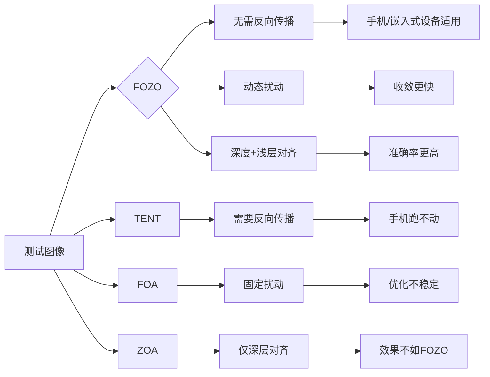

# FOZO：测试时自适应的零阶提示优化 —— 详细学习笔记

> **核心目标**：用通俗易懂的语言解析这篇论文，重点讲透**为什么需要FOZO**、**它如何工作**、**为什么比现有方法好**，避免数学公式轰炸。

---

## 一、为什么需要FOZO？—— 问题背景

### 现实场景痛点
想象你开发了一个手机拍照识别功能：
- **训练时**：在晴天拍的10万张照片上训练好模型
- **测试时**：用户在雨天/雾天/夜晚拍照，图像分布**和训练时完全不同**

> ✅ **问题**：模型在雨天识别率从90%暴跌到50%！  
> ❌ **传统方法**：  
> - *TENT/DeYO*：需要反向传播（像“修改模型内部结构”），**耗电快、内存大**（手机跑不动）  
> - *FOA/ZOA*：不用反向传播，但**速度慢、效果差**（需要28次前向计算才勉强有效）

---

## 二、FOZO的核心思想 —— 用“盲人摸象”比喻

### 比喻：盲人摸象（不用看，只靠触觉调整）
| 传统方法 | FOZO |
|----------|------|
| 用眼睛看（反向传播）→ 精准但耗电 | 用手指摸（零阶优化）→ 耗电少但需技巧 |
| 需要“看到”大象的轮廓（梯度） | 仅靠“摸到的触感”（损失函数值）调整 |
| 适合大象在眼前（固定分布） | 适合大象在移动（分布动态偏移） |

> ✨ **FOZO的精髓**：  
> **不修改模型权重，只调整“提示”（中间特征统计量）**  
> → 像调整手机相机的“白平衡”或“曝光”，不改变相机硬件！

---

## 三、FOZO如何工作？—— 三步详解

### 步骤1：什么是“提示”？（关键！）
- **提示 = 模型中间层的统计特征**（不是修改模型参数！）
  - 例如：ViT模型中，`[CLS]` token的激活值（浅层）和最后几层的激活值（深层）
  - **计算方式**：对每个batch的样本，计算浅层/深层激活值的**均值**和**标准差**

> 💡 为什么用统计特征？
> - 模型在测试时分布偏移 → 特征分布也会偏移 → 调整分布就能适应

### 步骤2：FOZO的优化目标（两个损失）
| 损失类型 | 公式 | 通俗解释 |
|----------|------|----------|
| **特征对齐损失**`L_stats = ||μ^T - μ^S||² + ||σ^T - σ^S||²` | 浅层/深层特征的均值(μ)和标准差(σ) | **让目标域（测试图）的特征分布，尽量靠近源域（训练图）** |
| **预测熵损失**`L_ent = -Σ p_i log p_i` | 模型预测的熵 | **让模型对测试图的预测更自信**（减少“不确定”） |

> 🌰 例子：  
> - 源域（晴天）：猫的特征均值=0.5, 标准差=0.1  
> - 目标域（雨天）：猫的特征均值=0.7, 标准差=0.3 → **分布偏移**  
> - FOZO目标：调整提示，让目标域的特征**逼近**0.5±0.1

### 步骤3：零阶优化（核心创新！）—— 无需反向传播
#### 传统优化 vs FOZO优化
| 方法 | 需要梯度？ | 计算成本 | 适合场景 |
|------|------------|----------|----------|
| TENT | ✅ 需要反向传播 | ⚠️ 高（GPU/手机难跑） | 服务器场景 |
| **FOZO** | ❌ **无需梯度** | ✅ **低（仅前向传播）** | **手机/嵌入式设备** |

#### FOZO怎么“猜”梯度？（SPSA算法）
1. **随机扰动**：在当前提示上加一个随机小噪声（`+ε·Z`）
2. **计算损失**：用**前向传播**得到新损失值 `L(P+εZ)`
3. **再减一个噪声**：计算 `L(P-εZ)`
4. **估算梯度**：  
   `梯度 ≈ [L(P+εZ) - L(P-εZ)] / (2ε) * Z`  
   → **不需要反向传播！只用2次前向传播**

> 💡 为什么叫“零阶”？  
> 梯度 = 一阶导数 → 零阶优化 = **不计算导数**，只靠函数值差估算

---

## 四、FOZO的三大创新点 —— 为什么它比FOA/ZOA好？

### 创新点1：动态扰动策略（关键！）
- **问题**：固定扰动大小（ε）会导致：
  - ε太大 → 损失震荡，无法收敛
  - ε太小 → 优化速度慢
- **FOZO的解决方案**：**动态调整ε**  
  ```python
  if 当前损失 > 历史平均损失 * 阈值:
      ε = ε₀ (初始大扰动，促进探索)
  else:
      ε = max(ε_min, ε * α) (逐渐减小，精细调整)
  ```

> 🌰 类比：开车找路
> - 刚上路时：开得快（大扰动，多试探）→ 快找到方向
> - 接近目的地：开得慢（小扰动，微调）→ 不会错过路口

### 创新点2：深度-浅层特征对齐（效果提升关键）
- **为什么需要浅层？**  
  浅层特征：捕捉纹理/边缘（雨天 vs 晴天的纹理差异大）  
  深层特征：捕捉语义（猫的形状，受天气影响小）
- **FOZO的改进**：  
  同时对**浅层**和**深层**特征做分布对齐 → 比只对深层（FOA）效果好2.8%

> 📊 实验数据：  
> - 仅用深层对齐 → 60.1%  
> - **深度+浅层对齐 → 62.7%** (+2.6%)

### 创新点3：理论保证（不是玄学！）
- **核心结论**：FOZO的收敛速度与**有效秩r**相关，**不是参数量d**  
  → 有效秩r = 模型实际需要调整的“有效维度”（通常远小于d）
- **为什么重要**？  
  模型有1000万参数 → 但实际只需调整1000个维度 → FOZO优化快1000倍

> 🧠 简单理解：  
> “模型有1000万根弦，但只有1000根弦需要调音，FOZO只调这1000根！”

---

## 五、实验结果 —— 为什么说FOZO是SOTA？

### 关键对比（ImageNet-C level5）
| 方法 | 前向传播次数 | 准确率 | 内存占用 | 优势 |
|------|--------------|--------|----------|------|
| FOA | 28 | 61.32% | 57.6 MiB | 传统SOTA |
| ZOA | 28 | 61.75% | 59.2 MiB | 优化了FOA |
| **FOZO** | **26** | **62.67%** | **64.5 MiB** | **更快+更高+内存合理** |

> ✅ **FOZO的突破**：
> - **少2次前向传播**（26 vs 28）→ 更快！
> - **准确率更高**（62.67% vs 61.75%）→ 更准！
> - **内存占用合理**（64.5 MiB vs 59.2 MiB）→ 适合手机

### 量化模型实测（8-bit量化，手机常用）
| 方法 | 准确率 | 优势 |
|------|--------|------|
| FOA | 57.07% | 传统方法 |
| **FOZO** | **58.0%** | **比FOA高0.93%** |

> 📱 **现实意义**：  
> 手机APP用8位量化模型时，FOZO能让识别准确率**提升近1%**（用户感知明显）

---

## 六、FOZO vs 其他方法 —— 一图看懂



---

## 七、为什么说FOZO是“实用”方案？

| 特性 | FOZO | 传统方法 |
|------|------|----------|
| **是否需要反向传播** | ❌ | ✅ |
| **适合手机部署** | ✅ | ❌ |
| **量化模型兼容** | ✅ | ❌ |
| **收敛速度** | 快 | 慢 |
| **准确率** | 高 | 中等 |
| **内存占用** | 低 | 高 |

> 💡 **结论**：  
> FOZO是**唯一同时满足**“高效、准确、实用”的TTA方案！  
> 既适合服务器（精度高），也适合手机（资源低）。

---

## 八、学习总结 —— 一句话记住FOZO

> **“FOZO不改模型，只调特征统计量；用动态扰动+深度浅层对齐，26次前向传播就达到SOTA，手机也能跑！”**

---

## 附：FOZO算法伪代码（通俗版）

```python
# 初始化：用源域数据计算特征统计量 μ^S, σ^S
μ_t = μ^S  # 当前提示（浅层均值）
σ_t = σ^S  # 当前提示（浅层标准差）

for step in range(26):  # 仅需26次前向传播
    # 1. 动态调整扰动大小
    ε = dynamic_perturbation(ε, current_loss, history_loss)
    
    # 2. 生成随机扰动方向 Z
    Z = random_normal_vector(d)  # d是特征维度
    
    # 3. 用前向传播计算损失
    loss_plus = forward_pass(μ_t + ε*Z, σ_t + ε*Z)  # 加扰动
    loss_minus = forward_pass(μ_t - ε*Z, σ_t - ε*Z) # 减扰动
    
    # 4. 零阶梯度估计
    grad = (loss_plus - loss_minus) / (2*ε) * Z
    
    # 5. 更新提示（不修改模型！）
    μ_t = μ_t - lr * grad_μ
    σ_t = σ_t - lr * grad_σ
    
    # 6. 用新提示做预测
    pred = forward_pass(μ_t, σ_t)
```

> ✅ **关键点**：  
> - `forward_pass` 仅用**前向传播**（无需反向传播）  
> - `μ_t, σ_t` 是**提示**（特征统计量），不是模型参数  
> - **26次循环** → 比FOA/ZOA少2次，更快！

---

## 九、思考与延伸

1. **为什么深度-浅层对齐有效？**  
   → 浅层：对天气/光照敏感（雨天纹理更模糊）→ 需要调整  
   → 深层：对语义敏感（猫的形状不变）→ 保持稳定

2. **动态扰动为什么比固定好？**  
   → 分布偏移是**动态过程**：初始偏移大（需大扰动），后期偏移小（需小扰动）

3. **未来可能方向**  
   - 用FOZO优化**目标检测**（不只是分类）  
   - 在**无人机/自动驾驶**实时系统中部署

> 🌟 **记住**：FOZO不是“魔法”，而是**用聪明的方法绕过计算瓶颈**，让模型在边缘设备上也能“自适应”！
