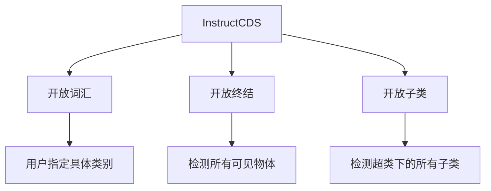

# InstructSAM论文详解：一种面向指令的免训练遥感目标识别框架

## 1. 研究背景与核心问题

### 1.1 传统方法的局限性
- **依赖显式类别提示**：现有开放词汇和视觉定位方法需要明确的类别名称
- **固定类别列表不完整**：遥感图像中物体种类繁多，任何预定义类别列表都无法覆盖所有情况
- **复杂推理能力不足**：难以处理需要上下文理解和高级推理的复杂查询

### 1.2 研究创新点
- **新任务套件**：InstructCDS（指令导向的目标计数、检测和分割）
- **首个基准**：EarthInstruct，用于遥感领域的指令导向目标识别
- **免训练框架**：InstructSAM，无需特定任务训练即可完成复杂指令

## 2. InstructCDS任务定义

### 2.1 三种设置


### 2.2 与传统方法对比
| 设置类型 | 指令示例 | 特点 |
|---------|----------|------|
| 封闭集 | 标准标注 | 使用数据集预定义类别 |
| 开放词汇 | "检测足球场、停车场" | 用户指定具体类别 |
| 开放终结 | "检测所有可见物体" | 不指定类别，检测一切 |
| 开放子类 | "检测所有运动场地" | 指定超类，检测所有子类 |

## 3. InstructSAM算法原理详解

### 3.1 整体框架架构
```
输入: 图像I + 指令P
    ↓
[LVLM计数器] → 类别{cat_j} + 数量{num_j} (语义+数量信息)
    ↓
[SAM2掩码提议] → 掩码{mask_i} (视觉信息)
    ↓
[CLIP相似度计算] → 相似度矩阵S
    ↓
[二进制整数规划] → 最优分配矩阵X
    ↓
输出: {(mask_i, cat_j)} 识别结果
```

### 3.2 核心组件详解

#### 3.2.1 LVLM指令导向计数
```python
# 结构化提示示例
{
    "Persona": "遥感图像分析专家",
    "Task": "计数特定类别的物体",
    "Instructions": ["数据集特定规则...", "类别定义..."],
    "Output": "{'category': count}"
}
```
**作用**：解析复杂指令，理解数据集特定标注规则，输出目标类别和数量。

#### 3.2.2 SAM2掩码生成
- **类无关分割**：不依赖类别信息，生成所有可能物体的掩码
- **高召回率**：通过密集点网格提示确保小物体也能被检测
- **多尺度处理**：对图像裁剪以增强小物体检测

#### 3.2.3 CLIP语义相似度计算
```math
s_{ij} = \text{cosine\_similarity} \left(
    \text{CLIP}_{\text{image}}(\text{mask}_i \times 1.2),\quad
    \text{CLIP}_{\text{text}}("a\ satellite\ image\ of\ a\ \{\text{cat}_j\}")
\right)


\text{其中：掩码区域扩大1.2倍包含上下文，} \text{cat}_j \text{表示第} j \text{个类别}


```
**创新点**：使用遥感专用的CLIP模型（GeoRSCLIP），在遥感领域有更好的表现。

### 3.3 核心算法：带计数约束的掩码-标签匹配

#### 3.3.1 问题形式化
我们有一个**优化问题**，目标是找到最好的方式把类别标签分配给掩码。

**已知条件**：
- `N`个掩码提议：`{mask_1, mask_2, ..., mask_N}`
- `M`个目标类别：`{cat_1, cat_2, ..., cat_M}`
- 每个类别的预测数量：`{num_1, num_2, ..., num_M}`
- 相似度矩阵`S`：`s_ij`表示掩码`i`与类别`j`的相似度

#### 3.3.2 二进制整数规划公式详解

##### 目标函数（公式1）：
```math
min_X ∑_{i=1}^N ∑_{j=1}^M (1 - s_ij) · x_ij
```

**通俗解释**：
- 我们要最小化总的"不相似度代价"
- `(1 - s_ij)`表示不相似度（相似度越高，这个值越小）
- `x_ij`是决策变量：1表示分配，0表示不分配
- **目标**：让相似的掩码-类别对被分配，不相似的避免分配

##### 约束条件：

**约束(2)**：每个掩码最多分配到一个类别
```math
∑_{j=1}^M x_ij ≤ 1, ∀i ∈ {1,...,N}
```
**意义**：一个物体不能同时属于多个类别，避免重复计数。

**约束(3)**：每个类别的分配数量等于预测数量（当掩码足够时）
```math
∑_{i=1}^N x_ij = num_j, ∀j ∈ {1,...,M}, 如果 N ≥ ∑_{j=1}^M num_j
```
**意义**：LVLM预测有多少个某类物体，我们就必须分配多少个掩码给这个类别。

**约束(4)**：当掩码不足时的处理
```math
∑_{i=1}^N ∑_{j=1}^M x_ij = N, 如果 N < ∑_{j=1}^M num_j
```
**意义**：如果SAM2生成的掩码数量少于总预测物体数，就把所有掩码都分配出去。

#### 3.3.3 公式的直观理解

把这个优化问题想象成**人才分配问题**：
- **掩码** = 求职者
- **类别** = 工作岗位  
- **相似度** = 求职者与岗位的匹配度
- **预测数量** = 每个岗位需要招聘的人数
- **目标**：在满足招聘人数要求的前提下，让总体人岗匹配度最高

### 3.4 算法优势分析

#### 3.4.1 免置信度阈值
传统方法问题：
```python
# 传统方法需要设置阈值
if similarity > threshold:
    accept_prediction
else:
    reject_prediction
```
**问题**：不同类别的最佳阈值不同，单一阈值会导致性能下降。

InstructSAM解决方案：
- 使用**全局计数约束**代替局部阈值
- 动态分配，无需手动调参

#### 3.4.2 推理效率
- **恒定推理时间**：不随物体数量线性增长
- **输出令牌减少89%**：相比直接生成边界框的方法
- **总运行时间减少32%**

## 4. 实验验证与结果分析

### 4.1 基准数据集
| 数据集 | 类别数 | 分辨率 | 特点 |
|--------|--------|--------|------|
| NWPU-VHR-10 | 10 | 0.08-2m | 高分辨率，小物体 |
| DIOR | 20 | 0.3-30m | 大规模，多场景 |

### 4.2 性能对比结果

#### 4.2.1 开放词汇设置
```
InstructSAM-GPT4o 在 NWPU-VHR-10 上的表现：
- 计数F1: 83.0% (最佳)
- 检测F1: 41.8% (最佳)  
- 分割F1: 26.1% (最佳)
```

#### 4.2.2 开放终结设置
相比专门训练的遥感模型，InstructSAM在计数任务上表现更优，证明其理解复杂指令的能力。

#### 4.2.3 推理时间分析
```
推理时间 vs 物体数量：
- InstructSAM: 近乎恒定 (~2.5秒)
- Qwen2.5-VL: 线性增长 (2-10秒)
- 其他方法: 线性或超线性增长
```

### 4.3 消融实验关键发现

#### 4.3.1 提示设计重要性
- 添加数据集特定指令后，车辆检测精度从11%提升到75%
- 结构化JSON提示比自由文本更稳定

#### 4.3.2 模型组件缩放
- 更大的CLIP模型带来性能提升
- 即使使用较小组件，仍优于直接检测方法

## 5. 技术贡献与意义

### 5.1 方法论创新
1. **任务定义创新**：首次系统定义指令导向的遥感目标识别任务
2. **算法框架创新**：将复杂问题分解为可处理的子问题
3. **优化 formulation**：用BIP统一视觉、语义和数量信息

### 5.2 实际应用价值
- **大规模制图**：自动化标注，降低成本
- **灾害响应**：快速分析受灾情况
- **资源监测**：贫困评估、野生动物监测等

### 5.3 局限性及未来方向
- **依赖基础模型能力**：性能受限于GPT-4o、SAM2等模型
- **几何复杂物体**：篮球场等复杂形状分割不完整
- **多模态扩展**：目前主要针对光学图像，SAR图像效果有限

## 6. 总结

InstructSAM通过巧妙的**问题分解**和**优化建模**，实现了无需训练的指令导向遥感目标识别。其核心创新在于：

1. **三阶段流水线**：计数→提议→匹配，各司其职
2. **BIP统一优化**：将视觉、语义、数量信息统一到数学框架中  
3. **免阈值设计**：用全局约束代替局部阈值，更鲁棒
4. **高效推理**：恒定时间复杂度，适合大规模应用

这项工作为开发更通用、更灵活的遥感目标识别系统奠定了重要基础，展示了基础模型组合在专业领域的巨大潜力。
