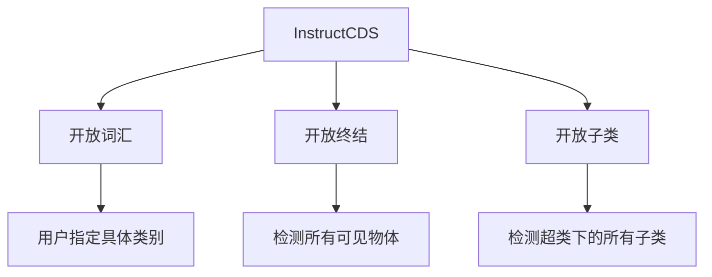

# InstructSAM论文详解：一种面向指令的免训练遥感目标识别框架

## 1. 研究背景与核心问题

### 1.1 传统方法的局限性
- **依赖显式类别提示**：现有开放词汇和视觉定位方法需要明确的类别名称
- **固定类别列表不完整**：遥感图像中物体种类繁多，任何预定义类别列表都无法覆盖所有情况
- **复杂推理能力不足**：难以处理需要上下文理解和高级推理的复杂查询

### 1.2 研究创新点
- **新任务套件**：InstructCDS（指令导向的目标计数、检测和分割）
- **首个基准**：EarthInstruct，用于遥感领域的指令导向目标识别
- **免训练框架**：InstructSAM，无需特定任务训练即可完成复杂指令

## 2. InstructCDS任务定义

### 2.1 三种设置


### 2.2 与传统方法对比
| 设置类型 | 指令示例 | 特点 |
|---------|----------|------|
| 封闭集 | 标准标注 | 使用数据集预定义类别 |
| 开放词汇 | "检测足球场、停车场" | 用户指定具体类别 |
| 开放终结 | "检测所有可见物体" | 不指定类别，检测一切 |
| 开放子类 | "检测所有运动场地" | 指定超类，检测所有子类 |

## 3. InstructSAM算法原理详解

### 3.1 整体框架架构
```
输入: 图像I + 指令P
    ↓
[LVLM计数器] → 类别{cat_j} + 数量{num_j} (语义+数量信息)
    ↓
[SAM2掩码提议] → 掩码{mask_i} (视觉信息)
    ↓
[CLIP相似度计算] → 相似度矩阵S
    ↓
[二进制整数规划] → 最优分配矩阵X
    ↓
输出: {(mask_i, cat_j)} 识别结果
```

### 3.2 核心组件详解

#### 3.2.1 LVLM指令导向计数
```python
# 结构化提示示例
{
    "Persona": "遥感图像分析专家",
    "Task": "计数特定类别的物体",
    "Instructions": ["数据集特定规则...", "类别定义..."],
    "Output": "{'category': count}"
}
```
**作用**：解析复杂指令，理解数据集特定标注规则，输出目标类别和数量。

#### 3.2.2 SAM2掩码生成
- **类无关分割**：不依赖类别信息，生成所有可能物体的掩码
- **高召回率**：通过密集点网格提示确保小物体也能被检测
- **多尺度处理**：对图像裁剪以增强小物体检测

#### 3.2.3 CLIP语义相似度计算
```math
s_{ij} = \text{cosine\_similarity} \left(
    \text{CLIP}_{\text{image}}(\text{mask}_i \times 1.2),\quad
    \text{CLIP}_{\text{text}}("a\ satellite\ image\ of\ a\ \{\text{cat}_j\}")
\right)


\text{其中：掩码区域扩大1.2倍包含上下文，} \text{cat}_j \text{表示第} j \text{个类别}


```
**创新点**：使用遥感专用的CLIP模型（GeoRSCLIP），在遥感领域有更好的表现。

### 3.3 核心算法：带计数约束的掩码-标签匹配

#### 3.3.1 问题形式化
我们有一个**优化问题**，目标是找到最好的方式把类别标签分配给掩码。

**已知条件**：
- `N`个掩码提议：`{mask_1, mask_2, ..., mask_N}`
- `M`个目标类别：`{cat_1, cat_2, ..., cat_M}`
- 每个类别的预测数量：`{num_1, num_2, ..., num_M}`
- 相似度矩阵`S`：`s_ij`表示掩码`i`与类别`j`的相似度

#### 3.3.2 二进制整数规划公式详解

##### 目标函数（公式1）：
```math
min_X ∑_{i=1}^N ∑_{j=1}^M (1 - s_ij) · x_ij
```

**通俗解释**：
- 我们要最小化总的"不相似度代价"
- `(1 - s_ij)`表示不相似度（相似度越高，这个值越小）
- `x_ij`是决策变量：1表示分配，0表示不分配
- **目标**：让相似的掩码-类别对被分配，不相似的避免分配

##### 约束条件：

**约束(2)**：每个掩码最多分配到一个类别
```math
∑_{j=1}^M x_ij ≤ 1, ∀i ∈ {1,...,N}
```
**意义**：一个物体不能同时属于多个类别，避免重复计数。

**约束(3)**：每个类别的分配数量等于预测数量（当掩码足够时）
```math
∑_{i=1}^N x_ij = num_j, ∀j ∈ {1,...,M}, 如果 N ≥ ∑_{j=1}^M num_j
```
**意义**：LVLM预测有多少个某类物体，我们就必须分配多少个掩码给这个类别。

**约束(4)**：当掩码不足时的处理
```math
∑_{i=1}^N ∑_{j=1}^M x_ij = N, 如果 N < ∑_{j=1}^M num_j
```
**意义**：如果SAM2生成的掩码数量少于总预测物体数，就把所有掩码都分配出去。

#### 3.3.3 公式的直观理解

把这个优化问题想象成**人才分配问题**：
- **掩码** = 求职者
- **类别** = 工作岗位  
- **相似度** = 求职者与岗位的匹配度
- **预测数量** = 每个岗位需要招聘的人数
- **目标**：在满足招聘人数要求的前提下，让总体人岗匹配度最高

### 3.4 算法优势分析

#### 3.4.1 免置信度阈值
传统方法问题：
```python
# 传统方法需要设置阈值
if similarity > threshold:
    accept_prediction
else:
    reject_prediction
```
**问题**：不同类别的最佳阈值不同，单一阈值会导致性能下降。

InstructSAM解决方案：
- 使用**全局计数约束**代替局部阈值
- 动态分配，无需手动调参

#### 3.4.2 推理效率
- **恒定推理时间**：不随物体数量线性增长
- **输出令牌减少89%**：相比直接生成边界框的方法
- **总运行时间减少32%**

## 4. 实验验证与结果分析

### 4.1 基准数据集
| 数据集 | 类别数 | 分辨率 | 特点 |
|--------|--------|--------|------|
| NWPU-VHR-10 | 10 | 0.08-2m | 高分辨率，小物体 |
| DIOR | 20 | 0.3-30m | 大规模，多场景 |

### 4.2 性能对比结果

#### 4.2.1 开放词汇设置
```
InstructSAM-GPT4o 在 NWPU-VHR-10 上的表现：
- 计数F1: 83.0% (最佳)
- 检测F1: 41.8% (最佳)  
- 分割F1: 26.1% (最佳)
```

#### 4.2.2 开放终结设置
相比专门训练的遥感模型，InstructSAM在计数任务上表现更优，证明其理解复杂指令的能力。

#### 4.2.3 推理时间分析
```
推理时间 vs 物体数量：
- InstructSAM: 近乎恒定 (~2.5秒)
- Qwen2.5-VL: 线性增长 (2-10秒)
- 其他方法: 线性或超线性增长
```

### 4.3 消融实验关键发现

#### 4.3.1 提示设计重要性
- 添加数据集特定指令后，车辆检测精度从11%提升到75%
- 结构化JSON提示比自由文本更稳定

#### 4.3.2 模型组件缩放
- 更大的CLIP模型带来性能提升
- 即使使用较小组件，仍优于直接检测方法

## 5. 技术贡献与意义

### 5.1 方法论创新
1. **任务定义创新**：首次系统定义指令导向的遥感目标识别任务
2. **算法框架创新**：将复杂问题分解为可处理的子问题
3. **优化 formulation**：用BIP统一视觉、语义和数量信息

### 5.2 实际应用价值
- **大规模制图**：自动化标注，降低成本
- **灾害响应**：快速分析受灾情况
- **资源监测**：贫困评估、野生动物监测等

### 5.3 局限性及未来方向
- **依赖基础模型能力**：性能受限于GPT-4o、SAM2等模型
- **几何复杂物体**：篮球场等复杂形状分割不完整
- **多模态扩展**：目前主要针对光学图像，SAR图像效果有限

## 6. 总结

InstructSAM通过巧妙的**问题分解**和**优化建模**，实现了无需训练的指令导向遥感目标识别。其核心创新在于：

1. **三阶段流水线**：计数→提议→匹配，各司其职
2. **BIP统一优化**：将视觉、语义、数量信息统一到数学框架中  
3. **免阈值设计**：用全局约束代替局部阈值，更鲁棒
4. **高效推理**：恒定时间复杂度，适合大规模应用

这项工作为开发更通用、更灵活的遥感目标识别系统奠定了重要基础，展示了基础模型组合在专业领域的巨大潜力。

# InstructSAM算法原理深度解析

## 1. 整体算法框架数学表达

InstructSAM将复杂的指令导向目标识别问题分解为三个可处理的子问题：

```math
F(I, P) = Match(Propose(I), Count(I, P))
```

其中：
- `I`: 输入图像
- `P`: 用户指令
- `Count()`: LVLM计数函数
- `Propose()`: SAM2掩码生成函数  
- `Match()`: 掩码-标签匹配函数

## 2. LVLM计数模块数学原理

### 2.1 指令解析过程
```math
{cat_j, num_j} = LVLM-Counter(I, P)
```

**数学本质**：这是一个条件概率建模问题：
```math
P({cat_j, num_j} | I, P) = ∏_{j=1}^M P(cat_j, num_j | I, P)
```

**结构化提示的作用**：
```math
P = {"Persona", "Task", "Instructions", "Output", "Examples"}
```
通过结构化提示，我们实际上在约束LVLM的输出空间，提高预测准确性。

### 2.2 类别-数量联合分布
对于每个可能的类别`c`和数量`n`：
```math
P(c, n | I, P) = softmax( f_θ(I, P)[c, n] )
```
其中`f_θ`是LVLM的推理函数，输出每个(类别,数量)对的logit。

## 3. SAM2掩码生成数学原理

### 3.1 自动掩码生成公式
SAM2使用密集点网格提示生成掩码：
```math
{mask_i} = SAM2(I; {p_k}_{k=1}^K)
```
其中`p_k`是均匀分布在图像上的提示点。

### 3.2 掩码质量评估
每个掩码`mask_i`都有一个质量分数：
```math
quality_i = f_IoU(mask_i) × f_stability(mask_i)
```
在推理时，使用阈值过滤：
```math
{mask_i | quality_i > τ_quality} = {mask_i}_{i=1}^N
```

## 4. CLIP语义相似度计算详细公式

### 4.1 图像嵌入计算
对于每个掩码区域，我们计算其CLIP嵌入：
```math
v_i = CLIP_image(crop(I, bbox(mask_i) × 1.2))
```
**扩大1.2倍的数学意义**：
```math
bbox_expanded = center_scale(bbox_original, 1.2)
```
这确保了包含足够的上下文信息，提高分类准确性。

### 4.2 文本嵌入计算
```math
t_j = CLIP_text("a satellite image of a " + cat_j)
```

### 4.3 相似度矩阵构造
```math
S ∈ ℝ^(N×M), 其中 s_ij = cosine_similarity(v_i, t_j)
```
具体计算：
```math
s_ij = (v_i · t_j) / (||v_i|| × ||t_j||)
```
由于CLIP嵌入是归一化的，上式简化为：
```math
s_ij = v_i · t_j
```

## 5. 二进制整数规划(BIP)核心算法深度解析

### 5.1 优化问题完整数学描述

#### 决策变量定义
定义二进制决策矩阵：
```math
X ∈ {0,1}^(N×M), 其中 x_ij = {
    1, 如果掩码i被分配给类别j
    0, 否则
}
```

#### 5.1.1 目标函数深度解析
```math
min_X ∑_{i=1}^N ∑_{j=1}^M (1 - s_ij) · x_ij
```

**数学变换**：
```math
原目标 = ∑∑ (1 - s_ij)x_ij 
       = ∑∑ x_ij - ∑∑ s_ij x_ij
       = 常数 - ∑∑ s_ij x_ij
```

因此，最小化`∑(1-s_ij)x_ij`等价于**最大化**`∑s_ij x_ij`。

**物理意义**：我们实际上是在最大化所有被分配对的相似度总和。

#### 5.1.2 约束条件数学含义

**约束(2)**：每个掩码最多分配到一个类别
```math
∀i ∈ {1,...,N}: ∑_{j=1}^M x_ij ≤ 1
```

**矩阵形式**：`X·1_M ≤ 1_N`，其中`1_k`是长度为k的全1向量。

**物理意义**：避免一个物体被重复计数到多个类别。

**约束(3)**：数量匹配约束（当掩码充足时）
```math
∀j ∈ {1,...,M}: ∑_{i=1}^N x_ij = num_j, 当 N ≥ ∑_{j=1}^M num_j
```

**矩阵形式**：`1_N^T · X = [num_1, ..., num_M]`

**物理意义**：确保LVLM预测的每个类别的物体数量得到满足。

**约束(4)**：掩码不足时的处理
```math
当 N < ∑_{j=1}^M num_j 时: ∑_{i=1}^N ∑_{j=1}^M x_ij = N
```

**物理意义**：当SAM2生成的掩码数量少于总预测物体数时，我们只能分配所有可用的掩码。

### 5.2 BIP问题的数学性质分析

#### 5.2.1 可行性分析
问题可行的充分条件：
- 约束(2)总是可满足（最坏情况是所有`x_ij=0`）
- 约束(3)的可满足性取决于：`N ≥ max(num_j)`且`N ≥ ∑num_j`
- 约束(4)总是可满足

#### 5.2.2 最优性条件
根据线性规划理论，该BIP问题的最优解满足：

对于被分配的每个对`(i,j)`，有：
```math
s_ij ≥ s_ik, ∀k ≠ j 且 s_ij ≥ s_lj, ∀l ≠ i
```
即每个被分配的掩码-类别对在其行和列上都是相对最优的。

### 5.3 算法求解过程

#### 5.3.1 问题预处理
```python
def preprocess_bip(N, M, S, num_j):
    total_demand = sum(num_j)
    if N >= total_demand:
        problem_type = "SUFFICIENT_MASKS"
        constraints = [constraint2, constraint3]
    else:
        problem_type = "INSUFFICIENT_MASKS" 
        constraints = [constraint2, constraint4]
    return problem_type, constraints
```

#### 5.3.2 求解算法
使用标准BIP求解器（如PuLP）：
```python
# 创建问题实例
prob = LpProblem("MaskLabelAssignment", LpMinimize)

# 定义决策变量
x = [[LpVariable(f"x_{i}_{j}", cat='Binary') for j in range(M)] for i in range(N)]

# 目标函数
prob += lpSum((1 - S[i][j]) * x[i][j] for i in range(N) for j in range(M))

# 添加约束
for i in range(N):  # 约束(2)
    prob += lpSum(x[i][j] for j in range(M)) <= 1

if problem_type == "SUFFICIENT_MASKS":
    for j in range(M):  # 约束(3)
        prob += lpSum(x[i][j] for i in range(N)) == num_j[j]
else:  # 约束(4)
    prob += lpSum(x[i][j] for i in range(N) for j in range(M)) == N
```

## 6. 与传统方法的数学对比

### 6.1 基于阈值的方法
传统CLIP-based检测：
```math
预测集合 = {(mask_i, cat_j) | s_ij > τ}
```
**问题**：最优阈值`τ`随类别和图像变化。

### 6.2 生成式方法
如Qwen2.5-VL直接生成边界框：
```math
{bbox_k, label_k} = LM-Decoder(Encoder(I, P))
```
**问题**：输出长度随物体数量线性增长，推理时间增加。

### 6.3 InstructSAM的优势数学表达

**恒定时间复杂度**：
```math
T_InstructSAM = T_LVLM + T_SAM2 + T_CLIP + T_BIP
```
其中`T_BIP`对于实际问题规模几乎是常数。

**输出压缩**：
```math
输出令牌数 ∝ M (类别数) ≪ N (物体数)
```
实现了89%的令牌减少。

## 7. 误差传播分析

### 7.1 各模块误差贡献
最终性能受三个模块误差影响：
```math
Error_total = Error_LVLM + Error_SAM2 + Error_Matching
```

#### 7.1.1 LVLM计数误差
如果LVLM低估数量：`num_j' < num_j_true`
→ 约束(3)迫使分配不足 → 漏检

如果LVLM高估数量：`num_j' > num_j_true`  
→ 当掩码充足时产生误检，不足时挤占其他类别资源

#### 7.1.2 SAM2掩码质量误差
低质量掩码导致`v_i`不准确 → `s_ij`不可靠 → 错误分配

#### 7.1.3 CLIP相似度误差
领域差异导致`s_ij`不能真实反映语义相似性

## 8. 算法泛化性分析

### 8.1 对组件模型的依赖性
算法性能下界：
```math
Performance ≥ min(Performance_LVLM, Performance_SAM2, Performance_CLIP)
```

### 8.2 扩展到其他领域
只需更换领域特定的CLIP模型：
```math
s_ij = CLIP_domain(crop(I, mask_i), text_template(cat_j))
```

## 9. 数学创新点总结

1. **问题重构**：将检测分割问题转化为带约束的分配问题
2. **多模态融合**：统一视觉、语义、数量三种信息源
3. **免阈值设计**：用全局约束替代局部决策
4. **高效优化**：利用BIP的数学性质保证最优解

这个数学框架的核心洞察是：**通过整合高层语义理解（LVLM）和低层视觉感知（SAM2），在计数约束的指导下实现精确的对象识别**。
