SAM的掩码生成机制确实巧妙，它让计算机能“读懂”图像并勾勒出物体轮廓。下面我为你梳理了其核心原理和对应的代码实现。

总结掩码生成的核心组件及其协作关系：

| 组件模块 | 核心功能 | 关键实现机制 |
| :--- | :--- | :--- |
| **图像编码器** | 提取图像特征，生成图像嵌入（Image Embedding） | 使用基于Transformer的视觉骨干网络（如ViT），将图像转换为高维特征表示。 |
| **提示编码器** | 将各种提示（点、框、掩码）转换为提示嵌入（Prompt Embedding） | 为点、框（视为点对）和掩码（通过卷积）分别设计编码方式，统一嵌入空间。 |
| **掩码解码器** | **核心**：综合图像和提示嵌入，预测输出掩码。 | 采用**Transformer解码器**，通过交叉注意力融合图像与提示信息；上采样层还原掩码分辨率；MLP预测掩码质量分数。 |
| **提示采样策略** (自动掩码生成) | 在无人工提示时，自动生成有效提示以分割图中所有物体。 | **原始SAM**：在图像上生成密集的**网格点**作为前景点提示。 **改进方案**(如MobileSAMv2)：使用**目标检测器**(如YOLOv8)生成**目标感知的框提示**，提升效率。 |

### 🔄 掩码生成的工作流程

上述组件是如何协作生成掩码的呢？下图清晰地展示了这一过程：

```mermaid
flowchart TD
    A[输入图像] -->|图像编码器| B[图像嵌入]
    C[提示<br>点/框/自动生成] -->|提示编码器| D[提示嵌入]
    
    B & D --> E{掩码解码器}
    
    subgraph E [掩码解码器]
        E1[Transformer解码器<br>交叉注意力融合特征] --> E2[上采样层<br>还原掩码分辨率] --> E3[质量预测MLP<br>输出掩码与分数]
    end
    
    E --> F[输出: 最终掩码]
    
    G[自动掩码生成<br>可选循环] --> C
```



这个过程可以分为两种主要模式：

 **交互式分割 (SegAny)**：如流程图左侧路径所示，当你提供点或框等提示时，模型会基于该特定提示生成一个或多个候选掩码及其质量分数。
  **自动分割 (SegEvery)**：如流程图右侧循环所示，当没有人工提示时，模型会使用**提示采样策略**（例如网格点或目标检测框）自动生成大量提示。对于每一个候选提示，都会经过上述流程生成候选掩码，最后再通过**非极大值抑制（NMS）** 等后处理步骤过滤掉高度重叠的掩码，输出最终结果。

### 🔍 深入代码实现

理解原理后，如果想深入代码细节，可以重点关注以下文件（以官方SAM仓库为例）：

| 代码文件 | 功能描述 |
| :--- | :--- |
| `modeling/mask_decoder.py` | **掩码解码器核心实现**，包括Transformer结构、上采样、MLP头。 |
| `modeling/prompt_encoder.py` | **提示编码器**，处理点、框、掩码的编码。 |
| `modeling/sam.py` | **SAM模型整体结构**，整合图像编码器、提示编码器、掩码解码器。 |
| `utils/amg.py` | **自动掩码生成（AMG）** 的具体实现，包含提示点网格生成、掩码后处理（如NMS）等。 |

在阅读代码时，建议你重点关注 `mask_decoder.py` 中的 `forward` 函数，以及 `amg.py` 中生成提示点和过滤掩码的逻辑。一些基于SAM的第三方库（如 `samtool`）对原始接口进行了封装，可能更易于理解和使用。

### 💡 关键机制与改进

-   **效率瓶颈与优化**：原始的自动掩码生成因依赖密集的网格点提示和多次运行掩码解码器而**较慢**。改进方案如**MobileSAMv2**采用**目标检测器生成目标感知的框提示**，直接生成有效提示，避免了大量冗余计算，据报道掩码解码速度可提升**16倍**。
-   **掩码质量评估**：掩码解码器会为每个生成的掩码预测一个**质量分数**（如 `predict_iou`），这有助于在自动生成的大量掩码中筛选出高质量的结果。


## 多掩码输出机制详解

### 1. 设计初衷：处理模糊性

当用户只提供一个点提示时，这个点可能对应**多个合理的分割结果**：

```python
# 例如用户点击在"人"的区域
input_point = [[450, 300]]  # 点击在一个人像上
input_label = [1]           # 前景点

# 可能的三种解释：
# 1. 整个人体
# 2. 上半身  
# 3. 头部区域
```

### 2. 三个掩码的具体含义

每个掩码代表对提示的**不同尺度或范围**的解释：

| 掩码 | 通常含义 | 适用场景 | 示例 |
|------|----------|----------|------|
| **Mask 1** | **最完整对象**<br>（最大范围） | 需要整个物体 | 整个人、整辆车 |
| **Mask 2** | **中等范围**<br>（部分对象） | 物体主要部分 | 上半身、车体外壳 |
| **Mask 3** | **最小范围**<br>（核心区域） | 精细分割 | 头部、车轮 |

### 3. 代码层面的实现

```python
def predict(
    self,
    point_coords: Optional[np.ndarray] = None,
    point_labels: Optional[np.ndarray] = None,
    box: Optional[np.ndarray] = None,
    mask_input: Optional[np.ndarray] = None,
    multimask_output: bool = True,  # 关键参数！
    return_logits: bool = False,
):
    """
    multimask_output: 
        - True: 输出3个掩码处理模糊性
        - False: 输出1个最佳掩码
    """
```

### 4. 实际案例分析

让我们通过具体例子来理解：

```python
import matplotlib.pyplot as plt

def demonstrate_multimask(image, point_coords, point_labels):
    masks, scores, logits = predictor.predict(
        point_coords=point_coords,
        point_labels=point_labels, 
        multimask_output=True
    )
    
    # 可视化三个掩码
    fig, axes = plt.subplots(1, 4, figsize=(20, 5))
    
    # 原图
    axes[0].imshow(image)
    axes[0].scatter(point_coords[:, 0], point_coords[:, 1], 
                   color='red', marker='*', s=200, edgecolor='white')
    axes[0].set_title('Original Image with Prompt')
    
    # 三个掩码
    for i, (mask, score) in enumerate(zip(masks, scores)):
        axes[i+1].imshow(image)
        show_mask(mask, axes[i+1])
        axes[i+1].set_title(f'Mask {i+1}\nScore: {score:.3f}')
        axes[i+1].axis('off')
    
    plt.tight_layout()
    plt.show()
    
    return masks, scores

# 使用示例
masks, scores = demonstrate_multimask(image, input_point, input_label)
```

### 5. 三个掩码的生成原理

#### 5.1 模型内部机制

```python
# 在掩码解码器中
class MaskDecoder(nn.Module):
    def __init__(self):
        # 输出3个掩码token
        self.num_mask_tokens = 3  # 关键！
        
    def forward(self, image_embeddings, prompt_embeddings):
        # 同时生成3个掩码预测
        masks = []
        iou_predictions = []
        
        for mask_token in self.mask_tokens:  # 3个不同的token
            mask, iou_pred = self.predict_masks(
                image_embeddings, prompt_embeddings, mask_token
            )
            masks.append(mask)
            iou_predictions.append(iou_pred)
            
        return torch.stack(masks), torch.stack(iou_predictions)
```

#### 5.2 训练策略

SAM 在训练时通过以下方式学习三个不同的掩码：

```python
# 伪代码表示训练过程
for training_mask in dataloader:
    # 对每个真实掩码，生成多个尺度的变体
    full_mask = training_mask                    # 完整掩码
    medium_mask = erode_mask(training_mask)      # 腐蚀后的掩码  
    small_mask = erode_mask(medium_mask)         # 进一步腐蚀
    
    # 让三个输出头分别学习不同尺度
    pred_masks, pred_scores = model(prompt)
    
    loss1 = compute_loss(pred_masks[0], full_mask)
    loss2 = compute_loss(pred_masks[1], medium_mask) 
    loss3 = compute_loss(pred_masks[2], small_mask)
    
    total_loss = loss1 + loss2 + loss3
```

### 6. 评分机制解析

分数 `score` 表示模型对每个掩码质量的置信度：

```python
# 评分基于多个因素：
def calculate_mask_score(mask, image_embedding, prompt_embedding):
    # 1. IoU 预测（与"理想掩码"的预估重叠率）
    iou_score = iou_prediction_head(mask_features)
    
    # 2. 稳定性分数（在不同dropout下的稳定性）
    stability = calculate_stability(mask)
    
    # 3. 与图像特征的匹配度
    feature_similarity = compute_similarity(mask, image_embedding)
    
    final_score = combine_scores(iou_score, stability, feature_similarity)
    return final_score
```

### 7. 实际应用建议

#### 7.1 如何选择掩码

```python
def select_best_mask(masks, scores, strategy="auto"):
    """
    选择最佳掩码的策略
    """
    if strategy == "highest_score":
        # 直接选择分数最高的
        best_idx = np.argmax(scores)
        return masks[best_idx]
    
    elif strategy == "balanced":
        # 平衡策略：避免过大或过小的掩码
        areas = [mask.sum() for mask in masks]
        normalized_areas = areas / np.max(areas)
        
        # 综合考虑分数和面积
        combined_scores = scores * (1 - 0.2 * np.abs(normalized_areas - 0.5))
        best_idx = np.argmax(combined_scores)
        return masks[best_idx]
    
    elif strategy == "largest":
        # 选择最大的掩码
        areas = [mask.sum() for mask in masks]
        return masks[np.argmax(areas)]
    
    elif strategy == "smallest": 
        # 选择最小的掩码
        areas = [mask.sum() for mask in masks]
        return masks[np.argmin(areas)]

# 使用示例
best_mask = select_best_mask(masks, scores, strategy="balanced")
```

#### 7.2 单掩码输出模式

如果你不需要多个选项，可以强制只输出一个掩码：

```python
# 只输出最佳掩码
single_mask, single_score, _ = predictor.predict(
    point_coords=input_point,
    point_labels=input_label,
    multimask_output=False  # 关键参数！
)

print(f"最佳掩码分数: {single_score:.3f}")
```

### 8. 不同提示类型的行为

| 提示类型 | 多掩码输出 | 说明 |
|----------|------------|------|
| **单个点** | ✅ 通常启用 | 模糊性最高，需要多个选项 |
| **多个点** | ⚠️ 可能减少 | 多个点减少了模糊性 |
| **边界框** | ❌ 通常禁用 | 框已经明确了范围，输出单个掩码 |
| **掩码+点** | ⚠️ 视情况而定 | 取决于新提示的模糊程度 |

### 总结

三个掩码的设计体现了 SAM 对视觉分割**模糊性**的深刻理解：

1. **应对不确定性**：一个点提示可能有多种合理解释
2. **提供选择余地**：用户可以根据具体需求选择最合适的尺度
3. **分数指导选择**：质量分数帮助用户做出明智决定
4. **灵活性**：可以通过 `multimask_output` 参数控制这个行为

这种设计使得 SAM 在处理真实世界的复杂场景时更加鲁棒和实用。
