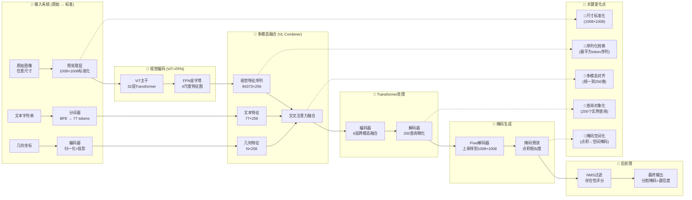

# 🔄 SAM3输入输出变化关键位置详解

## 一、输入输出变化全流程定位图



## 二、输入输出变化关键节点详解

### 1. **图像尺寸标准化** - 核心变化点①
**位置**: `sam3/model/sam3_image_processor.py` 的 `preprocess()` 方法
```python
# 关键代码位置
def preprocess(self, x: torch.Tensor) -> torch.Tensor:
    # 输入: [B, 3, H, W] (任意尺寸)
    # 处理: 1. 归一化 2. 填充/裁剪到1008×1008
    x = (x - self.pixel_mean) / self.pixel_std
    h, w = x.shape[-2:]
    padh = self.target_size - h  # target_size=1008
    padw = self.target_size - w
    x = F.pad(x, (0, padw, 0, padh))
    # 输出: [B, 3, 1008, 1008] ← 第一次重大形状变化
    return x
```
**变化本质**: 任意尺寸 → 固定尺寸1008×1008
**作用**: 统一输入规范，适配ViT的patch划分(1008/14=72整数)

### 2. **Patch序列化转换** - 核心变化点②
**位置**: `sam3/model/vitdet.py` 的 `PatchEmbed` 层
```python
# ViT的patch嵌入层
class PatchEmbed(nn.Module):
    def forward(self, x):
        # 输入: [B, 3, 1008, 1008]
        x = self.proj(x)  # 14×14卷积，stride=14
        # 输出: [B, 1024, 72, 72] (1008/14=72)
        if self.flatten:
            x = x.flatten(2).transpose(1, 2)  # [B, 5184, 1024]
        # 关键变化: 空间网格 → 序列化token
        return x
```
**数学变换**:
```
原始: [B, 3, H, W] → [B, 3, 1008, 1008]
Patch划分: 1008×1008 → (72×72)个14×14 patch
展平: [B, 1024, 72, 72] → [B, 5184, 1024]
```
**变化本质**: 2D图像 → 1D token序列
**作用**: 将空间信息转换为Transformer可处理的序列格式

### 3. **特征金字塔多尺度生成** - 核心变化点③
**位置**: `sam3/model/necks.py` 的 `Sam3DualViTDetNeck`
```python
class Sam3DualViTDetNeck(nn.Module):
    def forward(self, x):
        # 输入: [B, 1024, 72, 72] (ViT输出)
        outputs = []
        for i, (conv, bn) in enumerate(zip(self.conv_layers, self.bn_layers)):
            feat = conv(x)  # 降维到256通道
            feat = bn(feat)
            feat = F.relu(feat)
            # 尺度调整: [72,72] → [252,252]/[126,126]/[63,63]/[32,32]
            feat = F.interpolate(feat, scale_factor=self.scale_factors[i])
            outputs.append(feat)
        # 输出: 4个尺度特征图
        # [B,256,252,252], [B,256,126,126], [B,256,63,63], [B,256,32,32]
        return outputs
```
**尺度变化逻辑**:
```
基础分辨率: 72×72 (1008/14)
Level0: ×4 → 288×288 → 裁剪 → 252×252
Level1: ×2 → 144×144 → 裁剪 → 126×126  
Level2: ×1 → 72×72 → 调整 → 63×63
Level3: ×0.5 → 36×36 → 调整 → 32×32
```
**变化本质**: 单尺度 → 多尺度金字塔
**作用**: 兼顾细节(高分辨率)和语义(低分辨率)

### 4. **多模态特征维度统一** - 核心变化点④
**位置**: 多个文件协同完成
```python
# 1. 文本特征降维 - sam3/model/text_encoder_ve.py
text_features = self.text_projection(text_encoder_output)  # [B,77,1024]→[B,77,256]

# 2. 视觉特征降维 - 已在FPN中完成 (1024→256)

# 3. 几何特征投影 - sam3/model/geometry_encoders.py
point_features = self.point_proj(points)  # [N,2]→[N,256]
box_features = self.box_proj(boxes)      # [N,4]→[N,256]
```
**统一规格**:
- 视觉特征: 256通道 (FPN输出)
- 文本特征: 256维 (投影层输出)
- 几何特征: 256维 (MLP投影)
**变化本质**: 不同模态 → 统一256维特征空间
**作用**: 为跨模态注意力计算提供维度一致性

### 5. **序列化特征拼接** - 核心变化点⑤
**位置**: `sam3/model/vl_combiner.py` 的特征拼接操作
```python
def prepare_encoder_input(self, visual_feats, text_feats, geo_feats):
    # 视觉特征展平: 4个尺度 → 1个长序列
    visual_tokens = []
    for feat in visual_feats:  # [B,256,H,W]
        B, C, H, W = feat.shape
        flat = feat.flatten(2).transpose(1, 2)  # [B, H×W, C]
        visual_tokens.append(flat)
    
    visual_sequence = torch.cat(visual_tokens, dim=1)  # [B, 84373, 256]
    
    # 文本特征: [B, 77, 256]
    # 几何特征: [B, N_geo, 256]
    
    # 拼接所有提示特征
    prompt_sequence = torch.cat([text_feats, geo_feats], dim=1)  # [B, 77+N_geo, 256]
    
    return visual_sequence, prompt_sequence
```
**序列长度计算**:
```
Level0: 252×252 = 63504
Level1: 126×126 = 15876  
Level2: 63×63 = 3969
Level3: 32×32 = 1024
总计: 63504 + 15876 + 3969 + 1024 = 84373 tokens
```
**变化本质**: 空间特征图 → 长序列 + 多模态拼接
**作用**: 为Transformer编码器准备输入序列

### 6. **对象查询初始化与精化** - 核心变化点⑥
**位置**: `sam3/model/decoder.py` 的查询处理
```python
class TransformerDecoder(nn.Module):
    def __init__(self, num_queries=200, d_model=256):
        # 可学习的查询参数
        self.query_embed = nn.Embedding(num_queries, d_model)  # [200, 256]
    
    def forward(self, visual_memory, prompt_memory):
        # 初始化查询
        B = visual_memory.shape[1]
        query = self.query_embed.weight  # [200, 256]
        query = query.unsqueeze(1).expand(-1, B, -1)  # [200, B, 256]
        
        # 6层解码器精化
        for layer in self.layers:
            # 自注意力: 查询间交互
            query = layer.self_attn(query, query, query)[0]
            # 视觉交叉注意力: 查询 ← 视觉特征
            query = layer.cross_attn_visual(query, visual_memory, visual_memory)[0]
            # 文本交叉注意力: 查询 ← 文本特征
            query = layer.cross_attn_text(query, prompt_memory, prompt_memory)[0]
        
        # 输出: 精化的对象查询 [200, B, 256]
        return query
```
**变化本质**: 固定参数 → 实例感知的特征
**作用**: 200个查询学习代表200个潜在对象实例

### 7. **掩码空间化生成** - 核心变化点⑦
**位置**: `sam3/model/maskformer_segmentation.py` 的掩码预测
```python
class UniversalSegmentationHead(nn.Module):
    def forward(self, queries, pixel_features):
        """
        queries: [B, 200, 256] - 对象查询特征
        pixel_features: [B, 256, H, W] - Pixel解码器输出 (H=W=1008)
        """
        # 1. 查询特征映射到掩码嵌入
        mask_embed = self.mask_embed(queries)  # [B, 200, 256]
        
        # 2. 点积计算相似度 (关键操作!)
        masks = torch.einsum("bqc,bchw->bqhw", mask_embed, pixel_features)
        # 数学解释: 对于每个查询q和每个位置(h,w)
        # mask[q,h,w] = Σ_c mask_embed[q,c] × pixel_features[c,h,w]
        
        # 3. 上采样到原始分辨率
        masks = F.interpolate(masks, size=(1008, 1008), mode='bilinear')
        
        # 输出: [B, 200, 1008, 1008] - 200个候选掩码
        return masks
```
**数学变换**:
```
输入: 
  Q ∈ ℝ^{B×200×256}  (查询特征)
  P ∈ ℝ^{B×256×1008×1008} (像素特征)
  
计算:
  对于每个batch b, 每个查询 q:
    M[b,q,h,w] = Σ_{c=1}^{256} Q[b,q,c] × P[b,c,h,w]
    
输出: M ∈ ℝ^{B×200×1008×1008}
```
**变化本质**: 向量查询 → 空间掩码
**作用**: 将抽象的查询特征转换为具体的空间分割结果

### 8. **后处理筛选** - 核心变化点⑧
**位置**: `sam3/model/sam3_image.py` 的后处理函数
```python
def postprocess_masks(self, masks, presence_scores, iou_pred):
    """
    masks: [B, 200, 1008, 1008] - 原始200个掩码
    presence_scores: [B, 200] - 存在性分数
    iou_pred: [B, 200] - IoU预测分数
    """
    B, N, H, W = masks.shape
    
    # 1. 基于存在性分数过滤
    valid_mask = presence_scores > self.presence_threshold  # 默认0.5
    # valid_mask: [B, 200]布尔张量
    
    # 2. 计算每个掩码的边界框 (用于NMS)
    boxes = masks_to_boxes(masks)  # [B, 200, 4]
    
    # 3. 非极大值抑制 (NMS)
    keep_indices = batched_nms(
        boxes, 
        presence_scores, 
        torch.arange(B).repeat_interleave(N),
        iou_threshold=self.nms_threshold  # 默认0.5
    )
    
    # 4. 选择top-k结果
    final_masks = masks[:, keep_indices[:self.max_detections]]  # 默认max_detections=100
    # 输出: [B, K, 1008, 1008], K ≤ 100
    
    return final_masks
```
**变化本质**: 200候选 → K个最终结果
**作用**: 过滤低质量预测，消除重叠，输出最可信的分割结果

## 三、关键变化点总结表

| 变化点 | 所在模块 | 输入形状 | 输出形状 | 变化本质 | 技术实现 |
|--------|----------|----------|----------|----------|----------|
| **①尺寸标准化** | `sam3_image_processor.py` | [B,3,H,W] | [B,3,1008,1008] | 任意尺寸→固定尺寸 | 填充/裁剪+归一化 |
| **②Patch序列化** | `vitdet.py/PatchEmbed` | [B,3,1008,1008] | [B,5184,1024] | 2D图像→1D序列 | 14×14卷积+展平 |
| **③多尺度金字塔** | `necks.py/Sam3DualViTDetNeck` | [B,1024,72,72] | 4尺度[B,256,H,W] | 单尺度→多尺度 | 上采样+卷积降维 |
| **④维度统一** | 多模块协同 | 混合维度 | 统一256维 | 多模态对齐 | 投影层/卷积降维 |
| **⑤序列拼接** | `vl_combiner.py` | 多尺度特征 | [B,84373,256] | 空间→序列 | 展平+拼接 |
| **⑥对象查询** | `decoder.py` | 编码器输出 | [200,B,256] | 特征→实例 | 可学习查询+注意力 |
| **⑦掩码生成** | `maskformer_segmentation.py` | [B,200,256] + [B,256,1008,1008] | [B,200,1008,1008] | 向量→空间 | 点积相似度 |
| **⑧后处理筛选** | `sam3_image.py` | [B,200,1008,1008] | [B,K,1008,1008] | 200→K结果 | NMS+阈值过滤 |

## 四、数据流形状变化全链条

### 完整形状演变路径：
```
原始输入:
  图像: [B, 3, H, W] (任意尺寸)
  文本: List[str] (自然语言)
  几何: [N, 2]/[N, 4] (坐标)

阶段1: 输入标准化
  ↓ 图像预处理
  图像: [B, 3, 1008, 1008] ← 变化点①
  ↓ 文本分词
  文本: [B, 77] (token IDs)
  ↓ 几何编码
  几何: [B, N, 256]

阶段2: 特征提取
  ↓ ViT编码
  视觉: [B, 1024, 72, 72]
  ↓ FPN多尺度
  视觉: [ [B,256,252,252], [B,256,126,126], [B,256,63,63], [B,256,32,32] ] ← 变化点③
  ↓ 文本编码器
  文本: [B, 77, 256] ← 变化点④(部分)
  ↓ 几何编码器
  几何: [B, N, 256] ← 变化点④(部分)

阶段3: 多模态融合
  ↓ 特征展平
  视觉序列: [B, 84373, 256] ← 变化点⑤
  ↓ 提示拼接
  提示序列: [B, 77+N, 256] ← 变化点⑤

阶段4: Transformer处理
  ↓ 编码器(6层)
  视觉记忆: [B, 84373, 256]
  ↓ 解码器(6层)
  对象查询: [B, 200, 256] ← 变化点⑥

阶段5: 掩码生成
  ↓ Pixel解码器
  像素特征: [B, 256, 1008, 1008]
  ↓ 掩码预测(点积)
  原始掩码: [B, 200, 1008, 1008] ← 变化点⑦

阶段6: 后处理
  ↓ 存在性过滤+NMS
  最终掩码: [B, K, 1008, 1008] ← 变化点⑧ (K≤100)
  ↓ 输出整理
  结果: {
    "masks": [B, K, 1008, 1008],
    "scores": [B, K],
    "boxes": [B, K, 4]
  }
```

## 五、核心变换的技术意义

### 1. **序列化变换的意义**
- **技术实现**: 2D卷积特征 → 1D序列
- **设计目的**: 适配Transformer架构
- **优势**: 打破空间局部性限制，实现全局信息交互

### 2. **多尺度金字塔的意义**
- **技术实现**: 上采样+降维生成4尺度
- **设计目的**: 兼顾细节与语义
- **优势**: Level0(252×252)捕捉细节，Level3(32×32)提供全局上下文

### 3. **统一256维的意义**
- **技术实现**: 所有模态投影到256维
- **设计目的**: 跨模态注意力计算
- **优势**: 维度一致使注意力权重点积计算可行

### 4. **对象查询机制的意义**
- **技术实现**: 200个可学习查询向量
- **设计目的**: 实例感知的特征学习
- **优势**: 每个查询学习特定对象模式，实现one-to-many预测

### 5. **点积掩码生成的意义**
- **技术实现**: 查询向量 × 像素特征
- **设计目的**: 将语义匹配转换为空间分割
- **优势**: 避免了传统分割头的参数冗余，查询驱动式生成

## 六、模块间的形状契约

SAM3各模块通过明确的形状契约相互连接：

### 输入契约：
```python
# 图像处理器契约
输入: [B, 3, H, W] (H,W任意)
输出: [B, 3, 1008, 1008]

# ViT契约  
输入: [B, 3, 1008, 1008]
输出: [B, 1024, 72, 72]

# FPN契约
输入: [B, 1024, 72, 72]
输出: 4尺度特征图列表

# 文本编码器契约
输入: [B, 77] (token IDs)
输出: [B, 77, 256]

# 几何编码器契约
输入: [B, N, 2/4] (坐标)
输出: [B, N, 256]
```

### 融合契约：
```python
# VL Combiner契约
视觉输入: 4尺度特征图列表
文本输入: [B, 77, 256]
几何输入: [B, N, 256]
输出: 
  视觉序列: [B, 84373, 256]
  提示序列: [B, 77+N, 256]

# 编码器契约
视觉输入: [B, 84373, 256]
提示输入: [B, 77+N, 256]
输出: [B, 84373, 256] (增强视觉特征)

# 解码器契约
记忆输入: [B, 84373, 256] (编码器输出)
输出: [B, 200, 256] (对象查询)
```

### 输出契约：
```python
# Pixel解码器契约
输入: 4尺度特征图列表
输出: [B, 256, 1008, 1008]

# 分割头契约
查询输入: [B, 200, 256]
像素输入: [B, 256, 1008, 1008]
输出: [B, 200, 1008, 1008]

# 后处理器契约
输入: [B, 200, 1008, 1008] + [B, 200] (分数)
输出: [B, K, 1008, 1008] (K≤100)
```

这种明确的形状契约保证了模块间的无缝衔接，每个模块只需关注自己的输入输出规范，无需了解其他模块的内部实现。

## 七、总结

SAM3的输入输出变化是一个**精心设计的渐进式转换过程**，从原始的多模态输入逐步转换为统一的分割掩码输出。关键的8个变化点分布在不同的网络层，每个变化点都承担着特定的语义转换任务：

1. **标准化**：统一输入规格
2. **序列化**：适配Transformer
3. **多尺度化**：丰富特征表示
4. **维度对齐**：实现跨模态交互
5. **序列拼接**：准备注意力计算
6. **对象化**：学习实例特征
7. **空间化**：生成分割掩码
8. **筛选化**：输出最优结果

这些变化点共同构成了SAM3从"像素到掩码"的完整转换路径，每一个变化都是模型能够实现高质量多模态分割的关键所在。理解这些变化点的位置和原理，对于深入理解SAM3的工作机制和进行模型改进都至关重要。

# SAM3模型超详解：从像素到掩码的完全解析

## 🔍 一、输入系统：多模态信息的精密接收

### 1.1 图像输入：像素级预处理

**原始输入数据流：**
```
相机/图像源 → 原始像素矩阵 → 预处理流水线
```

**具体处理步骤详解：**

1. **尺寸调整算法：**
   ```python
   # 输入: 任意尺寸的RGB图像
   # 目标: 1008×1008像素 (1008能被14整除，适配ViT的patch处理)
   # 方法: 双线性插值算法保持几何不变性
   image = resize(original_image, (1008, 1008), interpolation='bilinear')
   ```

2. **数值标准化流程：**
   ```
   原始像素值: [0, 255] (uint8整数)
        ↓
   归一化为浮点数: [0.0, 1.0] (float32)
        ↓
   去中心化: 减去均值[0.485, 0.456, 0.406]
        ↓
   标准化: 除以标准差[0.229, 0.224, 0.225]
        ↓
   最终数值范围: [-1.0, 1.0] (利于神经网络处理)
   ```

3. **内存布局优化：**
   ```
   原始格式: [高度, 宽度, 通道] (HWC) → 1024×1024×3 ≈ 3.15MB
   转换格式: [批次, 通道, 高度, 宽度] (BCHW) → [1, 3, 1008, 1008] ≈ 12.2MB
   ↑
   这种布局适配PyTorch的卷积操作，提高GPU计算效率
   ```

### 1.2 文本输入：语义级编码

**分词系统的运作机制：**

```
自然语言: "a brown dog sitting on the grass"
        ↓
分词器处理流程:
1. 规范化: 转换为小写，去除标点
2. 子词切分: 使用BPE(Byte-Pair Encoding)算法
   - "sitting" → ["sitt", "ing"]
   - "brown" → ["brown"]
3. 添加特殊token:
   - 开始标记 <SOS>: 指示序列开始
   - 结束标记 <EOS>: 指示序列结束
4. 填充到77个token: 
   - 77是根据CLIP模型设计的最优长度
   - 短序列用<pad>填充，长序列截断
```

**Token ID映射表示例：**
```python
# 词汇表的一部分
vocab = {
    "<SOS>": 49406,   # Start of Sequence
    "<EOS>": 49407,   # End of Sequence  
    "<PAD>": 0,       # Padding token
    "a": 320,
    "brown": 3582,
    "dog": 1929,
    "sitting": 5118,
    "on": 533,
    "the": 518,
    "grass": 3897
}

# 最终token序列
token_ids = [49406, 320, 3582, 1929, 5118, 533, 518, 3897, 49407]
        + [0] × 68  # 填充到77长度
```

### 1.3 几何提示：空间信息编码

**点提示编码的数学原理：**

```
输入: 归一化坐标 (x, y) ∈ [0, 1]²
标签: l ∈ {0, 1} (0:负例，1:正例)

编码过程:
1. 坐标投影: f_c(x,y) = W_c * [x, y] + b_c
   - W_c ∈ ℝ²ˣ²⁵⁶, b_c ∈ ℝ²⁵⁶
   - 将2D坐标线性映射到256维空间

2. 位置编码: 采用正弦余弦编码
   PE(pos, 2i) = sin(pos / 10000^(2i/d))
   PE(pos, 2i+1) = cos(pos / 10000^(2i/d))
   - pos: 位置坐标
   - i: 维度索引
   - d: 特征维度(256)

3. 标签嵌入: 正例和负例使用不同的可学习嵌入向量
   e_label = { E_positive if l=1 else E_negative }
```

**RoI池化详解：**
```
RoI (Region of Interest)池化是一种从特征图中提取固定大小特征的技术

输入: 
- 特征图 F ∈ ℝ^{C×H×W} (通道×高度×宽度)
- 边界框 [x_min, y_min, x_max, y_max]

处理过程:
1. 将RoI划分为固定大小的网格(如7×7)
2. 在每个网格单元内进行最大池化或平均池化
3. 输出固定尺寸的特征图(如7×7×C)

数学表达:
设RoI大小为h×w，目标大小为H'×W'
每个网格单元的大小 = (h/H', w/W')
在网格内取最大值 → 输出特征

为什么用RoI池化？
- 处理不同尺寸的输入区域
- 输出固定尺寸便于后续全连接层处理
- 保持空间信息的同时减少维度
```

## 🧩 二、Patch投影：视觉信息的结构化编码

### 2.1 图像分块的数学原理

**卷积操作的等价性：**
```
将14×14的卷积核应用于图像，步长为14
等价于将图像划分为不重叠的14×14小块

数学证明:
输入图像 I ∈ ℝ^{H×W×C} (H=1008, W=1008, C=3)
卷积核 K ∈ ℝ^{14×14×C×D} (D=1024为输出通道)
输出特征 O ∈ ℝ^{H'×W'×D} (H'=72, W'=72)

计算公式:
O[i,j,d] = Σ_{c=1}^C Σ_{p=0}^{13} Σ_{q=0}^{13} I[14i+p, 14j+q, c] · K[p,q,c,d]

这恰好是:
1. 提取第(i,j)个14×14图像块
2. 与所有D个滤波器进行点积
3. 得到该位置的D维特征向量
```

**视觉化的分块过程：**
```
原始图像 (1008×1008):
┌───┬───┬───┬───┬───┐
│P₀₀│P₀₁│P₀₂│...│P₀₇₁│
├───┼───┼───┼───┼───┤
│P₁₀│P₁₁│P₁₂│...│P₁₇₁│
├───┼───┼───┼───┼───┤
│...│...│...│...│...│
├───┼───┼───┼───┼───┤
│P₇₁₀│P₇₁₁│P₇₁₂│...│P₇₁₇₁│
└───┴───┴───┴───┴───┘
每个Pᵢⱼ是14×14×3=588维的patch

转换为序列:
[P₀₀(588维), P₀₁, ..., P₀₇₁, P₁₀, ..., P₇₁₇₁] → 5184个patch

线性投影:
每个588维patch → 通过1024个滤波器 → 1024维向量

最终: 5185 × 1024维矩阵，还需要加上一个记录全局信息的CLS Token（1 × 1024）
```

### 2.2 CLS Token的设计哲学

**CLS Token的功能解析：**
```
1. 全局信息聚合器:
   CLS token通过自注意力机制与所有patch交互
   数学上: CLS_attention = softmax(Q_cls · K_patches^T / √d) · V_patches
   CLS token最终包含所有patch的加权组合信息

2. 多模态对齐锚点:
   文本特征和图像特征在CLS token处对齐
   形成统一的语义空间

3. 下游任务接口:
   分类任务: 直接使用CLS token特征
   检测任务: CLS token提供全局上下文
```

## 🌉 三、特征金字塔网络(FPN)深度解析

### 3.1 FPN架构原理

**FPN的定义与作用：**
```
FPN (Feature Pyramid Network) 特征金字塔网络
是一种多尺度特征提取架构，能够在不同分辨率上
提取并融合特征，兼顾细节信息和语义信息。

为什么需要FPN？
1. 小物体需要高分辨率细节（大特征图）
2. 大物体需要强语义信息（小特征图）
3. 不同尺度的物体需要不同感受野
```

**SAM3的FPN实现细节：**

```python
class SAM3FPN(nn.Module):
    def __init__(self, in_channels=1024, out_channels=256):
        super().__init__()
        # 1x1卷积降维
        self.conv_layers = nn.ModuleList([
            nn.Conv2d(in_channels, out_channels, 1) for _ in range(4)
        ])
        
        # 批归一化
        self.bn_layers = nn.ModuleList([
            nn.BatchNorm2d(out_channels) for _ in range(4)
        ])
        
        # 不同尺度的缩放因子
        self.scale_factors = [4.0, 2.0, 1.0, 0.5]
        
    def forward(self, x):
        # x: [1, 1024, 72, 72]
        outputs = []
        
        for i, (conv, bn) in enumerate(zip(self.conv_layers, self.bn_layers)):
            # 降维处理
            feat = conv(x)  # [1, 256, 72, 72]
            feat = bn(feat)
            feat = F.relu(feat)
            
            # 尺度调整
            scale = self.scale_factors[i]
            if scale != 1.0:
                feat = F.interpolate(feat, scale_factor=scale, mode='bilinear')
            
            # 裁剪到目标尺寸
            target_size = self.calculate_target_size(i)
            feat = self.crop_to_size(feat, target_size)
            
            outputs.append(feat)
        
        return outputs  # 4个不同尺度的特征图
```

**尺度计算与裁剪逻辑：**
```
输入图像尺寸: 1008×1008
Patch大小: 14×14
基础特征图: 72×72 (1008/14)

金字塔层级计算:
Level 0: 放大4倍 → 72×4 = 288 → 裁剪到252×252
        解释: 252 = 1008/4，保持与原始图像的比例关系
Level 1: 放大2倍 → 72×2 = 144 → 裁剪到126×126
        解释: 126 = 1008/8
Level 2: 原始尺寸 → 72×1 = 72 → 调整为63×63
        解释: 63 = 1008/16，层级间对齐
Level 3: 缩小2倍 → 72×0.5 = 36 → 调整为32×32
        解释: 32 = 1008/32

裁剪策略: 中心裁剪
if H_current > H_target:
    start = (H_current - H_target) // 2
    end = start + H_target
    feature = feature[:, :, start:end, start:end]
```

## 🔤 四、文本编码器的内部机制

### 4.1 Transformer编码器层详解

**单层Transformer的完整计算流程：**

```python
class TransformerEncoderLayer(nn.Module):
    def __init__(self, d_model=1024, n_head=12, dim_feedforward=4096):
        super().__init__()
        # 多头注意力机制
        self.self_attn = nn.MultiheadAttention(d_model, n_head)
        
        # 前馈网络
        self.linear1 = nn.Linear(d_model, dim_feedforward)
        self.linear2 = nn.Linear(dim_feedforward, d_model)
        
        # 归一化层
        self.norm1 = nn.LayerNorm(d_model)
        self.norm2 = nn.LayerNorm(d_model)
        
        # Dropout防止过拟合
        self.dropout = nn.Dropout(0.1)
        
    def forward(self, src):
        # src: [seq_len, batch_size, d_model]
        
        # 残差连接1
        src2 = self.norm1(src)
        
        # 自注意力计算
        # Q, K, V都来自src2
        src2, _ = self.self_attn(src2, src2, src2)
        src = src + self.dropout(src2)  # 残差连接
        
        # 残差连接2
        src2 = self.norm2(src)
        
        # 前馈网络
        src2 = self.linear2(F.relu(self.linear1(src2)))
        src = src + self.dropout(src2)  # 残差连接
        
        return src
```

**注意力机制的数学原理：**
```
多头注意力计算步骤:

1. 线性投影:
   Q = XW_Q, K = XW_K, V = XW_V
   W_Q, W_K, W_V ∈ ℝ^{d_model×d_k}

2. 缩放点积注意力:
   Attention(Q,K,V) = softmax(QK^T/√d_k)V

3. 多头组合:
   MultiHead(Q,K,V) = Concat(head_1,...,head_h)W_O
   其中 head_i = Attention(QW_Q^i, KW_K^i, VW_V^i)

为什么用多头？
- 每个头可以学习不同的注意力模式
- 有的头关注局部信息，有的头关注全局信息
- 并行计算提高效率
```

### 4.2 位置编码的重要性

**可学习位置编码的实现：**
```
传统Transformer使用正弦位置编码:
PE(pos,2i) = sin(pos/10000^(2i/d_model))
PE(pos,2i+1) = cos(pos/10000^(2i/d_model))

SAM3采用可学习位置编码:
位置嵌入表: embedding_table ∈ ℝ^{max_len×d_model}
对于第pos个位置: pos_embed = embedding_table[pos]

优点:
- 更灵活，可以学习数据特有的位置模式
- 无需手动设计频率参数
- 训练时自动优化
```

## 🔢 五、几何编码的数学基础

### 5.1 点提示编码的完整流程

```python
def encode_point_prompt(self, point_coords, point_labels, image_features):
    """
    点提示编码器
    
    参数:
        point_coords: [N, 2] 归一化坐标
        point_labels: [N] 0表示负例，1表示正例
        image_features: [C, H, W] 图像特征
    
    返回:
        point_features: [N, 256] 点特征
    """
    N = point_coords.shape[0]
    
    # 1. 坐标投影
    # 将2D坐标映射到256维空间
    coord_features = self.coord_proj(point_coords)  # [N, 256]
    
    # 2. 从图像特征中采样
    # 将归一化坐标转换为特征图坐标
    feat_coords = point_coords * torch.tensor([image_features.shape[2], 
                                               image_features.shape[1]])
    
    # 双线性插值采样
    sampled_features = F.grid_sample(
        image_features.unsqueeze(0),
        feat_coords.unsqueeze(1).unsqueeze(2),
        mode='bilinear',
        align_corners=False
    ).squeeze()  # [N, 256]
    
    # 3. 位置编码
    # 使用正弦编码或可学习编码
    pos_features = self.position_encoding(point_coords)  # [N, 256]
    
    # 4. 标签嵌入
    # 正例和负例使用不同的嵌入
    label_features = self.label_embedding(point_labels.long())  # [N, 256]
    
    # 5. 特征融合
    point_features = (coord_features + 
                     sampled_features + 
                     pos_features + 
                     label_features)
    
    # 6. 线性变换调整
    point_features = self.output_proj(point_features)  # [N, 256]
    
    return point_features
```

### 5.2 双线性插值的数学原理

```
双线性插值是一种在二维网格上进行插值的方法

已知四个点: Q₁₁=(x₁,y₁), Q₁₂=(x₁,y₂), Q₂₁=(x₂,y₁), Q₂₂=(x₂,y₂)
对应的值: f(Q₁₁), f(Q₁₂), f(Q₂₁), f(Q₂₂)

要插值的点: P=(x,y), 其中 x₁≤x≤x₂, y₁≤y≤y₂

计算步骤:
1. 在x方向线性插值:
   f(R₁) = (x₂-x)/(x₂-x₁)·f(Q₁₁) + (x-x₁)/(x₂-x₁)·f(Q₂₁)
   f(R₂) = (x₂-x)/(x₂-x₁)·f(Q₁₂) + (x-x₁)/(x₂-x₁)·f(Q₂₂)

2. 在y方向线性插值:
   f(P) = (y₂-y)/(y₂-y₁)·f(R₁) + (y-y₁)/(y₂-y₁)·f(R₂)

在特征图采样中的应用:
- 将连续坐标映射到离散的特征图网格
- 计算周围四个特征点的加权平均
- 保证采样的连续性和可微性
```

## 🧩 六、特征融合阶段：多模态信息的深度整合与形状演化

### 6.1 融合前的特征准备：形状对齐与维度统一

**输入特征的形状整理：**

```
第一阶段：特征预处理
┌─────────────────────────────────────────────────────────────┐
│ 视觉特征准备:                                                │
│ 原始输入: [1024, 72, 72] (来自ViT主干网络)                   │
│    ↓ FPN处理 (四个尺度)                                      │
│ Level0: [256, 252, 252]   → 展平 → [1, 63504, 256]          │
│ Level1: [256, 126, 126]   → 展平 → [1, 15876, 256]          │
│ Level2: [256, 63, 63]     → 展平 → [1, 3969, 256]           │
│ Level3: [256, 32, 32]     → 展平 → [1, 1024, 256]           │
│                                                              │
│ 拼接操作: concat(level0, level1, level2, level3)            │
│    ↓                                                         │
│ 视觉序列: [1, 63504+15876+3969+1024, 256] = [1, 84373, 256] │
├─────────────────────────────────────────────────────────────┤
│ 文本特征准备:                                                │
│ 原始输入: [1, 77, 1024] (来自CLIP文本编码器)                │
│    ↓ 降维投影                                                │
│ 文本特征: [1, 77, 256]                                      │
├─────────────────────────────────────────────────────────────┤
│ 几何特征准备:                                                │
│ 点提示: [N_points, 2] → 编码 → [N_points, 256]              │
│ 框提示: [N_boxes, 4] → 编码 → [N_boxes, 256]                │
│    ↓ 拼接                                                    │
│ 几何特征: [N_geo, 256] (N_geo = N_points + N_boxes)         │
└─────────────────────────────────────────────────────────────┘
```

**维度对齐的关键步骤：**
```
所有特征统一到256维的原因:
1. 计算效率: 统一的维度减少矩阵运算的复杂度
2. 特征兼容: 确保不同模态的特征在同一语义空间
3. 注意力机制: 多头注意力要求Q、K、V维度一致

投影层的具体实现:
文本投影: Linear(1024 → 256)
视觉投影: 已在FPN中通过1×1卷积完成(1024 → 256)
几何投影: 通过MLP将坐标映射到256维
```

### 6.2 早期融合：文本语义注入视觉特征

**具体操作步骤详解：**

```
输入: 
- 视觉特征: V = [1, 84373, 256] (展平后的多尺度特征)
- 文本特征: T = [1, 77, 256]
- 几何特征: G = [N_geo, 256]

步骤1: 文本特征全局池化
T_pooled = mean(T, dim=1)  # 在token维度取平均
形状变化: [1, 77, 256] → [1, 256]

步骤2: 将全局文本特征添加到视觉特征中
# 需要将视觉特征恢复到空间格式进行加法操作
V_spatial_level0 = V[..., :63504, :].reshape(1, 256, 252, 252)
V_spatial_level1 = V[..., 63504:63504+15876, :].reshape(1, 256, 126, 126)
V_spatial_level2 = V[..., 63504+15876:63504+15876+3969, :].reshape(1, 256, 63, 63)
V_spatial_level3 = V[..., -1024:, :].reshape(1, 256, 32, 32)

# 广播相加操作
for level in [V_spatial_level0, V_spatial_level1, V_spatial_level2, V_spatial_level3]:
    level = level + T_pooled.unsqueeze(-1).unsqueeze(-1)  # [1,256,1,1] → 广播到[H,W]
    
形状变化:
每个视觉特征图: [1, 256, H, W] → 保持不变，但每个位置的值更新了
物理意义: 每个像素都获得了相同的文本语义偏置
```

**数学公式解释：**
```
设视觉特征图为 V ∈ ℝ^{B×C×H×W}，其中B=1, C=256
设文本全局特征为 t ∈ ℝ^{B×C}

更新公式: V'[b,c,h,w] = V[b,c,h,w] + t[b,c]

这等价于: V' = V + t ⊗ 𝟙_{H×W}
其中𝟙_{H×W}是全1矩阵，⊗表示外积

效果: 无论像素位置如何，都添加相同的文本语义信息
```

### 6.3 中期融合：Transformer编码器内的跨模态交互

**编码器输入准备与形状变换：**

```
步骤1: 重新展平增强后的视觉特征
V_level0_flat = V_spatial_level0.flatten(2).transpose(1,2)  # [1, 63504, 256]
V_level1_flat = V_spatial_level1.flatten(2).transpose(1,2)  # [1, 15876, 256]
V_level2_flat = V_spatial_level2.flatten(2).transpose(1,2)  # [1, 3969, 256]
V_level3_flat = V_spatial_level3.flatten(2).transpose(1,2)  # [1, 1024, 256]

V_fused = torch.cat([V_level0_flat, V_level1_flat, V_level2_flat, V_level3_flat], dim=1)
形状: [1, 84373, 256] (与之前相同，但值已更新)

步骤2: 准备提示特征序列
# 文本特征 (保留token级信息，不池化)
T_seq = T  # [1, 77, 256]

# 几何特征 (需要添加batch维度)
G_seq = G.unsqueeze(0)  # [1, N_geo, 256]

# 拼接所有提示特征
P_seq = torch.cat([T_seq, G_seq], dim=1)  # [1, 77+N_geo, 256]
```

**Transformer编码器的详细处理流程：**

```python
class SAM3EncoderLayer(nn.Module):
    def forward(self, visual_feat, prompt_feat):
        """
        visual_feat: [batch_size, seq_len_visual, dim] = [1, 84373, 256]
        prompt_feat: [batch_size, seq_len_prompt, dim] = [1, 77+N_geo, 256]
        """
        batch_size, seq_len_v, dim = visual_feat.shape
        _, seq_len_p, _ = prompt_feat.shape
        
        # 1. 视觉特征自注意力 (理解图像内部关系)
        # 形状变化: [1, 84373, 256] → [1, 84373, 256]
        visual_norm = self.norm1(visual_feat)
        visual_self_attn = self.self_attn(
            query=visual_norm,
            key=visual_norm,
            value=visual_norm
        )[0]  # 注意力输出
        visual_feat = visual_feat + self.dropout1(visual_self_attn)
        
        # 2. 视觉-提示交叉注意力 (融合多模态信息)
        # Q: 视觉特征 [1, 84373, 256]
        # K, V: 提示特征 [1, 77+N_geo, 256]
        visual_norm = self.norm2(visual_feat)
        prompt_norm = self.norm_prompt(prompt_feat)
        
        visual_cross_attn = self.cross_attn(
            query=visual_norm,      # 视觉作为查询
            key=prompt_norm,        # 提示作为键
            value=prompt_norm       # 提示作为值
        )[0]
        
        visual_feat = visual_feat + self.dropout2(visual_cross_attn)
        
        # 3. 前馈网络
        visual_norm = self.norm3(visual_feat)
        ff_output = self.ffn(visual_norm)  # 两个线性层 + ReLU
        visual_feat = visual_feat + self.dropout3(ff_output)
        
        return visual_feat  # 形状保持: [1, 84373, 256]
```

**注意力权重的可视化示例：**

```
假设我们有:
- 视觉token: V1(狗耳朵), V2(狗身体), V3(背景草), V4(天空)
- 文本token: T1("a"), T2("brown"), T3("dog"), T4("grass")
- 几何token: G1(点在狗身上)

交叉注意力权重矩阵示例:
            T1   T2   T3   T4   G1
        ┌─────────────────────────┐
    V1  │ 0.1  0.2  0.6  0.0  0.1 │ ← 狗耳朵主要关注"dog"
    V2  │ 0.1  0.3  0.4  0.1  0.1 │ ← 狗身体关注"brown"和"dog"
    V3  │ 0.0  0.0  0.1  0.8  0.1 │ ← 草地关注"grass"
    V4  │ 0.3  0.2  0.2  0.2  0.1 │ ← 天空均匀关注
        └─────────────────────────┘

每个视觉token从相关提示token聚合信息:
V1' = 0.1×T1 + 0.2×T2 + 0.6×T3 + 0.0×T4 + 0.1×G1
```

### 6.4 后期融合：解码器中的查询精化

**对象查询的初始化与处理流程：**

```
步骤1: 对象查询初始化
# 可学习的查询参数
query_embed = nn.Embedding(num_queries=200, embedding_dim=256)
queries = query_embed.weight  # [200, 256]
queries = queries.unsqueeze(0)  # 添加batch维度 → [1, 200, 256]

步骤2: 编码器输出特征准备
encoder_output = visual_feat  # [1, 84373, 256] (来自编码器最后一层)
text_features = T_seq  # [1, 77, 256]

步骤3: 解码器处理 (6层)
for layer in decoder_layers:
    # 输入形状:
    # queries: [1, 200, 256]
    # encoder_output: [1, 84373, 256]
    # text_features: [1, 77, 256]
    
    # 1. 查询自注意力
    queries = layer.self_attn(queries, queries, queries)[0]
    # 形状: [1, 200, 256] → [1, 200, 256]
    
    # 2. 查询-图像交叉注意力
    queries = layer.cross_attn_img(queries, encoder_output, encoder_output)[0]
    # 形状: [1, 200, 256] → [1, 200, 256]
    
    # 3. 查询-文本交叉注意力
    queries = layer.cross_attn_text(queries, text_features, text_features)[0]
    # 形状: [1, 200, 256] → [1, 200, 256]
    
    # 4. 前馈网络
    queries = layer.ffn(queries)
    # 形状: [1, 200, 256] → [1, 200, 256]

最终查询特征: queries_final = [1, 200, 256]
```

**Presence Token的处理：**
```
Presence Token是一个特殊的查询，用于预测每个对象是否存在
presence_token = nn.Embedding(1, 256)  # [1, 256]
presence_feat = presence_token.weight.unsqueeze(0)  # [1, 1, 256]

在解码器中，presence token与对象查询一起处理
最终通过线性层预测存在概率:
presence_scores = linear(presence_feat)  # [1, 200, 1]
presence_probs = sigmoid(presence_scores)  # [1, 200, 1]
```

### 6.5 特征融合的完整形状演变图

```
第一阶段: 特征准备
┌─────────────────────────────────────────────────────────────────┐
│ 视觉特征: [1024,72,72] → FPN → 4个尺度 → 展平 → 拼接            │
│                                       ↓                          │
│                                 [1, 84373, 256]                  │
├─────────────────────────────────────────────────────────────────┤
│ 文本特征: [1,77,1024] → 降维 → [1,77,256]                        │
├─────────────────────────────────────────────────────────────────┤
│ 几何特征: 点[N,2]+框[M,4] → 编码 → 拼接 → [N+M,256] → unsqueeze  │
│                                       ↓                          │
│                                 [1, N+M, 256]                    │
└─────────────────────────────────────────────────────────────────┘

第二阶段: 早期融合
文本特征 [1,77,256] → 全局池化 → [1,256]
                      ↓ 广播相加
每个尺度视觉特征 [1,256,H,W] → 增强 → [1,256,H,W]
                      ↓ 重新展平
视觉序列: [1, 84373, 256] (值更新)

第三阶段: 中期融合 (Transformer编码器)
输入: 
- 视觉序列: [1, 84373, 256]
- 提示序列: [1, 77+N+M, 256]

处理流程 (6层编码器):
每层内部:
1. 视觉自注意力: [1,84373,256] → [1,84373,256]
2. 视觉-提示交叉注意力: [1,84373,256] ← [1,77+N+M,256] → [1,84373,256]
3. 前馈网络: [1,84373,256] → [1,84373,256]

输出: 增强的视觉特征 [1, 84373, 256]

第四阶段: 后期融合 (Transformer解码器)
输入:
- 对象查询: [1, 200, 256] (可学习参数)
- 编码器输出: [1, 84373, 256]
- 文本特征: [1, 77, 256]

处理流程 (6层解码器):
每层内部:
1. 查询自注意力: [1,200,256] → [1,200,256]
2. 查询-图像交叉注意力: [1,200,256] ← [1,84373,256] → [1,200,256]
3. 查询-文本交叉注意力: [1,200,256] ← [1,77,256] → [1,200,256]
4. 前馈网络: [1,200,256] → [1,200,256]

输出: 精化的对象查询 [1, 200, 256]
```

### 6.6 融合机制的关键设计原理

**为什么采用分层融合策略？**

```
1. 早期融合 (特征级):
   - 目的: 建立初步的跨模态关联
   - 方法: 全局文本特征广播到视觉特征
   - 优势: 计算简单，建立全局语义关联
   - 局限: 无法进行细粒度的对齐

2. 中期融合 (注意力级):
   - 目的: 实现细粒度的跨模态对齐
   - 方法: 交叉注意力机制
   - 优势: 动态的、自适应的特征交互
   - 示例: 狗的视觉区域自动关注"dog"文本token

3. 后期融合 (查询级):
   - 目的: 任务导向的特征精化
   - 方法: 对象查询与多模态特征交互
   - 优势: 专注于分割任务，优化对象表示
   - 效果: 每个查询学习特定的对象模式
```

**形状保持与信息流动：**
```
关键观察: 在融合过程中，特征序列的长度保持不变
- 视觉序列: 始终是84373个token
- 对象查询: 始终是200个查询
- 文本提示: 始终是77个token (除非截断)

为什么保持形状?
1. 计算一致性: 便于批处理和并行计算
2. 信息完整性: 每个位置对应原始输入的一个部分
3. 可解释性: 可以追溯每个输出的来源

信息流动路径:
像素 → Patch → 视觉token → 与文本/几何交互 → 对象查询 → 掩码
每个阶段都有明确的信息转换和传递
```

**融合效果的数学度量：**
```
可以通过注意力权重分析融合效果:

1. 文本对齐度:
   align_text = mean(max(attention_weights_visual_to_text, dim=-1))
   度量视觉token对文本的关注程度

2. 几何对齐度:
   align_geo = mean(attention_weights_visual_to_geo)
   度量视觉token对几何提示的关注程度

3. 跨模态一致性:
   consistency = cosine_similarity(visual_feat, projected_text_feat)
   度量视觉和文本特征在共享空间的对齐程度
```

这种分层、渐进的特征融合策略，使得SAM3能够有效地整合多模态信息，同时保持计算效率和模型的可解释性。每个阶段的形状变化都是精心设计的，确保信息在流动过程中既不丢失也不冗余。
## 🎯 七、Transformer解码器的工作原理

### 7.1 对象查询的初始化与演化

**对象查询的本质：**
```
对象查询是可学习的参数向量，每个查询代表一个潜在的对象

初始化:
query_embedding = nn.Embedding(num_queries=200, embedding_dim=256)
初始查询: Q₀ = query_embedding.weight  # [200, 256]

在训练过程中，每个查询学习特定的模式:
- 查询1: 可能学习"狗"的模式
- 查询2: 可能学习"猫"的模式  
- 查询3: 可能学习"背景"的模式
- 查询4: 可能学习"小物体"的模式
- ...

查询通过解码器层逐步精化:
Q₀ → Decoder Layer1 → Q₁ → Decoder Layer2 → Q₂ → ... → Q₆
```

**解码器层的完整计算：**
```python
class TransformerDecoderLayer(nn.Module):
    def forward(self, tgt, memory, text_memory):
        """
        tgt: 对象查询 [200, 256]
        memory: 编码器输出的视觉特征 [84373, 256]  
        text_memory: 文本特征 [77, 256]
        """
        # 1. 查询自注意力
        # 对象查询之间相互关注
        tgt2 = self.self_attn(tgt, tgt, tgt)[0]
        tgt = tgt + self.dropout1(tgt2)
        tgt = self.norm1(tgt)
        
        # 2. 查询-视觉交叉注意力
        # 对象查询关注相关的视觉区域
        tgt2 = self.cross_attn_visual(tgt, memory, memory)[0]
        tgt = tgt + self.dropout2(tgt2)
        tgt = self.norm2(tgt)
        
        # 3. 查询-文本交叉注意力
        # 对象查询关注相关的文本概念
        tgt2 = self.cross_attn_text(tgt, text_memory, text_memory)[0]
        tgt = tgt + self.dropout3(tgt2)
        tgt = self.norm3(tgt)
        
        # 4. 前馈网络
        tgt2 = self.linear2(self.dropout(F.relu(self.linear1(tgt))))
        tgt = tgt + self.dropout4(tgt2)
        tgt = self.norm4(tgt)
        
        return tgt
```

### 7.2 Divide-and-Conquer (DAC) 机制

**DAC的运作原理：**
```
原始问题: 200个查询可能不够覆盖所有情况
解决方案: 复制查询，独立处理，合并结果

具体流程:
1. 查询复制:
   Q_original = [200, 256]
   Q_copy = Q_original.clone()  # 另一组200个查询
   
2. 独立处理:
   Q_original → 解码器 → 掩码预测1
   Q_copy → 解码器 → 掩码预测2
   
3. 一致性评估:
   比较两组预测的相似度
   相似度高 → 预测稳定可靠
   相似度低 → 预测不确定
   
4. 结果融合:
   选择更稳定的预测
   或者合并两组预测

优势分析:
- 提高模型鲁棒性
- 减少随机性影响
- 类似集成学习的效果
```

## 🎨 八、Pixel解码器与掩码生成

### 8.1 Pixel解码器的详细架构

**Pixel解码器的定义：**
```
Pixel解码器负责将多尺度特征融合并上采样到原始分辨率
生成用于掩码预测的Pixel特征

输入: 4个尺度的特征图
- Level 0: [1, 256, 252, 252]
- Level 1: [1, 256, 126, 126]  
- Level 2: [1, 256, 63, 63]
- Level 3: [1, 256, 32, 32]

输出: 高分辨率Pixel特征 [1, 256, 1008, 1008]
```

**融合上采样的数学过程：**
```
从最粗尺度开始，逐级上采样融合:

设F₃为Level 3特征 [32,32]
设F₂为Level 2特征 [63,63]
设F₁为Level 1特征 [126,126]
设F₀为Level 0特征 [252,252]

1. F₃上采样2倍 → [64,64]
   与F₂调整到相同尺寸 → 相加 → 卷积 → F₂'
   
2. F₂'上采样2倍 → [128,128]  
   与F₁调整到相同尺寸 → 相加 → 卷积 → F₁'
   
3. F₁'上采样2倍 → [256,256]
   与F₀调整到相同尺寸 → 相加 → 卷积 → F₀'
   
4. F₀'上采样4倍 → [1008,1008] → Pixel特征

每一步都使用双线性插值上采样和3×3卷积融合
```

### 8.2 掩码生成的数学原理

**点积相似度的计算：**
```
查询特征: Q ∈ ℝ^{200×256} (200个查询，每个256维)
Pixel特征: P ∈ ℝ^{256×1008×1008} (256通道，1008×1008空间)

对于第i个查询:
mask_i = σ(Q[i] · P)  # 点积 + sigmoid

展开计算:
设q_i = [q₁, q₂, ..., q₂₅₆]  # 查询i的256维向量
对于每个空间位置(x,y):
设p_{x,y} = [p₁, p₂, ..., p₂₅₆]  # 该位置的256维Pixel特征

点积: s_{x,y} = Σ_{k=1}^{256} q_k · p_k
sigmoid: m_{x,y} = 1 / (1 + exp(-s_{x,y}))

几何解释:
每个查询定义了一个256维的超平面
像素特征在该超平面的哪一侧决定其属于该掩码的概率
```

**可视化理解：**
```
想象一个256维的空间:
- 每个查询是一个方向向量
- 每个像素是一个点
- 点积测量像素点在查询方向上的投影长度
- sigmoid将投影长度转换为概率

如果查询学习到了"狗"的模式:
- 狗的像素点在该方向上有较大的正投影
- 背景的像素点有较小的投影
- 通过sigmoid得到高概率(狗)和低概率(背景)
```

## 📊 九、结果选择与后处理

### 9.1 非极大值抑制(NMS)详解

**NMS的定义与目的：**
```
NMS (Non-Maximum Suppression) 非极大值抑制
一种用于目标检测的后处理算法，用于消除重叠的检测框

问题: 一个物体可能被多个检测框检测到
目标: 只保留最好的检测框，消除冗余
```

**NMS的算法步骤：**

```python
def nms(boxes, scores, iou_threshold=0.5):
    """
    非极大值抑制算法
    
    参数:
        boxes: [N, 4] 边界框 (x1, y1, x2, y2)
        scores: [N] 置信度分数
        iou_threshold: IoU阈值
    
    返回:
        keep_indices: 保留的索引
    """
    # 1. 按分数降序排序
    order = scores.argsort()[::-1]
    
    keep = []  # 保留的索引
    
    while order.size > 0:
        # 2. 选择分数最高的框
        i = order[0]
        keep.append(i)
        
        if order.size == 1:
            break
        
        # 3. 计算与剩余框的IoU
        ious = box_iou(boxes[i].unsqueeze(0), boxes[order[1:]])[0]
        
        # 4. 保留IoU低于阈值的框
        inds = torch.where(ious <= iou_threshold)[0]
        order = order[inds + 1]  # +1因为跳过了第一个
    
    return keep
```

**IoU的计算方法：**
```
IoU (Intersection over Union) 交并比
用于衡量两个边界框的重叠程度

计算步骤:
1. 计算交集区域:
   x1 = max(box1_x1, box2_x1)
   y1 = max(box1_y1, box2_y1)
   x2 = min(box1_x2, box2_x2)
   y2 = min(box1_y2, box2_y2)
   
   交集面积 = max(0, x2-x1) × max(0, y2-y1)

2. 计算并集区域:
   并集面积 = area1 + area2 - 交集面积

3. 计算IoU:
   IoU = 交集面积 / 并集面积

IoU的意义:
- IoU=1: 完全重叠
- IoU=0: 没有重叠
- IoU>0.5: 通常认为有显著重叠
```

### 9.2 存在性评分与掩码质量

**存在性评分的计算：**
```
Presence Token是一个特殊的可学习token
它学习预测每个查询对应的对象是否存在

处理流程:
1. 解码器输出中包含presence特征
2. 通过线性层和sigmoid得到存在概率
3. 概率>0.5认为对象存在

数学表达:
presence_score = σ(W_p · Q_presence + b_p)
其中Q_presence是从解码器输出的presence特征
```

**掩码质量评估：**
```
除了存在性评分，还需要评估掩码的质量

质量指标:
1. 内部一致性: 掩码内像素特征的相似度
2. 边界清晰度: 掩码边界的梯度强度
3. 语义一致性: 与文本提示的匹配程度

最终置信度:
confidence = presence_score × mask_quality
```

## 🚀 十、完整流程总结与优化

### 10.1 端到端数据流全景图

```
第一阶段: 多模态输入编码
┌─────────────────────────────────────────────────────────┐
│ 图像输入 → Patch投影 → 视觉特征 [5185,1024]              │
│ 文本输入 → Tokenize → 文本编码 → 文本特征 [77,1024]      │
│ 几何输入 → 坐标编码 → 几何特征 [N,256]                   │
└─────────────────────────────────────────────────────────┘

第二阶段: 多尺度特征提取
视觉特征 → FPN → 四级特征金字塔
[1024,72,72] → [[256,252,252], [256,126,126], [256,63,63], [256,32,32]]

第三阶段: 特征融合与增强
1. 早期融合: 文本全局特征注入视觉特征
2. 中期融合: Transformer编码器内的交叉注意力
3. 特征重整: 展平、拼接、编码器处理
4. 后期融合: Transformer解码器精化查询

第四阶段: 掩码生成与选择
1. Pixel解码器: 生成高分辨率Pixel特征 [256,1008,1008]
2. 掩码预测: 查询特征×Pixel特征 → 200个掩码
3. 后处理: 存在性评分 + NMS → 最终掩码

输出: 分割掩码 + 置信度分数
```

### 10.2 关键技术创新点总结

```
1. 多模态统一架构:
   - 图像、文本、几何提示统一处理
   - 共享的特征空间和注意力机制

2. 分层特征融合:
   - 浅层: 特征级别融合
   - 中层: 注意力级别融合  
   - 深层: 查询级别融合

3. 动态交互机制:
   - 交叉注意力实现模态间动态交互
   - 查询自适应关注相关区域

4. 鲁棒性设计:
   - DAC机制提高稳定性
   - 多尺度特征增强泛化能力

5. 高效推理:
   - 一次处理生成多个候选
   - 后处理快速选择最佳结果
```

这个完整的解析展示了SAM3如何将复杂的多模态输入转换为精确的分割掩码，每一步都经过精心设计和优化，体现了现代深度学习模型的精巧与强大。
