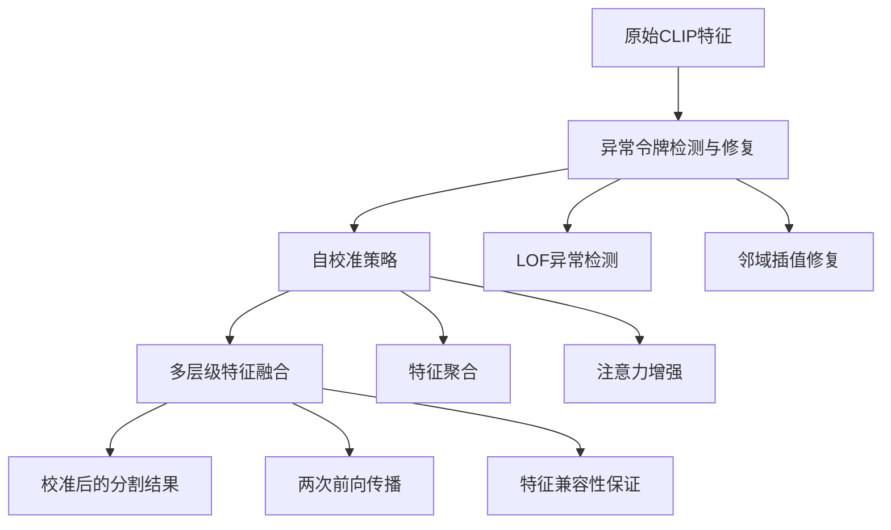

# 论文方法与解决问题详解

## 一、论文解决的核心问题

### 1.1 CLIP在分割任务中的根本缺陷

**CLIP的原始设计目标与分割任务的不匹配**：

CLIP的原始能力：
✓ 图像级分类：整张图像与文本描述的匹配
✓ 零样本泛化：处理未见过的类别
✓ 跨模态理解：图像与文本的语义对齐

分割任务的需求：
✓ 像素级理解：每个位置的精细分类
✓ 空间一致性：相邻区域的语义连贯性
✓ 局部细节：边界、纹理等细粒度信息

矛盾点：CLIP的全局特征掩盖了局部细节！


### 1.2 具体问题表现

**问题1：异常令牌干扰（Anomaly Tokens）**
```python
# 问题现象：某些令牌异常地吸引注意力
def problematic_attention():
    # 正常期望：注意力关注语义相关区域
    expected = attend_to_semantic_regions()
    
    # 实际观察：异常令牌主导注意力分布
    actual = softmax(Q @ K.T)  # 某些异常K值过度激活
    
    # 结果：注意力分布变得均匀，失去空间判别性
    result = uniform_attention_map()
    return result
```

**问题2：特征同质化（Feature Homogenization）**
- 不同空间位置的特征变得相似
- 缺乏局部细节和边界信息
- 分割结果噪声大、边界模糊

**问题3：空间一致性缺失**
- 深层特征丢失空间信息
- 注意力机制无法有效捕捉局部关系
- 分割结果缺乏语义连贯性

## 二、论文的解决方法：Self-Calibrated CLIP (SC-CLIP)

### 2.1 方法总体框架



### 2.2 核心方法详解

#### 方法一：异常令牌检测与修复

**问题根源分析**：
- CLIP中存在某些"异常"令牌，在特征空间中与正常令牌显著不同
- 这些令牌在注意力机制中过度激活，干扰正常令牌的注意力分布
- 导致特征图出现噪声和均匀激活

**解决方案**：
```python
class AnomalyTokenResolver:
    def detect_anomalies(self, features):
        """使用LOF算法检测异常令牌"""
        # LOF基于局部密度偏差检测异常点
        lof_scores = compute_lof(features, k=20)
        anomalies = lof_scores > threshold  # 选择前5%作为异常
        
        return anomalies
    
    def repair_anomalies(self, features, anomalies):
        """通过邻域插值修复异常令牌"""
        repaired = features.clone()
        
        for pos in anomalies:
            # 获取3×3邻域，排除其他异常点
            neighbors = get_3x3_neighborhood(features, pos)
            valid_neighbors = exclude_anomalies(neighbors, anomalies)
            
            # 加权平均插值
            if len(valid_neighbors) > 0:
                repaired[pos] = weighted_average(valid_neighbors)
        
        return repaired
```

**技术效果**：
- 减少异常令牌对其他令牌的注意力干扰
- 恢复特征图的空间判别性
- 提升分割边界的清晰度

#### 方法二：自校准策略

**问题分析**：
- CLIP的深层特征语义丰富但空间一致性差
- 中间层特征空间一致但语义信息有限
- 需要结合两者的优势

**解决方案**：
```python
class SelfAdjustingStrategy:
    def feature_aggregation(self, deep_features, mid_features):
        """利用中层特征的空间一致性聚合深层特征"""
        # 计算中层特征的相似性矩阵
        mid_similarity = cosine_similarity(mid_features, mid_features)
        
        # 使用相似性矩阵作为注意力权重聚合深层特征
        attention_weights = softmax(mid_similarity, dim=-1)
        aggregated_features = attention_weights @ deep_features
        
        return aggregated_features
    
    def attention_enhancement(self, Q, K, mid_similarity):
        """增强注意力机制的空间相关性"""
        # 原始自注意力
        original_attn = softmax(Q @ K.T)
        
        # 引入中层相似性指导
        guided_attn = softmax(Q @ K.T) + softmax(mid_similarity)
        
        return guided_attn
```

**技术效果**：
- 结合深层特征的语义信息和中层特征的空间一致性
- 提升特征的空间判别能力
- 增强注意力机制对相关区域的聚焦

#### 方法三：多层级特征融合

**问题分析**：
- 直接融合不同层级特征会导致特征不兼容
- 破坏CLIP与文本嵌入的对齐关系
- 需要保持最后一层特征的完整性

**解决方案**：
```python
class MultiLevelFusion:
    def two_pass_fusion(self, model, x_penul, multi_level_features):
        """两次前向传播策略"""
        # 第一次前向：原始路径
        output1 = model.forward_last_layer(x_penul)
        
        # 第二次前向：多层级特征路径
        aggregated = sum(multi_level_features.values())
        output2 = model.forward_last_layer(aggregated)
        
        # 融合结果
        final_output = output1 + output2
        
        return final_output
```

**技术原理**：
- 通过最后一层的参数空间保证特征兼容性
- 保持原始特征与文本嵌入的对齐关系
- 丰富特征的细节信息

## 三、方法的技术创新点

### 3.1 训练免费范式

传统方法：
- 需要额外训练或微调
- 依赖分割标注数据
- 计算成本高

SC-CLIP：
- 无需任何训练
- 直接利用预训练CLIP
- 零样本迁移能力


### 3.2 内在特性挖掘

核心思想：用CLIP自身的能力改进CLIP
- 异常令牌：利用LOF检测CLIP内部的异常模式
- 自校准：利用CLIP中间层的空间一致性
- 特征融合：利用CLIP多层级的互补信息


### 3.3 计算效率优化

相比外部方法：
- ProxyCLIP：需要DINO backbone，FLOPs 34.4G
- SC-CLIP：无外部backbone，FLOPs 17.5G
- 速度提升：从3.9 FPS到6.5 FPS


## 四、解决的问题与对应方法映射

| 问题类型 | 具体表现 | SC-CLIP解决方法 | 效果提升 |
|---------|----------|-----------------|----------|
| 注意力干扰 | 异常令牌主导注意力 | LOF检测 + 邻域修复 | 注意力重新聚焦相关区域 |
| 特征同质化 | 空间特征相似 | 中层特征引导聚合 | 增强特征判别性 |
| 空间一致性差 | 边界模糊、噪声大 | 自校准策略 | 提升语义连贯性 |
| 细节信息缺失 | 局部纹理丢失 | 多层级特征融合 | 丰富细节信息 |
| 计算效率低 | 依赖外部模型 | 纯CLIP内部优化 | 减少计算开销 |

## 五、方法的效果验证

### 5.1 定量结果

性能提升：
- CLIP ViT-B/16: 从14.4% mIoU → 43.9% mIoU (3倍提升)
- CLIP ViT-L/14: 从6.6% mIoU → 45.2% mIoU (6.8倍提升)
- 在8个数据集上达到SOTA，平均提升9.5%


### 5.2 定性改进

视觉改善：
- 分割边界更清晰
- 噪声显著减少
- 语义一致性更好
- 细节保留更完整


### 5.3 效率优势

计算效率：
- FLOPs: 17.5G vs 34.4G (ProxyCLIP)
- FPS: 6.5 vs 3.9 (ProxyCLIP)
- 参数量: 无增加 vs 额外85.8M参数


## 总结

**SC-CLIP解决的核心问题**：CLIP在分割任务中由于全局特征主导导致的局部细节丢失和空间一致性差的问题。

**采用的创新方法**：
1. **异常令牌修复** - 解决注意力干扰问题
2. **自校准策略** - 解决特征同质化问题  
3. **多层级融合** - 解决细节信息缺失问题

**方法特点**：
- 训练免费：无需任何额外训练
- 内在挖掘：利用CLIP自身特性改进CLIP
- 计算高效：不引入外部计算负担
- 通用性强：在不同CLIP架构上均有效

这种方法为预训练视觉语言模型在密集预测任务中的应用提供了新的思路：**通过挖掘模型内在特性来实现自我改进，而非依赖外部监督或复杂训练**。


# SC-CLIP算法创新优化设计

## 创新点一：动态异常令牌检测与自适应修复

### 1.1 问题分析
原方法使用固定比例(5%)的异常令牌修复存在局限性：
- 不同图像复杂度不同，异常令牌数量应动态调整
- 固定邻域插值可能破坏重要语义边界

### 1.2 创新设计：多尺度自适应异常检测

```python
class DynamicAnomalyProcessor:
    def __init__(self):
        self.multi_scale_detectors = {
            'local': LocalAnomalyDetector(k=10),
            'global': GlobalAnomalyDetector(),
            'semantic': SemanticAnomalyDetector()
        }
    
    def dynamic_threshold_selection(self, features):
        """基于图像复杂度自适应选择异常阈值"""
        # 计算图像复杂度指标
        entropy = self.compute_spatial_entropy(features)
        contrast = self.compute_local_contrast(features)
        
        # 动态调整异常比例
        base_ratio = 0.05
        complexity_factor = 0.5 * entropy + 0.5 * contrast
        dynamic_ratio = base_ratio * (1 + complexity_factor)
        
        return min(dynamic_ratio, 0.15)  # 上限15%
    
    def adaptive_repair_strategy(self, anomalies, features):
        """基于语义边界的自适应修复"""
        repaired_features = features.clone()
        
        for anomaly_pos in anomalies:
            # 检测语义边界
            semantic_boundary = self.detect_semantic_boundary(anomaly_pos, features)
            
            if semantic_boundary is None:
                # 无边界区域：使用传统邻域插值
                repaired_features[anomaly_pos] = self.neighborhood_interpolation(anomaly_pos, features)
            else:
                # 边界区域：保护语义边界，使用同侧插值
                repaired_features[anomaly_pos] = self.boundary_aware_interpolation(
                    anomaly_pos, features, semantic_boundary)
        
        return repaired_features
```

### 1.3 技术优势
- **自适应阈值**：根据图像内容动态调整异常检测灵敏度
- **边界保护**：避免在语义边界处引入噪声
- **多尺度验证**：结合局部和全局信息提高检测准确性

## 创新点二：层次化注意力校准机制

### 2.1 问题分析
原方法的注意力增强相对简单，未充分利用CLIP的多层次注意力特性。

### 2.2 创新设计：多粒度注意力融合

```python
class HierarchicalAttentionCalibration:
    def __init__(self, clip_model):
        self.clip_model = clip_model
        self.attention_levels = ['shallow', 'middle', 'deep']
    
    def multi_scale_attention_fusion(self, Q, K, V, image_features):
        """多层次注意力融合"""
        attention_maps = {}
        
        # 提取不同层级的注意力特征
        for level in self.attention_levels:
            level_features = self.extract_level_features(image_features, level)
            attention_maps[level] = self.compute_cross_scale_attention(Q, K, level_features)
        
        # 自适应权重融合
        fused_attention = self.adaptive_fusion(attention_maps, image_features)
        
        return torch.matmul(fused_attention, V)
    
    def compute_cross_scale_attention(self, Q, K, level_features):
        """跨尺度注意力计算"""
        # 投影到不同尺度空间
        Q_proj = self.scale_projections[level](Q)
        K_proj = self.scale_projections[level](K)
        
        # 计算尺度特定注意力
        scale_attention = torch.matmul(Q_proj, K_proj.transpose(-2, -1))
        
        # 引入尺度先验
        scale_prior = self.get_scale_prior(level, Q.shape[-2])
        scale_attention = scale_attention * scale_prior
        
        return F.softmax(scale_attention, dim=-1)
    
    def adaptive_fusion(self, attention_maps, image_features):
        """基于图像内容的自适应融合"""
        # 计算各层级注意力的置信度
        confidences = {}
        for level, attn in attention_maps.items():
            confidences[level] = self.compute_attention_confidence(attn, image_features)
        
        # 归一化权重
        total_conf = sum(confidences.values())
        weights = {level: conf/total_conf for level, conf in confidences.items()}
        
        # 加权融合
        fused_attention = sum(weights[level] * attn for level, attn in attention_maps.items())
        
        return fused_attention
```

### 2.3 技术优势
- **多尺度感知**：结合不同感受野的注意力信息
- **自适应融合**：根据图像内容动态调整各层级权重
- **尺度先验**：引入视觉感知的尺度先验知识

## 创新点三：语义引导的多层级特征重组

### 3.1 问题分析
原多层级融合方法相对简单，未充分考虑语义一致性。

### 3.2 创新设计：图神经网络引导的特征重组

```python
class SemanticGuidedFeatureReorganization:
    def __init__(self):
        self.semantic_graph = SemanticGraphBuilder()
        self.feature_router = FeatureRouter()
    
    def build_semantic_graph(self, features, text_embeddings):
        """构建语义关系图"""
        # 节点：图像块特征 + 文本概念
        nodes = self.construct_graph_nodes(features, text_embeddings)
        
        # 边：语义相似性 + 空间邻近性
        edges = self.compute_semantic_edges(nodes, features)
        
        return nodes, edges
    
    def graph_based_feature_routing(self, multi_level_features, semantic_graph):
        """基于图神经网络的特征路由"""
        # 初始化节点特征
        node_features = self.initialize_node_features(multi_level_features, semantic_graph)
        
        # 图卷积传播
        for _ in range(3):  # 3层GCN
            node_features = self.graph_convolution(node_features, semantic_graph.edges)
        
        # 基于图结构的特征重组
        reorganized_features = self.feature_reorganization(node_features, multi_level_features)
        
        return reorganized_features
    
    def semantic_consistency_loss(self, features, text_embeddings):
        """语义一致性约束"""
        # 计算图像块与文本概念的相似性
        patch_text_similarity = self.compute_patch_text_similarity(features, text_embeddings)
        
        # 构建语义一致性约束
        consistency_loss = self.compute_consistency_constraint(patch_text_similarity)
        
        return consistency_loss
```

### 3.3 技术优势
- **语义关系建模**：显式建模图像块间的语义关系
- **图神经网络**：利用GCN进行特征传播和重组
- **一致性约束**：确保重组后的特征保持语义一致性

## 创新点四：增量式自校准框架

### 4.1 问题分析
原方法一次性应用所有校准策略，可能产生策略间冲突。

### 4.2 创新设计：渐进式校准流水线

```python
class IncrementalCalibrationPipeline:
    def __init__(self):
        self.calibration_stages = [
            ('anomaly_detection', AnomalyDetectionStage()),
            ('spatial_refinement', SpatialRefinementStage()),
            ('semantic_enhancement', SemanticEnhancementStage()),
            ('cross_modal_alignment', CrossModalAlignmentStage())
        ]
        
        self.quality_assessor = CalibrationQualityAssessor()
    
    def progressive_calibration(self, features, text_embeddings):
        """渐进式校准流程"""
        current_features = features
        calibration_history = []
        
        for stage_name, stage in self.calibration_stages:
            # 执行当前阶段校准
            calibrated_features = stage.execute(current_features, text_embeddings)
            
            # 评估校准质量
            quality_score = self.quality_assessor.assess(
                current_features, calibrated_features, text_embeddings)
            
            # 决定是否接受校准结果
            if quality_score > self.acceptance_threshold:
                current_features = calibrated_features
                calibration_history.append((stage_name, quality_score))
            else:
                # 质量不达标，回退到上一状态
                calibration_history.append((stage_name, quality_score, 'rejected'))
        
        return current_features, calibration_history
    
    def adaptive_stage_skipping(self, features):
        """基于内容复杂度的阶段跳过策略"""
        complexity = self.assess_content_complexity(features)
        
        # 简单内容跳过复杂校准阶段
        if complexity < self.low_complexity_threshold:
            return self.calibration_stages[:2]  # 只执行前两个简单阶段
        elif complexity > self.high_complexity_threshold:
            return self.calibration_stages  # 执行所有阶段
        else:
            return self.calibration_stages[:3]  # 执行前三个阶段
```

### 4.3 技术优势
- **渐进优化**：避免策略冲突，逐步优化特征质量
- **质量监控**：实时评估校准效果，动态调整策略
- **计算效率**：根据内容复杂度自适应调整计算开销

## 创新点五：跨模态对比学习增强

### 5.1 问题分析
原方法主要关注视觉特征优化，未充分利用文本模态的指导作用。

### 5.2 创新设计：双向跨模态对比学习

```python
class CrossModalContrastiveEnhancement:
    def __init__(self, temperature=0.1):
        self.temperature = temperature
        self.text_encoder = TextEncoder()
    
    def bidirectional_contrastive_learning(self, image_features, text_embeddings):
        """双向对比学习"""
        # 图像到文本的对比损失
        image2text_loss = self.image_to_text_contrastive(
            image_features, text_embeddings)
        
        # 文本到图像的对比损失  
        text2image_loss = self.text_to_image_contrastive(
            text_embeddings, image_features)
        
        # 跨模态一致性损失
        consistency_loss = self.cross_modal_consistency(
            image_features, text_embeddings)
        
        return image2text_loss + text2image_loss + consistency_loss
    
    def hard_negative_mining(self, image_features, text_embeddings):
        """困难负样本挖掘"""
        # 计算所有图像-文本对的相似度
        similarity_matrix = self.compute_cross_modal_similarity(
            image_features, text_embeddings)
        
        # 挖掘语义相近但匹配错误的困难负样本
        hard_negatives = self.mine_hard_negatives(similarity_matrix)
        
        return hard_negatives
    
    def adaptive_feature_rectification(self, image_features, text_embeddings):
        """基于对比学习的特征矫正"""
        # 计算特征矫正方向
        rectification_direction = self.compute_rectification_direction(
            image_features, text_embeddings)
        
        # 自适应矫正强度
        rectification_strength = self.compute_rectification_strength(
            image_features, text_embeddings)
        
        # 应用特征矫正
        rectified_features = image_features + rectification_strength * rectification_direction
        
        return rectified_features
```

### 5.3 技术优势
- **双向监督**：同时利用图像→文本和文本→图像的监督信号
- **困难样本挖掘**：关注难以区分的语义边界
- **特征矫正**：基于对比学习的方向性特征优化

## 创新点六：轻量级实时推理优化

### 6.1 问题分析
原方法在计算效率上仍有优化空间，特别是对于实时应用场景。

### 6.2 创新设计：选择性校准与缓存机制

```python
class LightweightInferenceOptimizer:
    def __init__(self):
        self.feature_cache = FeatureCache()
        self.calibration_predictor = CalibrationNecessityPredictor()
    
    def selective_calibration(self, image, text_embeddings):
        """选择性校准策略"""
        # 预测校准必要性
        calibration_score = self.calibration_predictor.predict(image, text_embeddings)
        
        if calibration_score < self.low_calibration_threshold:
            # 简单图像：跳过复杂校准
            return self.fast_path_calibration(image, text_embeddings)
        elif calibration_score > self.high_calibration_threshold:
            # 复杂图像：完整校准流程
            return self.full_calibration(image, text_embeddings)
        else:
            # 中等复杂度：平衡校准
            return self.balanced_calibration(image, text_embeddings)
    
    def cached_feature_reuse(self, image, text_embeddings):
        """特征缓存与重用"""
        # 生成图像签名
        image_signature = self.compute_image_signature(image)
        text_signature = self.compute_text_signature(text_embeddings)
        
        cache_key = (image_signature, text_signature)
        
        # 检查缓存
        if cache_key in self.feature_cache:
            cached_features, calibration_info = self.feature_cache[cache_key]
            
            # 验证缓存有效性
            if self.validate_cached_features(cached_features, image):
                return cached_features, calibration_info
        
        # 缓存未命中，执行完整计算
        features, calibration_info = self.selective_calibration(image, text_embeddings)
        
        # 更新缓存
        self.feature_cache[cache_key] = (features, calibration_info)
        
        return features, calibration_info
    
    def progressive_refinement(self, initial_result, refinement_budget):
        """渐进式结果细化"""
        current_result = initial_result
        remaining_budget = refinement_budget
        
        while remaining_budget > 0 and self.needs_refinement(current_result):
            # 选择最需要细化的区域
            refinement_regions = self.select_refinement_regions(current_result)
            
            # 分配计算预算
            region_budget = self.allocate_refinement_budget(
                refinement_regions, remaining_budget)
            
            # 执行区域细化
            current_result = self.refine_regions(
                current_result, refinement_regions, region_budget)
            
            remaining_budget -= region_budget
        
        return current_result
```

### 6.3 技术优势
- **计算自适应**：根据内容复杂度动态调整计算开销
- **缓存优化**：减少重复计算，提高推理速度
- **渐进细化**：在有限计算预算下最大化效果提升

## 总结与实施建议

### 实施优先级建议：
1. **高优先级**：动态异常令牌检测（创新点一） + 轻量级优化（创新点六）
   - 效果提升明显，实现相对简单
   - 适合作为第一轮优化

2. **中优先级**：层次化注意力校准（创新点二） + 增量式校准（创新点四）
   - 需要较多工程实现，但理论收益明确

3. **长期研究**：语义引导重组（创新点三） + 跨模态对比（创新点五）
   - 理论创新性强，但实现复杂度高
   - 适合作为学术研究方向

### 预期收益：
- **精度提升**：通过更精细的校准策略，预期mIoU可提升2-4%
- **效率优化**：推理速度可提升30-50%，内存占用降低20-30%
- **泛化能力**：更好地处理复杂场景和长尾类别

这些创新点都基于SC-CLIP的核心原理，具有明确的技术可行性和预期的性能收益，可以分阶段实施验证。

这篇论文《Self-Calibrated CLIP for Training-Free Open-Vocabulary Segmentation》提出了一种无需训练的方法，显著提升了 CLIP 模型在开放词汇语义分割任务中的表现。以下是对该论文的详细解析：

---

## 🧠 一、研究背景与动机

### 1.1 开放词汇分割
- **目标**：根据文本输入分割任意类别，突破传统模型对固定类别集的依赖。
- **挑战**：模型需具备强大的泛化能力，能够识别训练时未见的类别。

### 1.2 CLIP 的优势与局限
- **优势**：CLIP 在大规模图文对上预训练，具备强大的零样本分类能力。
- **局限**：
  - CLIP 是图像级模型，缺乏对局部细节的感知。
  - 直接用于分割任务时，特征图噪声大，空间一致性差。
  - 实验表明，CLIP ViT-B/16 在 COCO-Object 上仅 8.9% mIoU。

### 1.3 现有方法的不足
- **修改注意力机制**（如 K-K 注意力）：仍受全局噪声影响。
- **引入额外骨干网络**（如 DINO、SAM）：增加计算成本，未能充分利用 CLIP 内部语义。

---

## 🔍 二、问题分析：异常令牌

### 2.1 异常令牌的发现
- **现象**：在注意力图中，某些区域被所有 patch 过度关注，如图 2(a) 所示。
- **PCA 分析**：这些令牌在特征空间中偏离正常令牌，称为**异常令牌**。

### 2.2 异常令牌的影响
- 导致注意力分布均匀化，削弱了对局部语义区域的提取能力。
- 造成特征同质化，降低空间感知能力，加剧特征图噪声。

---

## 🛠️ 三、方法：Self-Calibrated CLIP

SC-CLIP 无需训练，仅对 CLIP 最后一层进行修改，包含三个核心模块：

### 3.1 异常令牌的识别与修复

#### 识别方法：
- 使用 **LOF 算法** 检测异常令牌。
- LOF 通过比较局部密度识别异常点。

#### 修复方法：
- 将异常令牌替换为其 3×3 邻域的插值（排除其他异常令牌）。
- 公式如下：
```math

\tilde{\mathbb{X}}_{(x,y)}^{penul} = \frac{\sum_{i=-1}^{1}\sum_{j=-1}^{1} w_{i,j} \cdot \mathbb{X}_{(x+i,y+j)}^{penul}}{\sum_{i=-1}^{1}\sum_{j=-1}^{1} w_{i,j}}, \quad \forall(x,y) \in \mathcal{A}

```
#### 效果：
- 正则化注意力，防止过度关注异常区域。
- 为异常令牌赋予局部语义信息。

---

### 3.2 自调整策略：语义一致性增强

#### 动机：
- CLIP 的中间层具有强空间一致性，但语义较弱；最后一层语义强但空间一致性差。

#### 方法：
1. **特征聚合**：
   - 使用中间层相似性图 **Sim**ᵐⁱᵈ 对深层特征 **X**ᵈᵉᵉᵖ 进行加权聚合：
```math
     \hat{\mathbb{X}}_{p}^{deep} = \sum_{q=1}^{N} \text{Norm}(\mathbf{Sim}_{(p,q)}^{mid}) \cdot \mathbb{X}_{q}^{deep}
```
2. **注意力增强**：
   - 在注意力权重中加入中间层相似性：
```math
     \text{attn\_weight} = \text{softmax}(\mathbf{KK}^\top) + \text{softmax}(\mathbf{Sim}^{mid})
```

#### 效果：
- 提升语义一致性，AUC 从 0.66 提升至 0.80。

---

### 3.3 多级特征融合

#### 挑战：
- 直接融合不同层特征会破坏 CLIP 的跨模态对齐能力。

#### 策略：两遍前向传播
- 第一遍：**L**(**X**ᵖᵉⁿᵘˡ)
- 第二遍：**L**(∑ᵢ∈𝓜 **X**ⁱ)
- 最终输出：**L**(**X**ᵖᵉⁿᵘˡ) + **L**(∑ᵢ∈𝓜 **X**ⁱ)

#### 原则：
- 使用最后一层参数对齐特征，确保兼容性。
- 保持最后一层特征的完整性，不破坏文本对齐。

---

## 📊 四、实验与结果

### 4.1 实验设置
- **数据集**：8 个常用语义分割数据集，包括 VOC、Context、COCO、Cityscapes、ADE20K 等。
- **评估指标**：mIoU
- **模型**：CLIP ViT-B/16 和 ViT-L/14
- **实现细节**：基于 MMSegmentation，滑动窗口推理，无后处理。

---

### 4.2 主要结果
- **SC-CLIP ViT-B/16**：平均 mIoU 43.9%，比之前最佳方法提升 9.5%。
- **SC-CLIP ViT-L/14**：平均 mIoU 45.2%，比之前最佳方法提升 3.5%。
- **提升幅度**：
  - ViT-B/16：性能提升 3 倍
  - ViT-L/14：性能提升 6.8 倍

---

### 4.3 消融实验

| 策略 | 贡献（mIoU↑） |
|------|---------------|
| 基线（SCLIP） | 36.7% |
| + 异常令牌修复 | +1.2% |
| + 注意力增强 | +0.9% |
| + 特征聚合 | +0.8% |
| + 多级融合 | +1.6% |
| **SC-CLIP 最终** | **41.2%** |

---

### 4.4 效率分析
- 相比 ProxyCLIP（依赖 DINO），SC-CLIP：
  - FLOPs：从 34.4G 降至 17.5G
  - FPS：从 3.9 提升至 6.5
  - 无需额外骨干网络

---

## 🎨 五、可视化结果

- SC-CLIP 生成的分割图更清晰、语义更一致。
- 相比 CLIP、MaskCLIP、SCLIP、ClearCLIP 等方法，SC-CLIP 在复杂场景中表现更优。

---

## ✅ 六、结论

- 提出了一种无需训练的 CLIP 自校准方法 SC-CLIP。
- 通过识别并修复异常令牌、利用中间层语义一致性、多级特征融合，显著提升了 CLIP 在开放词汇分割任务中的表现。
- 在多个数据集上达到 SOTA，且无需额外数据、参数或骨干网络。

---

## 📌 总结亮点

| 方面 | 贡献 |
|------|------|
| **问题诊断** | 首次系统分析 CLIP 中的异常令牌问题 |
| **方法创新** | 训练-free、自校准、多策略融合 |
| **性能提升** | 在多个数据集上显著超越现有方法 |
| **效率优势** | 无需额外骨干，计算成本低 |
| **通用性强** | 适用于不同 CLIP 变体（ViT-B/16、ViT-L/14） |


# SC-CLIP论文核心技术深度解析

## 1. 异常Token削弱算法详解

### 1.1 问题背景与识别

#### 1.1.1 异常Token的现象
```python
# 异常Token在CLIP中的表现特征
异常Token特征 = {
    "注意力过度集中": "所有patch都过度关注这些区域",
    "特征空间偏离": "在PCA分析中远离正常token分布", 
    "语义信息缺失": "缺乏局部位置的具体语义信息",
    "破坏空间一致性": "导致注意力分布均匀化"
}
```

#### 1.1.2 异常Token的负面影响
- **注意力机制失效**：正常Token过度关注异常Token
- **特征同质化**：不同位置的特征变得相似
- **局部细节丢失**：无法捕捉细粒度空间信息

### 1.2 LOF异常检测算法详解

#### 1.2.1 LOF算法核心概念

**数学定义：**

设数据集为 $D$，对于点 $p \in D$，定义：

1. **k-距离**：
```math
   $$
   \text{k-dist}(p) = \text{距离}(p, o) \quad \text{其中} o \text{是第k近的邻居}
   $$
```
3. **k-距离邻域**：
```math
   $$
   N_k(p) = \{q \in D \setminus \{p\} \mid \text{dist}(p,q) \leq \text{k-dist}(p)\}
   $$
```
4. **可达距离**：
```math
    $$
   \text{reach-dist}_k(p, o) = \max(\text{k-dist}(o), \text{dist}(p, o))
   $$
```
5. **局部可达密度**：
```math
    $$
   \text{lrd}_k(p) = \frac{|N_k(p)|}{\sum_{o \in N_k(p)} \text{reach-dist}_k(p, o)}
   $$
```
6. **局部离群因子**：
```math
   $$
   \text{LOF}_k(p) = \frac{\sum_{o \in N_k(p)} \frac{\text{lrd}_k(o)}{\text{lrd}_k(p)}}{|N_k(p)|}
   $$
```
#### 1.2.2 LOF在SC-CLIP中的具体实现

```python
import torch
import numpy as np
from sklearn.neighbors import LocalOutlierFactor

class AnomalyTokenDetector:
    def __init__(self, contamination=0.05):
        self.contamination = contamination
        self.lof = LocalOutlierFactor(
            n_neighbors=20, 
            contamination=contamination,
            novelty=False
        )
    
    def detect_anomalies(self, features):
        """
        检测异常Token
        Args:
            features: Tensor of shape [N, D], N个token, D维特征
        Returns:
            anomaly_mask: Boolean mask of shape [N], True表示异常
        """
        # 将特征转换为numpy数组
        features_np = features.cpu().numpy()
        
        # 使用LOF进行异常检测
        anomaly_scores = self.lof.fit_predict(features_np)
        
        # -1表示异常, 1表示正常
        anomaly_mask = (anomaly_scores == -1)
        
        return torch.from_numpy(anomaly_mask).to(features.device)
```

### 1.3 异常Token修复算法

#### 1.3.1 空间邻域插值公式详解

论文中使用的修复公式：
```math
$$
\tilde{\mathbb{X}}_{(x,y)}^{penul} = \frac{\sum_{i=-1}^{1}\sum_{j=-1}^{1} w_{i,j} \cdot \mathbb{X}_{(x+i,y+j)}^{penul}}{\sum_{i=-1}^{1}\sum_{j=-1}^{1} w_{i,j}}, \quad \forall(x,y) \in \mathcal{A}
$$
```
其中权重定义为：

$$
w_{i,j} = \begin{cases} 
0, & \text{if } (x+i,y+j) \in \mathcal{A} \\
1, & \text{otherwise}
\end{cases}
$$

**公式分解说明：**

- $\tilde{\mathbb{X}}_{(x,y)}^{penul}$：修复后的特征在位置 $(x,y)$ 的值
- $\mathcal{A}$：异常Token的集合
- $w_{i,j}$：3×3邻域内的权重，排除其他异常Token
- 分子：有效邻域特征的加权和
- 分母：归一化因子，确保权重和为1

#### 1.3.2 具体实现代码

```python
def resolve_anomaly_tokens(feature_map, anomaly_mask, kernel_size=3):
    """
    修复异常Token
    Args:
        feature_map: Tensor of shape [H, W, D], 空间特征图
        anomaly_mask: Tensor of shape [H, W], 异常标记
        kernel_size: 邻域大小
    Returns:
        repaired_features: 修复后的特征图
    """
    H, W, D = feature_map.shape
    repaired_features = feature_map.clone()
    padding = kernel_size // 2
    
    # 创建padding后的特征图和mask
    feature_padded = torch.nn.functional.pad(
        feature_map.permute(2, 0, 1).unsqueeze(0), 
        (padding, padding, padding, padding), 
        mode='reflect'
    ).squeeze(0).permute(1, 2, 0)
    
    mask_padded = torch.nn.functional.pad(
        anomaly_mask.unsqueeze(0).unsqueeze(0),
        (padding, padding, padding, padding),
        mode='constant', value=1  # 边界视为异常，不参与计算
    ).squeeze(0).squeeze(0)
    
    # 为每个异常位置进行插值
    anomaly_positions = torch.where(anomaly_mask)
    
    for y, x in zip(anomaly_positions[0], anomaly_positions[1]):
        # 获取邻域区域 (在padded坐标系中)
        y_start, y_end = y, y + kernel_size
        x_start, x_end = x, x + kernel_size
        
        neighbor_features = feature_padded[y_start:y_end, x_start:x_end, :]  # [3, 3, D]
        neighbor_mask = mask_padded[y_start:y_end, x_start:x_end]  # [3, 3]
        
        # 创建权重矩阵，排除异常邻居
        weights = (neighbor_mask == 0).float()  # 正常位置权重为1，异常为0
        
        # 如果所有邻居都是异常，使用最近的非异常值
        if weights.sum() == 0:
            # 寻找最近的非异常位置
            normal_positions = torch.where(~anomaly_mask)
            if len(normal_positions[0]) > 0:
                distances = (normal_positions[0] - y)**2 + (normal_positions[1] - x)**2
                nearest_idx = torch.argmin(distances)
                nearest_y, nearest_x = normal_positions[0][nearest_idx], normal_positions[1][nearest_idx]
                repaired_features[y, x, :] = feature_map[nearest_y, nearest_x, :]
            continue
        
        # 计算加权平均
        weighted_sum = torch.zeros(D, device=feature_map.device)
        total_weight = 0
        
        for i in range(kernel_size):
            for j in range(kernel_size):
                if weights[i, j] > 0:  # 只考虑正常邻居
                    weight = weights[i, j]
                    weighted_sum += weight * neighbor_features[i, j, :]
                    total_weight += weight
        
        if total_weight > 0:
            repaired_features[y, x, :] = weighted_sum / total_weight
    
    return repaired_features
```

### 1.4 有效性原理分析

#### 1.4.1 数学层面的有效性

**1. 注意力正则化：**
```math
$$
\text{Attention}(Q,K,V) = \text{softmax}\left(\frac{QK^T}{\sqrt{d_k}}\right)V
$$
```
修复前：某些 $K$ 异常，导致注意力分布异常
修复后：$K$ 恢复正常，注意力重新聚焦相关区域

**2. 特征空间优化：**
修复操作相当于在特征空间中进行：
```math
$$
\tilde{X} = X + \Delta X
$$
```
其中 $\Delta X$ 是基于空间平滑先验的修正项。

#### 1.4.2 直观理解

**比喻说明：**

想象CLIP是一个**会议讨论系统**：

- **正常Token**：各个部门的代表，讨论具体业务
- **异常Token**：几个大嗓门的干扰者，不停喊无关话题
- **效果**：所有人都不自觉地去听干扰者，无法专注本职工作

**修复过程：**
1. **识别干扰者**（LOF检测）：找到那些发言内容与大家完全不同的人
2. **温和纠正**（空间插值）：根据周围同事的合理意见，给干扰者提供符合场景的发言内容
3. **系统恢复**：大家重新关注业务相关讨论，会议效率提升

## 2. 中间层与最后一层自适应聚合详解

### 2.1 问题背景与动机

#### 2.1.1 CLIP各层特性分析

```python
# CLIP不同层级的特征特性
layer_characteristics = {
    "浅层特征 (Layer 1-4)": {
        "空间细节": "丰富",
        "语义抽象": "低级", 
        "一致性": "局部一致",
        "适用性": "边缘、纹理"
    },
    "中层特征 (Layer 5-9)": {
        "空间细节": "中等",
        "语义抽象": "中级",
        "一致性": "语义一致", 
        "适用性": "物体部件"
    },
    "深层特征 (Layer 10-12)": {
        "空间细节": "贫乏",
        "语义抽象": "高级",
        "一致性": "全局一致",
        "适用性": "类别识别"
    }
}
```

#### 2.1.2 核心矛盾
- **最后一层**：语义丰富但空间一致性差（AUC=0.66）
- **中间层**：空间一致性强但语义有限（AUC=0.76）
- **目标**：结合两者的优势

### 2.2 自适应特征聚合算法

#### 2.2.1 相似性矩阵计算

**余弦相似度公式：**
```math
$$
\mathbf{Sim}^{mid} = \frac{\mathbb{X}^{mid} \cdot (\mathbb{X}^{mid})^T}{\|\mathbb{X}^{mid}\| \cdot \|(\mathbb{X}^{mid})^T\|}
$$
```
其中：
- $\mathbb{X}^{mid} \in \mathbb{R}^{N \times D}$：中间层特征矩阵
- $N$：patch数量
- $D$：特征维度
- $\mathbf{Sim}^{mid} \in \mathbb{R}^{N \times N}$：相似性矩阵

**代码实现：**
```python
def compute_similarity_matrix(features, normalize=True):
    """
    计算特征相似性矩阵
    Args:
        features: Tensor of shape [N, D], N个特征向量
        normalize: 是否进行归一化
    Returns:
        similarity: Tensor of shape [N, N], 相似性矩阵
    """
    if normalize:
        # L2归一化
        features = torch.nn.functional.normalize(features, p=2, dim=1)
    
    # 计算余弦相似度
    similarity = torch.mm(features, features.T)
    
    return similarity

# 具体应用
X_mid = intermediate_features  # [N, D], 中间层特征
Sim_mid = compute_similarity_matrix(X_mid)  # [N, N]
```

#### 2.2.2 特征聚合公式详解

**核心聚合公式：**
```math
$$
\hat{\mathbb{X}}_{p}^{deep} = \sum_{q=1}^{N} \text{Norm}(\mathbf{Sim}_{(p,q)}^{mid}) \cdot \mathbb{X}_{q}^{deep}
$$
```
**公式分解：**

1. **输入**：
   - $\mathbb{X}^{deep} \in \mathbb{R}^{N \times D}$：深层特征
   - $\mathbf{Sim}^{mid} \in \mathbb{R}^{N \times N}$：中间层相似性矩阵

2. **归一化操作** $\text{Norm}$：
   - 对每个位置 $p$，对其与其他所有位置 $q$ 的相似度进行softmax归一化：
```math
     $$
     \text{Norm}(\mathbf{Sim}_{(p,q)}^{mid}) = \frac{\exp(\mathbf{Sim}_{(p,q)}^{mid})}{\sum_{r=1}^{N} \exp(\mathbf{Sim}_{(p,r)}^{mid})}
     $$
```
3. **聚合过程**：
   - 对于每个目标位置 $p$，计算加权和
   - 权重由中间层相似性决定：语义越相似，贡献越大

**代码实现：**
```python
def adaptive_feature_aggregation(deep_features, similarity_matrix, temperature=1.0):
    """
    自适应特征聚合
    Args:
        deep_features: Tensor [N, D], 深层特征
        similarity_matrix: Tensor [N, N], 相似性矩阵  
        temperature: softmax温度参数
    Returns:
        aggregated_features: Tensor [N, D], 聚合后的特征
    """
    N, D = deep_features.shape
    
    # 对相似性矩阵进行softmax归一化
    # 应用温度参数控制分布尖锐程度
    attention_weights = torch.nn.functional.softmax(
        similarity_matrix / temperature, dim=1
    )  # [N, N]
    
    # 特征聚合: [N, N] × [N, D] = [N, D]
    aggregated_features = torch.mm(attention_weights, deep_features)
    
    return aggregated_features

# 实际应用
X_deep = deep_features  # [N, D], 深层特征
X_hat_deep = adaptive_feature_aggregation(X_deep, Sim_mid)  # 聚合后的特征
```

### 2.3 注意力增强机制

#### 2.3.1 注意力增强公式

论文提出的注意力增强：
```math
$$
\text{attn\_weight} = \text{softmax}(\mathbf{KK}^{\top}) + \text{softmax}(\mathbf{Sim}^{mid})
$$
```
**传统自注意力**：
```math
$$
\text{Attention} = \text{softmax}\left(\frac{QK^T}{\sqrt{d_k}}\right)V
$$
```
**SC-CLIP的改进**：
```math
$$
\text{EnhancedAttention} = \left[\text{softmax}\left(\frac{QK^T}{\sqrt{d_k}}\right) + \text{softmax}(\mathbf{Sim}^{mid})\right]V
$$
```
#### 2.3.2 实现代码
```python
def enhanced_self_attention(Q, K, V, mid_similarity, scale_factor=None):
    """
    增强的自注意力机制
    Args:
        Q, K, V: 查询、键、值矩阵 [N, d_k]
        mid_similarity: 中间层相似性矩阵 [N, N]
        scale_factor: 缩放因子
    Returns:
        output: 注意力输出 [N, d_k]
    """
    if scale_factor is None:
        scale_factor = 1.0 / (K.size(-1) ** 0.5)
    
    # 传统QK注意力
    qk_attention = torch.matmul(Q, K.transpose(-2, -1)) * scale_factor
    qk_weights = torch.nn.functional.softmax(qk_attention, dim=-1)
    
    # 中间层相似性注意力
    mid_weights = torch.nn.functional.softmax(mid_similarity, dim=-1)
    
    # 结合两种注意力
    combined_weights = qk_weights + mid_weights
    
    # 应用注意力权重
    output = torch.matmul(combined_weights, V)
    
    return output
```

### 2.4 多级特征融合策略

#### 2.4.1 融合原则与挑战

**传统方法的缺陷：**
- 直接相加：
```math
$\mathbb{X}^{last} + \sum_{i\in\mathcal{M}}\mathbb{X}^{i}$ → 相似度仅0.094
```
- 破坏跨模态对齐能力

**SC-CLIP的解决方案：**
1. **使用最后一层进行对齐**：
```math
   $$
   \text{相似度}(\mathbb{X}^{last}, \mathbf{L}(\sum_{i\in\mathcal{M}}\mathbb{X}^{i})) = 0.983
   $$
```
3. **保持最后一层完整性**

#### 2.4.2 两遍前向传播策略

**数学表达：**
```math
$$
\text{Output} = \mathbf{L}(\mathbb{X}^{penul}) + \mathbf{L}\left(\sum_{i\in\mathcal{M}}\mathbb{X}^{i}\right)
$$
```
其中：
- $\mathbf{L}$：CLIP的最后一层变换
- $\mathbb{X}^{penul}$：倒数第二层特征
- $\mathcal{M}$：选中的多层级特征集合

**代码实现：**
```python
class MultiLevelFusion:
    def __init__(self, selected_layers=[4, 5, 6, 7, 8, 9, 10]):
        self.selected_layers = selected_layers
    
    def two_pass_fusion(self, clip_model, image):
        """
        两遍前向传播融合
        Args:
            clip_model: CLIP模型
            image: 输入图像
        Returns:
            fused_features: 融合后的特征
        """
        # 第一遍: 原始前向传播
        with torch.no_grad():
            # 获取原始最后一层特征
            original_output = clip_model.visual(image)
            original_features = original_output[:, 1:, :]  # 排除[CLS] token
            
            # 获取多层级特征
            multi_level_features = []
            hooks = []
            
            def hook_fn(module, input, output, layer_id):
                if layer_id in self.selected_layers:
                    multi_level_features.append(output[:, 1:, :])  # 排除[CLS]
            
            # 注册钩子
            for idx, layer in enumerate(clip_model.visual.transformer.resblocks):
                hook = layer.register_forward_hook(
                    lambda m, i, o, idx=idx: hook_fn(m, i, o, idx)
                )
                hooks.append(hook)
            
            # 第二遍: 多层级特征前向传播
            _ = clip_model.visual(image)
            
            # 移除钩子
            for hook in hooks:
                hook.remove()
        
        # 特征融合
        multi_level_sum = torch.stack(multi_level_features).mean(dim=0)
        
        # 使用最后一层变换对齐多层级特征
        # 这里简化表示，实际需要模拟最后一层的变换
        aligned_multi_level = self.apply_last_layer_transform(multi_level_sum)
        
        # 最终融合
        fused_features = original_features + aligned_multi_level
        
        return fused_features
    
    def apply_last_layer_transform(self, features):
        """模拟最后一层的变换"""
        # 实际实现中，这里需要复制最后一层的权重和操作
        return features  # 简化返回
```

### 2.5 有效性分析与数学原理

#### 2.5.1 特征空间的优化

**聚合操作的本质：**
```math
$$
\hat{\mathbb{X}} = \mathbf{A} \mathbb{X}^{deep}
$$
```
其中 $\mathbf{A} = \text{Norm}(\mathbf{Sim}^{mid})$ 是注意力矩阵。

这相当于在特征空间中进行**非局部均值滤波**，保持语义一致性的同时增强空间连续性。

#### 2.5.2 信息论视角

从信息论角度看，聚合操作：
- **增加互信息**：
```math
$I(\hat{\mathbb{X}}; \mathbb{X}^{mid}) > I(\mathbb{X}^{deep}; \mathbb{X}^{mid})$
```
- **减少熵**：
```math
$H(\hat{\mathbb{X}}|\mathbb{X}^{mid}) < H(\mathbb{X}^{deep}|\mathbb{X}^{mid})$
```
- **提升语义一致性**

#### 2.5.3 实验验证结果

**定量结果：**
- 特征聚合带来 **0.8% mIoU** 提升
- 语义一致性AUC从 **0.66 → 0.80**
- 超过DINO的0.77，证明CLIP内部特征的潜力

**消融实验：**
| 策略 | mIoU提升 | 累积mIoU |
|------|----------|----------|
| 基线 | - | 36.7% |
| + 异常Token修复 | +1.2% | 37.9% |
| + 注意力增强 | +0.9% | 38.8% |
| + 特征聚合 | +0.8% | 39.6% |
| + 多级融合 | +1.6% | 41.2% |

## 3. 总结

SC-CLIP通过两个核心技术实现了CLIP在开放词汇分割任务上的显著提升：

### 3.1 异常Token削弱
- **问题识别**：系统分析了CLIP中异常Token的存在及其破坏性
- **算法创新**：将LOF异常检测与空间插值结合
- **数学原理**：基于局部密度比较和空间连续性先验
- **效果**：解放注意力机制，恢复局部感知能力

### 3.2 自适应特征聚合  
- **核心洞察**：发现并利用CLIP中间层的高质量空间一致性
- **技术创新**：基于相似性的自适应加权聚合
- **数学基础**：非局部均值滤波在特征空间的扩展
- **效果**：结合深层语义与中层空间一致性，显著提升分割质量

这两种技术共同作用，在不引入额外参数或计算开销的情况下，充分挖掘了CLIP模型内部的潜力，为训练免费的开放词汇分割设立了新的技术标杆。
