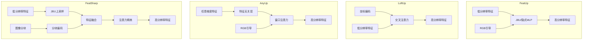

# 总览四种方法

以下是对四种特征上采样方法——**AnyUp**、**FeatUp**、**LoftUp** 和 **FeatSharp** 的详尽综合分析报告。

---

## 🧠 一、背景与问题定义

现代视觉基础模型（如 DINOv2、CLIP、ViT 等）通常输出**低分辨率特征图**（如 14×14 或 16×16），而许多下游任务（如语义分割、深度估计、目标检测）需要**高分辨率特征**（如 224×224 或更高）。特征上采样旨在将低分辨率特征图“放大”到高分辨率，同时保留语义信息、增强空间细节。

---

## 🧩 二、四种方法概览

### 1. **AnyUp**（《AnyUp: Universal Feature Upsampling》）
- **核心思想**：**通用特征上采样**，一次训练，适用于任何特征提取器、任何分辨率。
- **关键创新**：
  - **特征无关层**：使用卷积基对任意维度输入进行统一处理。
  - **局部窗口注意力**：限制注意力范围，避免全局注意力中的无关区域干扰。
  - **图像块训练策略**：使用局部图像块进行监督，提升训练效率与质量。
- **训练目标**：多视图一致性 + 自一致性正则化。

### 2. **FeatUp**（《FeatUp: A Model-Agnostic Framework for Features at Any Resolution》）
- **核心思想**：**多视图重建**，借鉴 NeRF 思想，通过图像抖动生成多个低分辨率视图，训练上采样器重建高分辨率特征。
- **两种变体**：
  - **JBU FeatUp**：堆叠联合双边滤波器，快速前馈上采样。
  - **Implicit FeatUp**：每张图像训练一个隐式 MLP，支持任意分辨率查询。
- **训练目标**：多视图重建损失 + 不确定性建模 + 总变差正则化。

### 3. **LoftUp**（《LoftUp: Learning a Coordinate-Based Feature Upsampler for Vision Foundation Models》）
- **核心思想**：**基于坐标的交叉注意力上采样**，将高分辨率坐标与低分辨率特征进行交叉注意力融合。
- **关键创新**：
  - **坐标编码 + 交叉注意力**：每个像素坐标与图像 RGB 结合，与低分辨率特征进行注意力交互。
  - **两阶段训练**：
    - Stage 1：使用类别无关掩码（如 SAM）生成伪真值。
    - Stage 2：自蒸馏，教师-学生架构提升细节。
- **训练目标**：亲和矩阵损失 + 掩码引导的伪真值监督。

### 4. **FeatSharp**（《FeatSharp: Your Vision Model Features, Sharper》）
- **核心思想**：**增强版 FeatUp + 分块融合**，结合 JBU 上采样与图像分块特征，提升细节还原能力。
- **关键创新**：
  - **分块特征融合**：将图像分块编码后拼接，与 JBU 上采样结果融合。
  - **局部注意力模块**：使用滑动窗口注意力融合两种特征源。
  - **去偏模块**：学习位置编码偏差，提升多视图一致性。
- **训练目标**：多视图一致性损失，无额外正则化。

---

## 🛠️ 三、方法对比分析

### 1. **架构设计对比**

| 方法 | 上采样方式 | 是否依赖图像引导 | 是否支持任意分辨率 | 是否需要每图优化 |
|------|-------------|------------------|---------------------|-------------------|
| AnyUp | 窗口注意力 + 特征无关卷积 | 是 | ✅ 是 | ❌ 否 |
| FeatUp-JBU | 堆叠 JBU 滤波器 | 是 | ✅ 是 | ❌ 否 |
| FeatUp-Implicit | 隐式 MLP | 是 | ✅ 是 | ✅ 是 |
| LoftUp | 坐标 + 交叉注意力 | 是 | ✅ 是 | ❌ 否 |
| FeatSharp | JBU + 分块融合 + 注意力 | 是 | ✅ 是 | ❌ 否 |

### 2. **训练策略对比**

| 方法 | 训练目标 | 是否需要高分辨率真值 | 是否任务无关 | 训练效率 |
|------|-----------|------------------------|--------------|----------|
| AnyUp | 多视图 + 自一致性 | ❌ 否 | ✅ 是 | 高 |
| FeatUp | 多视图重建 + 不确定性 | ❌ 否 | ✅ 是 | 中（JBU） / 低（Implicit） |
| LoftUp | 掩码伪真值 + 自蒸馏 | ✅ 是（伪真值） | ✅ 是 | 中 |
| FeatSharp | 多视图一致性 | ❌ 否 | ✅ 是 | 中 |

### 3. **性能表现对比（基于论文报告）**

| 方法 | 语义分割（mIoU） | 深度估计（RMSE） | 特征保真度 | 小物体细节 |
|------|------------------|------------------|------------|-------------|
| AnyUp | ✅ SOTA（62.16） | ✅ 最佳（0.4755） | ✅ 最佳 | ✅ 优秀 |
| FeatUp-JBU | 中等（61.95） | 中等（0.4816） | 中等 | 中等 |
| FeatUp-Implicit | 高（47.37） | 高（1.04） | 高 | ✅ 优秀 |
| LoftUp | 高（61.11） | 高（0.0921） | ❌ 较差 | ✅ 优秀 |
| FeatSharp | ✅ SOTA（53.13） | 未报告 | ✅ 高 | ✅ 最佳 |

> 注：不同方法使用的 backbone 和数据集略有差异，数值仅供参考趋势。

---

## ✅ 四、优缺点总结

### **AnyUp**
- ✅ 优点：
  - 通用性强，一次训练适用于任何特征提取器。
  - 特征保真度高，适合迁移学习。
  - 效率高，无需每图优化。
- ❌ 缺点：
  - 对高分辨率细节还原略逊于隐式方法。

### **FeatUp**
- ✅ 优点：
  - 两种变体灵活可选。
  - Implicit 版本细节还原能力强。
  - 多视图重建理论优雅。
- ❌ 缺点：
  - Implicit 版本训练慢、存储大。
  - JBU 版本在低对比区域易模糊。

### **LoftUp**
- ✅ 优点：
  - 细节还原能力强，尤其边界清晰。
  - 自蒸馏提升伪真值质量。
  - 适用于多种几何感知任务。
- ❌ 缺点：
  - 训练依赖 SAM 等外部模型。
  - 特征空间可能偏离原模型。

### **FeatSharp**
- ✅ 优点：
  - 细节还原最佳，尤其小物体。
  - 结合分块特征，引入新细节。
  - 适用于高分辨率 VLMs 和检测任务。
- ❌ 缺点：
  - 计算开销较大（需多次编码）。
  - 训练复杂度高。

---

## 🎯 五、适用场景推荐

| 方法 | 推荐场景 |
|------|----------|
| AnyUp | 需要通用性、快速推理、特征保真的任务（如线性探测、多任务学习） |
| FeatUp-JBU | 平衡速度与质量，适合语义分割、深度估计 |
| FeatUp-Implicit | 对细节要求极高，且可接受每图优化的场景（如图像编辑、超分） |
| LoftUp | 需要强几何边界、细节丰富的任务（如视频分割、交互式分割） |
| FeatSharp | 高分辨率感知任务（如小目标检测、VLM 增强、RADIO 训练） |

---

## 🔬 六、未来研究方向

1. **效率与质量的平衡**：如何在不牺牲细节的前提下降低计算开销。
2. **无监督/自监督上采样**：减少对伪真值或外部模型的依赖。
3. **多模态融合**：结合语言、深度等信息进一步提升上采样质量。
4. **动态分辨率支持**：实现任意输入/输出分辨率的无缝切换。

---

## 📌 总结

| 方法 | 核心贡献 | 是否通用 | 细节还原 | 训练成本 | 推理速度 |
|------|-----------|-----------|-----------|-----------|-----------|
| AnyUp | 通用特征上采样 | ✅ 高 | 中高 | 低 | 高 |
| FeatUp | 多视图重建 | ✅ 中 | 高（Implicit） | 中高 | 中 |
| LoftUp | 坐标注意力 + 自蒸馏 | ✅ 中 | 高 | 中 | 中 |
| FeatSharp | 分块融合 + 注意力 | ✅ 中 | ✅ 最高 | 中高 | 中 |

四种方法各有千秋，**AnyUp 强在通用性与保真度**，**FeatUp 强在多视图理论**，**LoftUp 强在细节与边界**，**FeatSharp 强在细节还原与小物体感知**。选择哪种方法需根据具体任务、资源约束和性能要求综合考虑。


# 特征上采样方法原理级深度对比分析

## 一、引言

### 1.1 问题定义
现代视觉基础模型（如DINOv2、CLIP、ViT等）通常输出**低分辨率特征图**，而许多下游任务需要**高分辨率特征**。特征上采样旨在将低分辨率特征图"放大"到高分辨率，同时保留语义信息、增强空间细节。

**数学形式化**：

- 输入图像：`I_hr ∈ ℝ^(H×W×3)`
  
- 低分辨率特征：`F_lr = f(I_hr) ∈ ℝ^(h×w×c)`，其中 `h ≪ H, w ≪ W`
  
- 目标：学习上采样函数 `g`，使得 `F_hr = g(F_lr, I_hr) ∈ ℝ^(H×W×c)`


### 1.2 核心挑战
- **缺乏真实监督**：没有高分辨率特征的真值标签
- **语义保持**：上采样过程不能破坏原始特征语义
- **细节恢复**：从低分辨率中恢复高频细节
- **计算效率**：避免二次复杂度增长

## 二、方法原理详解

### 2.1 FeatUp：多视图一致性重建

#### 2.1.1 核心思想
借鉴NeRF的3D重建思想，通过多个低分辨率特征视图重建高分辨率特征。

#### 2.1.2 数学建模
**多视图重建损失**：

$$\mathcal{L}_{rec} = \frac{1}{|T|}\sum_{t\in T} \frac{1}{2s^2}\|f(t(x)) - \sigma_{\downarrow}(t(F_{hr}))\|_2^2 + \log(s)$$

其中：
- $t \in T$：图像变换集合（平移、缩放、翻转）
- $\sigma_{\downarrow}$：学习的下采样器
- $s$：空间自适应不确定性参数

#### 2.1.3 架构变体

**A. JBU FeatUp（前馈网络）**
```python
# 伪代码实现
class JBU_FeatUp:
    def forward(self, F_lr, guidance):
        for factor in prime_factors(upscale_ratio):
            F_lr = joint_bilateral_upsample(F_lr, guidance, factor)
        return F_lr
        
def joint_bilateral_upsample(F_lr, G, factor):
    F_hr = zeros(H, W, C)
    for i, j in coordinates(H, W):
        weights = k_spatial(i,j) * k_range(G[i,j], G_neighbors)
        F_hr[i,j] = weighted_sum(F_lr, weights)
    return F_hr
```

**关键公式**：

$$\mathcal{L}_{rec} = \frac{1}{|T|}\sum_{t\in T} \frac{1}{2s^2}\|f(t(x)) - \sigma_{\downarrow}(t(F_{hr}))\|_2^2 + \log(s)$$


其中：
- $k_{range}(x,y) = \text{softmax}\left(\frac{1}{\sigma^2_{range}}MLP(x)\cdot MLP(y)\right)$
- $k_{spatial}(x,y) = \exp\left(-\frac{\|x-y\|^2_2}{2\sigma^2_{spatial}}\right)$

**B. Implicit FeatUp（隐式网络）**
```python
class ImplicitFeatUp:
    def __init__(self):
        self.mlp = MLP_with_fourier_features()
    
    def forward(self, coords, image):
        # coords: [H, W, 2] normalized coordinates
        # image: [H, W, 3] RGB values
        inputs = fourier_encode(coords, image, frequencies)
        return self.mlp(inputs)  # [H, W, C]
```

**数学表达**：
$$F_{hr} = MLP(h(e_i:e_j:x,\hat{\omega}))$$
其中 $h(z,\hat{\omega})$ 为傅里叶特征编码。

### 2.2 LoftUp：坐标基交叉注意力

#### 2.2.1 核心思想
将上采样重新定义为坐标到特征的映射问题，使用交叉注意力融合低分辨率特征和高分辨率坐标信息。

#### 2.2.2 数学建模

**坐标编码**：
$$Q = \text{Conv}(\text{Concat}(\text{PE}(coord), I_{hr})) \in \mathbb{R}^{HW\times d}$$

**交叉注意力**：
$$\text{Attention}(Q,K,V) = \text{softmax}\left(\frac{QK^T}{\sqrt{d_k}}\right)V$$

其中：
- $K,V \in \mathbb{R}^{hw\times d}$：低分辨率特征
- $Q \in \mathbb{R}^{HW\times d}$：高分辨率坐标+RGB查询

#### 2.2.3 两阶段训练

**阶段1：掩码引导伪真值**

$$F_{\text{Mask-Bicubic}}[m] = \alpha \cdot \overline{F_{\text{Bicubic}}}[m] + (1-\alpha) \cdot F_{\text{Bicubic}}[m]$$

**阶段2：自蒸馏**
```python
# 教师分支
teacher_output = upsampler(crop(high_res_image))

# 学生分支  
student_output = upsampler(normal_res_image)

# 亲和矩阵损失
loss = affinity_matrix_loss(
    downsample(teacher_output), 
    crop(student_output)
)
```

### 2.3 AnyUp：通用特征上采样

#### 2.3.1 核心创新：特征无关层

**数学表达**：

$$f_j = \frac{1}{N}\sum_{i=1}^{N} \frac{\exp(p_i * \psi_j)}{\sum_{j'=1}^{M} \exp(p_i * \psi_{j'})}$$

其中：
- $p_i$：输入特征的第$i$通道
- $\{\psi_j\}_{j=1}^M$：学习的卷积基
- $N$：可变输入通道数
- $M$：固定输出通道数

#### 2.3.2 局部窗口注意力
```python
class LocalWindowAttention:
    def forward(self, queries, keys, values, window_size):
        # 将特征划分为局部窗口
        windows = extract_windows(queries, window_size)
        for window in windows:
            # 在窗口内计算注意力
            attn = softmax(window_q @ window_k.T / sqrt(d))
            output_window = attn @ window_v
        return combine_windows(output_windows)
```

#### 2.3.3 训练策略
**图像块监督**：
```python
def training_step(batch):
    # 采样高分辨率图像块
    crop_hr = random_crop(image, crop_size)
    crop_lr = resize(image, crop_size)
    
    # 计算特征
    features_hr = backbone(crop_hr)  # 监督信号
    features_lr = backbone(crop_lr)  # 输入
    
    # 上采样并计算损失
    pred_hr = upsampler(features_lr, crop_lr)
    loss = cos_mse_loss(pred_hr, features_hr)
```

### 2.4 FeatSharp：多流融合架构

#### 2.4.1 三流信息融合

```python
class FeatSharp:
    def forward(self, image):
        # 流1: JBU上采样
        features_lr = backbone(image)
        features_jbu = jbu_upsampler(features_lr, image)
        
        # 流2: 分块编码
        tiles = split_into_tiles(image, grid_size)
        tile_features = [backbone(tile) for tile in tiles]
        features_tile = combine_tiles(tile_features)
        
        # 流3: 注意力精炼
        fused = concat(features_jbu, features_tile)
        refined = local_attention_block(fused)
        
        return refined[:, :, :C]  # 切片输出
```

#### 2.4.2 分块特征处理
**分块复杂度分析**：

$$f(x) = c(1 + n^2) \quad \text{vs} \quad g(x) = c(x^2)^2 = cx^4$$

其中 $n$ 为分块数，证明分块策略在 $n>1$ 时更高效。

#### 2.4.3 位置去偏模块
$$\hat{f}(x) = f(x) + g$$
其中 $g$ 为可学习的位置偏差，用于抵消ViT位置编码artifact。

## 三、原理级对比分析

### 3.1 上采样机制对比

| 方法 | 核心机制 | 数学基础 | 信息融合方式 |
|------|----------|----------|--------------|
| FeatUp-JBU | 学习的双边滤波 | 局部加权平均 | 像素级相似性 |
| FeatUp-Implicit | 坐标基MLP | 神经场表示 | 全局隐式函数 |
| LoftUp | 交叉注意力 | 注意力机制 | 全局内容感知 |
| AnyUp | 窗口注意力 | 注意力+卷积 | 局部内容感知 |
| FeatSharp | 多流融合+注意力 | 注意力+双边滤波 | 分层特征融合 |

### 3.2 训练信号理论对比

| 方法 | 监督信号 | 数学理论 | 一致性类型 |
|------|----------|----------|------------|
| FeatUp | 多视图重建 | NeRF体积渲染 | 变换等变性 |
| LoftUp | 伪真值+自蒸馏 | 函数逼近理论 | 特征相似性 |
| AnyUp | 图像块匹配 | 局部近似理论 | 空间一致性 |
| FeatSharp | 多视图重建 | 多分辨率分析 | 变换等变性 |

### 3.3 特征空间分析

**特征保真度理论**：
- **FeatUp**：通过不确定性建模保持分布
- **LoftUp**：亲和矩阵损失可能引起特征偏移
- **AnyUp**：精心设计的损失函数保持原空间
- **FeatSharp**：分块引入真实高频信息

**数学表达对比**：
```python
# FeatUp 特征保真
loss = mse_loss + uncertainty_regularization

# LoftUp 特征偏移风险  
loss = affinity_matrix_loss  # 可能改变特征分布

# AnyUp 特征保持
loss = cos_similarity + mse + consistency_regularization

# FeatSharp 细节增强
loss = multi_view_consistency + detail_preservation
```

## 四、架构设计深度分析

### 4.1 注意力机制差异

**LoftUp（全局交叉注意力）**：

$$\text{Attn}_{global} = \text{softmax}\left(\frac{Q_{coord}K_{lr}^T}{\sqrt{d}}\right)V_{lr}$$

**AnyUp（局部窗口注意力）**：

$$\text{Attn}_{local} = \text{softmax}\left(\frac{Q_{local}K_{local}^T}{\sqrt{d}}\right)V_{local}$$

**FeatSharp（局部自注意力融合）**：

$$\text{Attn}_{fusion} = \text{softmax}\left(\frac{Q_{fusion}K_{fusion}^T}{\sqrt{d}}\right)V_{fusion}$$


### 4.2 计算复杂度分析

| 方法 | 空间复杂度 | 时间复杂度 | 可扩展性 |
|------|------------|------------|----------|
| FeatUp-JBU | $O(HW\|\Omega\|)$ | $O(HW\|\Omega\|)$ | 中等 |
| FeatUp-Implicit | $O(\text{MLP参数量})$ | $O(HW \cdot \text{MLP计算量})$ | 每图优化 |
| LoftUp | $O(HWhw)$ | $O(HWhw)$ | 较差 |
| AnyUp | $O(HWw^2)$ | $O(HWw^2)$ | 良好 |
| FeatSharp | $O((1+n^2)C + HWw^2)$ | $O((1+n^2)T + HWw^2)$ | 中等 |


### 4.3 信息流分析



## 五、优化空间分析

### 5.1 FeatUp 优化方向

**理论改进**：
- 动态不确定性建模：$$s = N(f(t(x)))$$ 可扩展为更复杂的分布
- 多尺度一致性：引入金字塔多尺度监督
- 语义引导下采样：让下采样器感知语义边界

**架构改进**：
```python
class ImprovedFeatUp:
    def __init__(self):
        self.multi_scale_downsamplers = [...]  # 多尺度下采样器
        self.semantic_guidance_net = ...  # 语义引导网络
        
    def forward(self, x):
        # 多尺度一致性损失
        multi_scale_loss = 0
        for scale in scales:
            pred = upsampler(x, scale)
            target = multi_scale_backbone(x, scale)
            multi_scale_loss += consistency_loss(pred, target)
```

### 5.2 LoftUp 优化方向

**伪真值质量提升**：
- 多模型融合：结合多个基础模型的伪真值
- 时序一致性：视频序列中的时间一致性约束
- 不确定性感知蒸馏：教师模型不确定性传递

**架构优化**：
```python
class ImprovedLoftUp:
    def __init__(self):
        self.uncertainty_estimator = ...  # 不确定性估计
        self.temporal_consistency = ...  # 时间一致性模块
        
    def training_step(self, video_clip):
        # 时间一致性约束
        temporal_loss = temporal_consistency_loss(
            [upsampler(frame) for frame in video_clip]
        )
```

### 5.3 AnyUp 优化方向

**通用性扩展**：
- 跨模态上采样：支持文本、音频等多模态特征
- 动态架构：根据输入特征维度自适应调整网络
- 元学习：few-shot适应新特征类型

**算法改进**：
```python
class MetaAnyUp:
    def __init__(self):
        self.meta_learner = ...  # 元学习器
        self.dynamic_architecture = ...  # 动态架构
        
    def adapt_to_new_feature(self, support_set):
        # 少量样本适应新特征类型
        fast_weights = self.meta_learner(support_set)
        return self.dynamic_architecture(fast_weights)
```

### 5.4 FeatSharp 优化方向

**效率优化**：
- 渐进式上采样：coarse-to-fine策略减少计算
- 自适应分块：根据图像内容动态调整分块策略
- 知识蒸馏：将大模型蒸馏为轻量版本

**架构演进**：
```python
class EfficientFeatSharp:
    def __init__(self):
        self.progressive_upsampler = [...]  # 渐进上采样器
        self.adaptive_tiling = ...  # 自适应分块
        
    def forward(self, x):
        # 渐进式上采样
        current_res = low_res
        features = initial_features
        while current_res < target_res:
            features = progressive_upsampler[stage](features, x)
            current_res *= 2
```

### 5.5 统一优化框架

**跨方法融合机会**：
```python
class UnifiedFeatureUpsampler:
    def __init__(self):
        self.feature_agnostic_layer = AnyUp.style  # 特征无关处理
        self.coordinate_attention = LoftUp.style   # 坐标注意力
        self.multi_view_consistency = FeatUp.style # 多视图一致性
        self.tile_fusion = FeatSharp.style         # 分块融合
        
    def forward(self, features, guidance):
        # 统一架构
        normalized_features = feature_agnostic_layer(features)
        coordinate_enhanced = coordinate_attention(normalized_features, guidance)
        consistency_refined = multi_view_refinement(coordinate_enhanced)
        final_output = tile_fusion(consistency_refined, guidance)
        return final_output
```

## 六、总结与展望

### 6.1 核心贡献总结

| 方法 | 理论贡献 | 架构创新 | 实用价值 |
|------|----------|----------|----------|
| FeatUp | 多视图一致性理论 | JBU泛化+隐式网络 | 灵活的双模式 |
| LoftUp | 坐标注意力上采样 | 伪真值自蒸馏 | 细节还原强 |
| AnyUp | 通用特征上采样 | 特征无关层 | 真正模型无关 |
| FeatSharp | 多流融合理论 | 分块注意力融合 | 细节质量最佳 |

### 6.2 未来研究方向

1. **理论统一**：建立特征上采样的统一理论框架
2. **效率质量平衡**：动态计算分配机制
3. **跨模态扩展**：支持多模态特征上采样
4. **自监督学习**：减少对伪真值的依赖
5. **硬件协同**：专用硬件加速架构设计

### 6.3 选择指南

| 场景 | 推荐方法 | 理由 |
|------|----------|------|
| 需要通用性 | AnyUp | 一次训练支持任意backbone |
| 追求最佳细节 | FeatSharp | 分块融合提供真实高频信息 |
| 理论优雅性 | FeatUp | 多视图一致性理论基础坚实 |
| 边界清晰度 | LoftUp | 坐标注意力边界保持强 |
| 资源受限 | FeatUp-JBU | 计算效率相对较高 |

**结论**：四种方法各具特色，选择应基于具体任务需求、资源约束和理论偏好。未来趋势将向通用性、高效性和理论统一性方向发展。
```

